# 🧠 Machine Learning
**Machine Learning (ML)** é uma área da **Inteligência Artificial** que permite que sistemas aprendam padrões a partir de dados e tomem decisões ou façam previsões sem serem explicitamente programados para cada regra. Em vez de regras fixas, você fornece dados + objetivo → o modelo aprende a “função”.

## 📚 Abordagens


### 🕵🏻 1. Aprendizado Supervisionado

Você tem dados rotulados (entrada + resposta correta).

**👉 Objetivo:** aprender a mapear entrada → saída


#### Tipos principais:
- **Classificação →** prever categorias **Ex:** spam vs não spam
- **Regressão →** prever valores contínuos **Ex:** preço de casa

#### Algoritmos comuns:
- Regressão Linear
- Regressão Logística
- Árvores de Decisão
- Random Forest
- Gradient Boosting (XGBoost, LightGBM)
- SVM (Support Vector Machine)
- Redes Neurais

#### 📌 Exemplo prático:
Prever se um cliente vai cancelar **(classificação)** ou prever faturamento **(regressão)**

### 🙈 2. Aprendizado Não Supervisionado
Você tem dados sem rótulos.

**👉 Objetivo:** encontrar padrões escondidos


#### Tipos principais:
- **Clusterização →** agrupar dados similares
- **Detecção de Anomalias →** encontrar comportamentos fora do padrão
- **Redução de Dimensionalidade →** simplificar dados
- **Sistemas de Recomendação** (em parte)

#### Algoritmos comuns:
- K-Means
- DBSCAN
- Hierarchical Clustering
- PCA (Principal Component Analysis)
- Autoencoders

#### 📌 Exemplo:
Segmentação de clientes por comportamento


### 🫣 3. Aprendizado Semi-Supervisionado

#### Mistura de:

- poucos dados rotulados
- muitos dados não rotulados

👉 Muito usado quando rotular dados é caro (ex: imagens médicas)

### 🎰 4. Aprendizado por Reforço (Reinforcement Learning)
Um agente aprende interagindo com o ambiente.


#### 👉 Conceitos-chave:
- Estado
- Ação
- Recompensa

#### Algoritmos comuns:
- Q-Learning
- Deep Q-Network (DQN)
- Policy Gradient
- Actor-Critic

#### 📌 Exemplo:
- Jogos (tipo AlphaGo)
- Robótica
- Sistemas de decisão

### 🤔 Quando usar cada abordagem?
- **Supervisionado →** quando você tem histórico com respostas
- **Não supervisionado →** quando quer descobrir padrões
- **Reforço →** quando há tomada de decisão sequencial
- **Semi-supervisionado →** quando rótulos são escassos

### 💡 Resumão rápido
- **Supervisionado:** aprende com resposta
- **Não supervisionado:** encontra padrões
- **Reforço:** aprende por tentativa e erro
- Algoritmos variam conforme problema

## ⚛ Tipos de Algoritmos (organizado por função)


### 📊 Classificação

#### Prever classes/categorias:
- Logistic Regression
- Decision Tree
- Random Forest
- SVM
- KNN (K-Nearest Neighbors)
- Naive Bayes
- Redes Neurais (MLP, CNN)

### 📈 Regressão

#### Prever valores contínuos:
- Linear Regression
- Ridge / Lasso
- Decision Tree Regressor
- Random Forest Regressor
- Gradient Boosting

### 🧠 Clusterização

#### Agrupar dados:
- K-Means
- DBSCAN
- Hierárquico

### 🚨 Detecção de Anomalias

#### Identificar outliers:
- Isolation Forest
- One-Class SVM
- LOF (Local Outlier Factor)

### 🎯 Sistemas de Recomendação

#### Sugerir itens:
- Filtragem colaborativa
- Filtragem baseada em conteúdo
- Matrix Factorization

#### 📌 Exemplo:
Netflix, Amazon, Spotify

### 🧬 Algoritmos Bio-inspirados

#### Inspirados na natureza:
- Algoritmos Genéticos
- Particle Swarm Optimization
- Ant Colony Optimization

### 🔽 Redução de Dimensionalidade

#### Simplificar dados:
- PCA
- t-SNE
- UMAP


## 🚀 Pipeline típico de Machine Learning
1. Coleta de dados
1. Limpeza e tratamento
1. Feature engineering
1. Treinamento do modelo
1. Avaliação
1. Deploy
1. Monitoramento

## 📋 CRISP-DM

**CR**oss-**I**ndustry **S**tandart **P**rocess for **D**ata **M**ining é um framework de processo que define como conduzir um projeto de dados do início ao fim, focando não só no modelo, mas no valor para o negócio.

#### 👉 A grande sacada:
Machine Learning não começa no algoritmo — começa no problema de negócio


### 🔄 As 6 fases do CRISP-DM

O modelo é cíclico (você volta fases sempre que necessário)

### 📑 1. Entendimento do Negócio (Business Understanding)

Aqui você define o **problema real**

- Qual é o objetivo?
- Qual métrica de sucesso?
- Qual impacto esperado?
- É viavel seguir com o projeto?

#### 📌 Exemplo:
- Reduzir churn em 10%
- Aumentar conversão

👉 **Saída:** problema traduzido para ML


### 📊 2. Entendimento dos Dados (Data Understanding)

Exploração inicial dos dados
- **Coleta de dados**
    - Identificar fontes de dados relevantes para projeto
    - Fontes: (banco de dados, arquivos, APIs, etc.)
- **Exploração de dados**
    - Visualizar os dados usando gráficos (histogramas, gráficos de disperção, etc.)
    - Identificar tendências, padrões e anomalias
    - Calcular estatísticas descritivas (média, desvio padrão, quartis, etc.)
    - Realizar análizes preliminares pra entender a distribuição dos valores.
- **Qualidade de dados**
    - Identificar valores ausentes (nulos) e decidir tratá-los
    - Verificar a consistência dos dados (Ex: valores fazem sentido?)
    - Avaliar a integridade dos dados (se não há duplicatas ou registros inconsistentes)

👉 Aqui você começa a **“sentir”** os dados

### 🧹 3. Preparação dos Dados (Data Preparation)

Geralmente a fase mais demorada 😅

- **Seleção de dados**
    - Determine quais conjuntos de dados serão usados no projeto
    - Documente as razões para inclusão ou exclusão de cada conjunto  
- **Limpeza dos dados**
    - Essa é geralmente a tarefa mais extensa. Sem uma limpeza adequada, você corre o risco de obter resultados imprecisos.
    - Corrije, adicione ou remova valores errados.
    - Lide com dados ausentes de maneira apropriada.
- **Transformação dos dados**
    - Crie novos atributos relevantes a partir dos dados existentes
    - Por Exemplo, crie um índice de massa corporal (IMC) a partir dos campos altura e peso. Crie o valor de venda a partir de preço e frete e assim por diante.
- **Integração de dados**
    - Combine dados de várias fontes, se necessário.
    - Crie novos conjuntos de dados integrando informações relevantes.
- **Divisão dos dados**
    - Separe dados em conjuntos de treinamento, teste e validação
    - Isso é essencial para avaliar o desempenho do modelo

👉 **Resultado:** dataset pronto para modelagem

### 🤖 4. Modelagem (Modeling)

Aplicação dos algoritmos
- **Técnicas de Modelagem**
    - Selecione os algoritmos ou técnicas de modelagem apropriados para o seu problema.
    - Considere fatores como a natureza dos dados, os objetivos do projeto e recursos disponíveis.
- **Treinamento e ajuste**
    - Use os dados preparados para treinar e validar os modelos.
    - Ajuste os hiperparâmetros dos modelos para otimizar o desempenho.
- **Avaliação de performance**
    - Avalie eficácia dos modelos usando métricas relevantes (Ex: acurácia, precisão, recall, etc.)
    - Utilize técnicas como validação cruzada para evitar overfiting.
- **Escolha do modelo vencedor**
    - Com base nos resultados da avaliação, escolha o modelo que melhor atende aos critérios de sucesso.
    - Documente as razões para a escoolha do modelo.
- **Preparação para implantação**
    - Prepare o modelo para implantação em produção.
    - Isso pode envolver a conversão do modelo para um formato específico ou a integração com sistemas existentes.

#### 📌 Resumo:
- Escolhas dos algoritmos
- Treinamento
- Ajuste de hiperparâmetros
- Escolha do modelo vencedor

#### 📌 Exemplo:
- Regressão
- Random Forest
- Redes neurais

### 📈 5. Avaliação (Evaluation)

Verificar se o modelo resolve o problema de negócio
- **Avaliação dos resultados**
    - Nesta etapa, avaliamos a precisão e a eficácia do modelo.
    - Verificar se o modelo atende aos objetivos de negócios estabelecidos.
    - Identificar possíveis deficiências e áreas de melhoria.
- **Métricas de avaliação**
    - Utilize métricas relevantes para medir o desempenho do modelo.
    - Exemplos incluem acurácia, precisão, recall, F1-score, etc.
- **Validação cruzada**
    - Evitar overfitting avaliando o modelo com dados não utilizados anteriormente.
    - Dividir o conjunto de dados em treinamento, teste e validação.
- **Seleção do modelo final**
    - Com base na avaliação de negócio, escolhemos o modelo mais adequado.
    - Documentar as razões para a escolha.

**👉 Aqui muita gente erra:**
não basta “boa acurácia”, precisa gerar valor

### 🚀 6. Deploy (Deployment)

Colocar o modelo em produção
- **Planejamento da implantação**
     - Nesta etapa, você define o modelo que será implantado em produção.
     - Planeje a integração do modelo com sistemas existentes e considere questões de escalabilidade.
- **Escolhas de formatos de serialização**
    - **Formatos nativos:** pickle (.pkl), joblib (.joblib)
    - **ONNX (Open Neural Network Exchange):** Permite rodar em várias linguagens (python, C#, Java, C++)
    - **PMML:** Baseado em XML
    - **SavedModel (TensorFlow):** Formato padrão do TensorFlow
    - **TorchScript (PyTorch):** Permite rodar fora do python
    - **HDF5 (.h5):** Muito usado em keras
- **Escolhas de formas de publicação (servir o modelo)**
    - API REST
    - gRPC
    - **Batch (processamento em lote):** Executa previsões em massa
    - **Streaming:** Processamento em tempo real
    - **Embedded (embarcado):** Modelo roda dentro da aplicação
- **Implantação do modelo**
    - Publicar em algum destino que permita a área de negócios utilizar a predição.
- **Monitoramento e manutenção**
    - Após a implantação, monitore o desempenho do modelo em tempo real.
    - Faça ajustes conforme necessário para garantir que o modelo continue a atender aos objetivos.
- **Relatório final**
    - Documente os resultados, metodologia e conclusões do projeto.
    - Isso é importante para compartilhar insights com as partes interessadas.
- **Revisão do projeto**
    - Avalie o projeto como um todo.
    - Identifique lições aprendidas e áreas de melhoria para futuros projetos.

#### CRISP-DM


#### 👉 Modelo útil = modelo em produção


## 📚 Bilbiotecas em Python de Machine Learning
| Categoria     | Biblioteca   | Para que serve                                                                  |
| ------------- | ------------ | ------------------------------------------------------------------------------- |
| Dados         | pandas       | Manipulação e análise de dados em tabelas (DataFrames), limpeza e transformação |
| Dados         | NumPy        | Operações matemáticas e arrays multidimensionais (base para outras libs)        |
| Visualização  | Matplotlib   | Criação de gráficos básicos (linha, barra, dispersão)                           |
| Visualização  | Seaborn      | Visualizações estatísticas mais avançadas e bonitas                             |
| ML            | scikit-learn | Algoritmos de Machine Learning (classificação, regressão, clustering)           |
| Deep Learning | TensorFlow   | Construção e treinamento de modelos de deep learning em larga escala            |
| Deep Learning | Keras        | API de alto nível para criar redes neurais de forma simples                     |
| Deep Learning | PyTorch      | Framework flexível para deep learning, muito usado em pesquisa                  |
| NLP           | NLTK         | Processamento básico de linguagem natural (tokenização, stopwords)              |
| NLP           | spaCy        | NLP avançado com foco em performance (NER, POS tagging)                         |
| Boosting      | XGBoost      | Algoritmo de boosting eficiente e muito usado em competições                    |
| Boosting      | LightGBM     | Boosting otimizado para grandes volumes de dados                                |


# 📉 Estatística
Estatística é a ciência que utiliza-se das **teorias probabilísticas** para explicar a frequência de eventos, tanto em estudos observacionais quanto em experimentos para modelar a **aleatoriedade** e a **incerteza** de forma a estimar ou possibilitar a previsão de fenômenos futuros, conforme o caso.

## 🎲 Tipos de dados
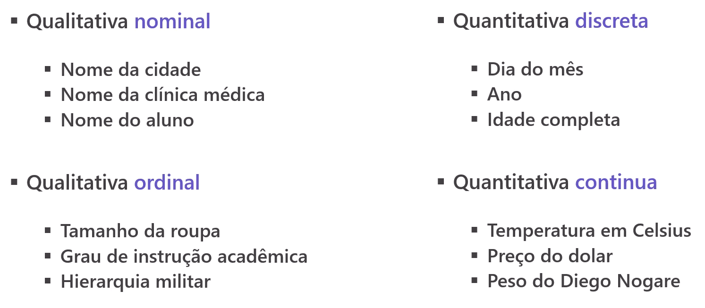


### 🟦 Dados Qualitativos (Categóricos)

Representam categorias, não números com significado matemático.

#### 📌 Tipos:
#### 🟢 Nominais
- Não t1êm ordem
- Apenas classificam

#### Exemplos:
- Cor (azul, vermelho)
- Estado civil
- Tipo de produto

#### 🟡 Ordinais
Têm ordem, mas sem distância numérica definida

#### Exemplos:
- Nível de satisfação (ruim, médio, bom)
- Escolaridade
- Ranking

### 🟦 Dados Quantitativos (Numéricos)

Representam valores numéricos com significado matemático

#### 📌 Tipos:
#### 🔵 Discretos
- Valores inteiros
- Resultado de contagem

#### Exemplos:
- Número de filhos
- Quantidade de vendas
- Número de acessos

#### 🔴 Contínuos
Podem assumir qualquer valor dentro de um intervalo

#### Exemplos:
- Altura
- Peso
- Temperatura
- Tempo

## ✨ Características dos Dados

### 🟦 Dados Estruturados

São dados organizados em um formato fixo e bem definido, geralmente em tabelas.

👉 Fácil de armazenar, consultar e analisar

#### 📊 Características:
- Estrutura rígida (linhas e colunas)
- Tipos de dados definidos
- Fácil uso com SQL
- Alta organização

#### 📌 Exemplos:
- Banco de dados relacional
- Planilhas (Excel)
- Tabelas CSV
 
```bash
Nome     Idade    Salário
João     30       5000
Maria    25       4000
``` 

#### 🧠 Onde são usados:
- Sistemas financeiros
- ERPs
- CRMs

### 🟦 Dados Não Estruturados

Não seguem um formato fixo ou tabela.

👉 Muito mais difíceis de processar automaticamente

#### 📊 Características:
- Sem estrutura definida
- Conteúdo livre
- Necessitam de processamento (NLP, visão computacional)

#### 📌 Exemplos:
- **Texto:** Isso pode incluir e-mails, documentos do World, PDFs, postagens de blogs, transcrições de áudio, etc. Esses dados são geralmente analisados usando técnicas de **processamento de linguagem natural (NLP)** para extrair informações úteis.
- **Imagens:** As imagens são uma forma comum de dados não estruturados. Elas podem ser analisadas usando técnicas de **visão computacional** para indentidicar padrões, objetos ou pessoas.
- **Vídeos:** Os vídeos contêm riqueza de informações, mas são desafiadores para analisar devido à natureza multimodal (visão, auditiva e, às vezes textual). Técnicas de **aprendizado profundo (deep learning)** são frequentemente usadas para analisar vídeos.
- **Sons:** Isso pode incluir gravações de áudio, músicas, ruídos de fundo, etc. A análise de som pode envolver **transcrição de fala em texto** ou a identificação de padrões específicos no áudio.

#### 🧠 Exemplos reais:
- Comentários de clientes
- Fotos de produtos
- Gravações de atendimento


### ⚔️ Dados Estruturados X Dados Não Estruturados
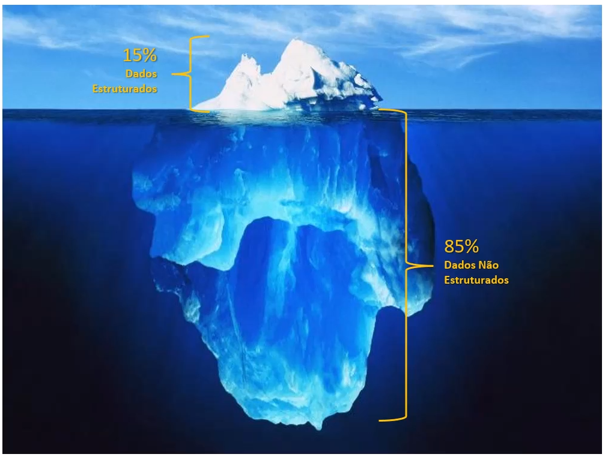

---

## 👨🏽‍🔬 Profissionais na área de dados
A área de dados é bem ampla e tem vários papéis, cada um com foco diferente dentro do **ciclo de dados (coleta → processamento → análise → modelagem → produção)**

### 🔷 1. Analista de Dados (Data Analyst)

👉 **Foco:** analisar e gerar insights

#### Funções:
- Explorar dados (EDA)
- Criar dashboards (Power BI, Tableau)
- Fazer consultas SQL
- Responder perguntas de negócio

#### 📌 Perfil:
- Mais próximo do negócio
- Menos foco em modelagem avançada

### 🔷 2. Cientista de Dados (Data Scientist)

👉 **Foco:** modelos preditivos e ML

#### Funções:
- Construir modelos de Machine Learning
- Fazer feature engineering
- Testar hipóteses
- Avaliar modelos

#### 📌 Usa:
- Python
- estatística
- ML

### 🔷 3. Engenheiro de Dados (Data Engineer)

👉 **Foco:** infraestrutura de dados

#### Funções:
- Construir pipelines (ETL/ELT)
- Integrar fontes de dados
- Trabalhar com Big Data
- Garantir qualidade e disponibilidade

#### 📌 Tecnologias:
- SQL
- Spark
- Airflow

### 🔷 4. Engenheiro de Machine Learning (ML Engineer)

👉 **Foco:** colocar modelos em produção

#### Funções:
- Deploy de modelos
- Criar APIs
- Monitorar performance
- Escalar soluções

#### 📌 Ponte entre:
- Data Science + Engenharia

### 🔷 5. Engenheiro de Analytics (Analytics Engineer)

👉 **Foco:** modelagem de dados para análise

#### Funções:
- Transformar dados brutos em dados confiáveis para análise
- Criar camadas analíticas
- Trabalhar com dbt

👉 Meio termo entre analista e engenheiro


### 🔷 6. Especialista em BI (Business Intelligence)

👉 **Foco:** visualização e indicadores

#### Funções:
- Criar dashboards
- Definir KPIs
- Automatizar relatórios

#### 📌 Ferramentas:
- Power BI
- Tableau

### 🔷 7. Arquiteto de Dados (Data Architect)

👉 **Foco:** design da arquitetura

#### Funções:
- Definir estrutura dos dados
- Escolher tecnologias
- Planejar armazenamento

👉 Papel mais estratégico


### 🔷 8. Engenheiro de MLOps

👉 **Foco:** operacionalizar ML

#### Funções:
- Automatizar pipelines de ML
- Versionar modelos
- Monitorar drift
- CI/CD para ML

### 🔷 9. Chief Data Officer (CDO)

👉 **Foco:** estratégia de dados

#### Funções:
- Nível Executivo
- Governança de dados
- Estratégia organizacional
- Cultura data-driven
- Garante que os dados gerem valor para o negócio

### 🔄 Como eles se conectam
```bash
Engenheiro de Dados → prepara dados
        ↓
Analista / BI → gera insights
        ↓
Cientista de Dados → cria modelo
        ↓
ML Engineer / MLOps → coloca em produção
```

### 💡 Resumo rápido
| Cargo                          | Foco                                               |
| ------------------------------ | -------------------------------------------------- |
| Analista de Dados              | Geração de insights e análises                     |
| Cientista de Dados             | Modelos preditivos e Machine Learning              |
| Engenheiro de Dados            | Construção de pipelines e infraestrutura           |
| Engenheiro de Machine Learning | Deploy e escala de modelos                         |
| Engenheiro de Analytics        | Modelagem de dados para análise (camada analítica) |
| BI (Business Intelligence)     | Dashboards e indicadores                           |
| Arquiteto de Dados             | Estrutura e arquitetura dos dados                  |
| Engenheiro de MLOps            | Operacionalização e monitoramento de ML            |
| CDO (Chief Data Officer)       | Estratégia e governança de dados                   |


### 🚀 Insight importante
👉 Não existe “melhor cargo”, existe o que mais combina com você:

- Gosta de negócio **→** Analista / BI
- Gosta de matemática **→** Cientista
- Gosta de sistemas **→** Engenheiro
- Gosta de produção **→** ML Engineer

---

## 📉 Estatística Descritiva
A **Estatística Descritiva** é a parte da Estatística focada em organizar, resumir e descrever os dados, sem tirar conclusões gerais (isso é papel da inferência).

#### 👉 Em outras palavras:
ela responde **“o que os dados estão mostrando?”**

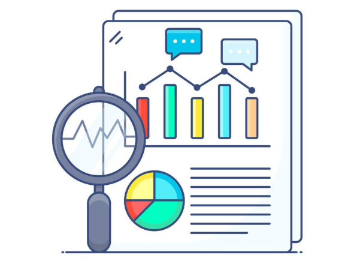

### 🔷 Principais pontos

#### 📌 Tendência central (valor típico)
- Média
- Mediana
- Moda

#### 📌 Dispersão (variação dos dados)
- Desvio padrão
- Variância
- Amplitude

#### 📌 Distribuição
- Forma dos dados (simétrica, assimétrica)
- Identificação de outliers

#### 📌 Visualização
- Histogramas
- Boxplots
- Gráficos

### 🧠 Para que serve?
- Entender rapidamente um conjunto de dados
- Identificar padrões e tendências
- Detectar outliers (valores fora do padrão)
- Apoiar decisões iniciais

### 📊 Quarteto de Anscombe
O **Quarteto de Anscombe** é um dos exemplos mais clássicos e importantes da estatística, criado por Francis Anscombe em 1973.

👉 A ideia dele é simples, mas poderosa:

>Conjuntos de dados podem ter as mesmas estatísticas, mas comportamentos completamente diferentes

#### 🧠 O que é o Quarteto de Anscombe?

São **4 conjuntos de dados diferentes** que possuem praticamente os mesmos valores de:

- Média
- Variância
- Correlação
- Regressão linear

👉 Mas quando você plota os dados, eles são totalmente diferentes visualmente

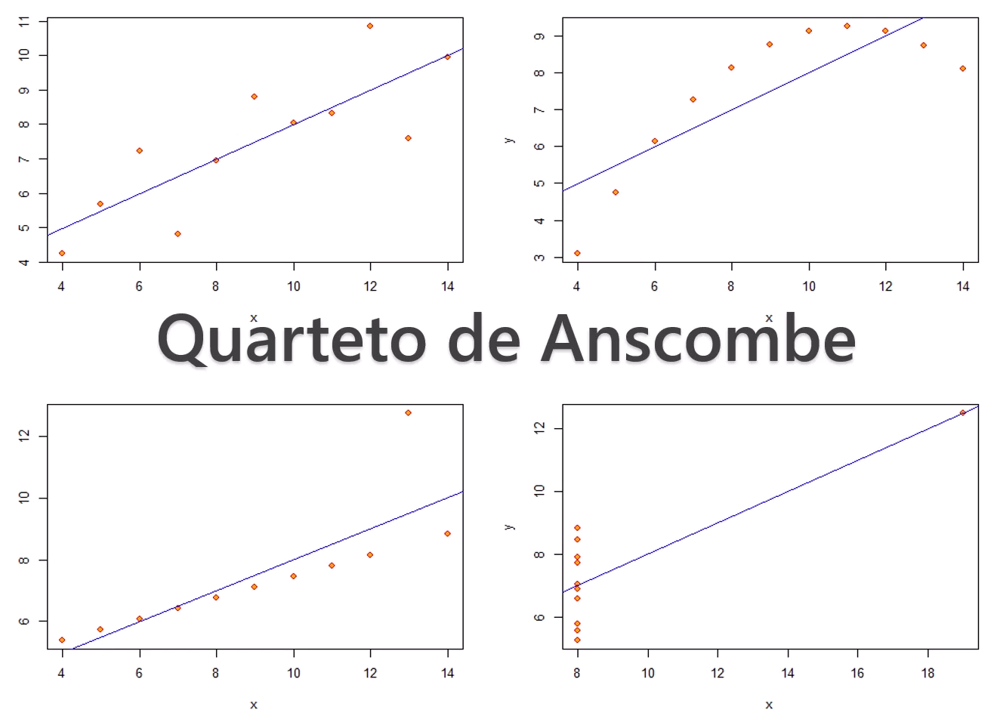


### 💡 Lições importantes
#### 🚨 1. Nunca confie só em métricas

#### Mesmo com:
- mesma média
- mesma correlação

👉 os dados podem ser completamente diferentes

#### 📉 2. Visualização é essencial

#### Antes de qualquer modelo:

- faça gráficos
- explore os dados

👉 Isso evita erros graves

#### ⚠️ 3. Outliers podem enganar
- Um único ponto pode distorcer tudo
- Pode mudar regressão e conclusões

### 📊 Medidas de Tendência Central

São métricas que indicam o **valor “central” ou mais representativo** de um conjunto de dados.

### 🔷 Principais medidas
#### 📌 Média (mean)
Soma de todos os valores ÷ quantidade

👉 Sensível a outliers

#### Ex:
```bash
[10, 20, 30] → média = 20
```

#### 🎯 Uso:
- Dados gerais sem pesos
- Quando todos têm mesma importância

#### 📌 Média Ponderada
Cada valkor tem um **peso diferente**

#### Ex:
```bash
Nota 7 (peso 2), Nota 9 (peso 3)
→ média = 8,2
```

#### 🎯 Uso:
- Notas
- indicadores com relevância diferente

#### ƒ Fórmula


#### 📌 Média Harmônica
Usado para **taxas e razões**

👉 Penaliza valores muito altos

#### Ex (velocidade):
```bash
60 km/h e 30 km/h → média harmônica = 40 km/h
```

#### 🎯 Uso:
- Velocidade média
- Taxas (ex: km/h, produtividade)

#### ƒ Fórmula


#### 📌 Média Geométrica
Usada para **crescimento multiplicativo**

👉 Penaliza valores muito altos

#### Ex (velocidade):
```bash
Crescimento: 10% e 20%
→ média geométrica ≈ 14,9%
```

#### 🎯 Uso:
- Juros compostos
- Crescimento populacional
- Retornos financeiros

#### ƒ Fórmula


#### 📌 Mediana
Valor central após ordenar os dados

👉 Mais robusta a outliers

#### Ex:
```bash
[10, 20, 1000] → mediana = 20
```

#### 📌 Moda
Valor que mais se repete

#### Ex:
```bash
[1, 2, 2, 3] → moda = 2
```

### ⚖️ Quando usar cada uma?
- Média → dados sem valores extremos
- Mediana → dados com outliers
- Moda → dados categóricos ou frequência

### 🧩 Resumo
| Medida      | Melhor uso            |
| ----------- | --------------------- |
| Média       | Dados “normais”       |
| Ponderada   | Valores com peso      |
| Harmônica   | Taxas/razões          |
| Geomética   | Crescimento           |
| Mediana     | Dados com outliers    |
| Moda        | Frequência/categorias |

### 📊 Medidas de Dispersão

#### 👉 Respondem:
“Os dados estão concentrados ou muito espalhados?”

#### 🔷 1. Amplitude Total (Range)
Diferença entre o maior e o menor valor

```bash
[10, 20, 30] → amplitude = 30 - 10 = 20
```

📌 Simples, mas sensível a extremos

#### 🔷 2. Variância
**Quadrado do desvio padrão:** Mede o quanto os dados se afastam da média (ao quadrado)

👉 Quanto maior, mais disperso

#### 🔷 3. Desvio Padrão
**Raiz da variância:** É a medida da variação (distância) dos valores comparado com a média, ou seja, mede o quanto os dados se afastam da média.

👉 Interpretação mais intuitiva (mesma unidade dos dados)

#### 🔷 4. Intervalo Interquartil (IQR)
Similar à **aplitude total**, porém obtem a **diferença entre o 1 e 3 quartis**.

👉 Ignora outliers \
👉 Muito usado com boxplot

#### ⚖️ Comparação rápida
| Medida        | Característica               |
| ------------- | ---------------------------- |
| Amplitude     | Simples, sensível a extremos |
| Variância     | Matemática, menos intuitiva  |
| Desvio padrão | Mais usado na prática        |
| IQR           | Robusto a outliers           |

#### 🧩 Resumo
- Medem a variabilidade dos dados
- Complementam as medidas de tendência central
- Essenciais para entender o comportamento real dos dados

### 📊 Análise Exploratória
A **Análise Exploratória de Dados (EDA – Exploratory Data Analysis)** é uma etapa fundamental em qualquer projeto de dados. Com elementos de estatística, são descobertos **padrões**, **distribuições** e **comportamento** dos dados

#### 🔰 Subdivisões

- **Descritiva:** É a forma de ánalise de dados que responde perguntas com as **descrições**  de um acontecido. **Ex:** Quantos carros vendi mês passado?
- **Associativa:** Procura **correlação** entre as variáveis. Existe um aspecto suspeito da hipótese ter causas nestas variações. **Ex:** O preço do dólar influenciou a venda de carros?
- **Comparativa:** **Comparar** duas situações e **validar** se a comparação faz sentido. **Ex:** Eu vendo mamis carros conversíveis no verão ou no inverno?
- **Preditiva:** Com base nos dados e analises anteriores, como ser mais **efetivo** nas decisões. **Ex:** Quantos carros conversíveis à gasolina vou vender no pŕoximo verão?

#### 🧠 O que é Análise Exploratória?

#### É o processo de:
- explorar os dados
- identificar padrões
- detectar problemas
- gerar hipóteses

#### 👉 Responde:
“O que tem nesses dados?”

#### 🔷 Principais objetivos
- Entender a estrutura dos dados
- Identificar valores faltantes
- Detectar outliers
- Ver distribuição dos dados
- Encontrar relações entre variáveis

#### 🔍 O que você analisa na prática?
#### 📌 1. Estrutura dos dados
Quantidade de linhas e colunas
Tipos de dados

#### 📌 2. Estatísticas básicas
- Média, mediana
- Desvio padrão
- Mínimo e máximo

#### 📌 3. Dados faltantes
- Onde existem valores nulos
- Quanto impacto eles têm

#### 📌 4. Distribuição
- Histograma
- Assimetria

#### 📌 5. Relações entre variáveis
- Correlação
- Gráficos de dispersão

#### 📌 6. Outliers
- Valores muito fora do padrão

### 🧩 Resumo
- Explorar dados antes de modelar
- Entender padrões e problemas
- Base para qualquer análise ou ML

## 🎰 Probabilidade
A probabilidade é uma área da estatística e da matetmática, utilizada para **modelar incertezas** e tomar decisões baseadas em **informações incompletas**. É a área que estuda a chance de um evento acontecer.

### 🔷 1. Experimento Aleatório

Processo cujo resultado não é previsível, mesmo que as condições iniciais sejam conhecidas.

#### 📌 Ex:
- jogar um dado 🎲
- lançar uma moeda 🪙

### 🔷 2. Espaço Amostral (S)

Conjunto de **todos os resultados possíveis**.

#### 📌 Ex:
- Dado → S = {1, 2, 3, 4, 5, 6}
- Cartas → S = {2, 3, 4,...,9,10,J,Q,K,A}
- Naipes → S = {Paus, Copas, Espada, Ouro}
- Moeda → S = {Cara, Coroa}

### 🔷 3. Evento

Um **subconjunto** do espaço amostral.

#### 📌 Ex:
- tirar número par ao jogar o dado → E = {2, 4, 6}

### 🔷 4. Probabilidade simples

A probabilidade é uma medida do quão provável é a ocorrência desse evento em relação ao espaço amostral.

Se todos os resultados são igualmente prováveis:

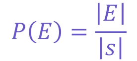

Onde **E** é o número de elementos no evento e **S** é o número total de resultados no espaço amostral.

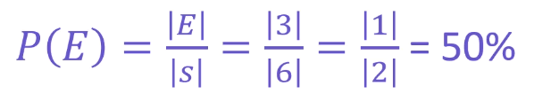

#### 📌 Ex:
- P(par) = 3/6 = 0,5

### 🔷 5. Probabilidade Condicional

A **probabilidade condicional** mede a probabilidade de um **evento ocorrer** dado que outro **evento já aconteceu**.

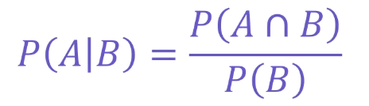

Queremos calcular a probabilidade condicional de que, uma vez que o primeiro **dado resultou em um número ímpar**, o **segundo dado também resulte em um número ímpar**.

**Interseção dos eventos (A ∩ B):** A interseção ocorre quando o primeiro dado é ímpar e o segundo dado também é ímpar.

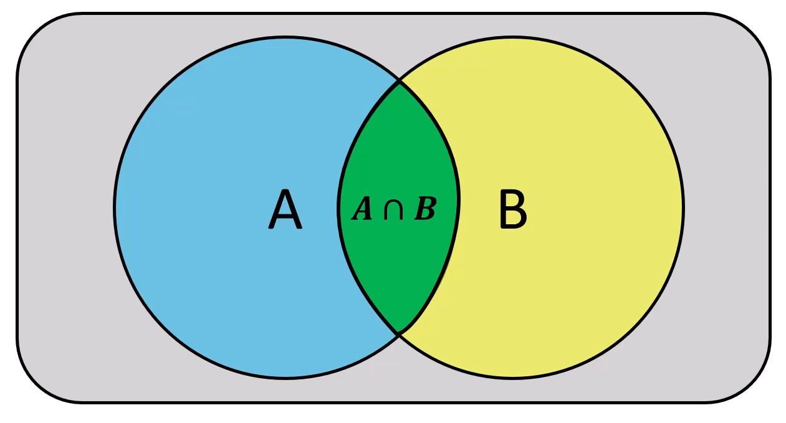

Como cada dado é independente, a probabilidade de ambos serem ímpares é calculada como o produnto das probabilidades individuais.


Probabilidade do **evento A** (primeiro dado ímpar)

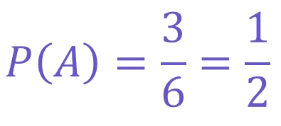

Probabilidade condicional do evento **B** dado **A** (segundo dado ímpar)

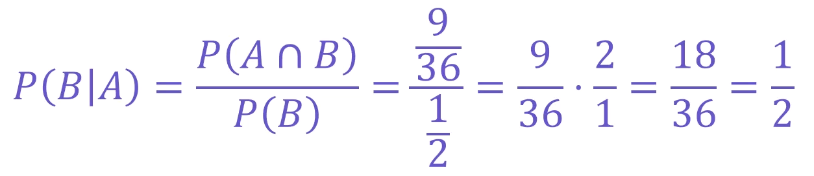

### 🔷 6. Teorema de Bayes

É uma fórmula que permite **atualizar a probabilidade de um evento com base em novas evidências**.

#### 📌 Conceitos
- **A priori** → Conhecimentos anteriores
- **A posteriori** → Argumentos posteriores

#### 👉 Em outras palavras:
você ajusta sua crença inicial quando recebe informação nova

#### ƒ Fórmula

**P(A|B) →** Probabilidade da hipótese **A** ser verdadeira dado que a evidência **B** foi observada (probabilidade a posteriori).

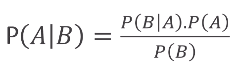

#### 🧠 O que significa cada parte?
- **P(B|A) →** probabilidade de observar a evidência **B** se a hipótese **A** for verdadeira (verossimilhança)
- **P(A) →** probabilidade da hipótese **A** ser verdadeira antes de observar a evidência (probabilidade a priori)
- **P(B) →** probabilidade de observar a evidência **B** em qualquer circunstância (probabilidade marginal).

#### 💡 Exemplo simples

- Segundo a OMS 1% da população 65+ tem a Doença de Parkison 🧐 
- Se uma pessoa faz o teste e o resultado é positivo, qual a probabilidade de ela realmente ter a doença? 🤔

#### 📝 Dados atualizados:
- **P(Doença)** = 1% = 0,01 (a priori)
- P(SemDoença) = **1-P(Doença)** = 99% = 0,99
- **P(TesteNegativo|SemDoença)** = 90% = 0,90
- P(TestePositivo|SemDoença) = **1-P(TesteNegativo|SemDoença)** 10% = 0,10
- **P(TestePositivo|Doença)** = 95% = 0,95 (verossimilhança)

#### Usando regra de probabilidade total
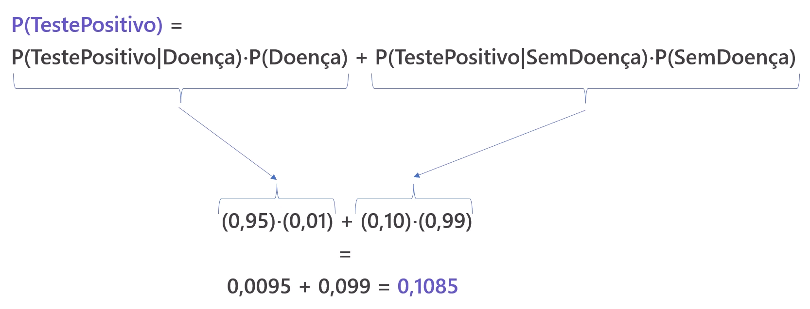

#### Usando teorema de bayes
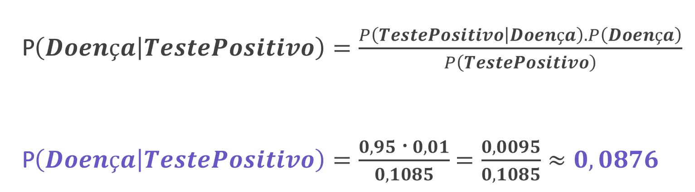

#### ✅ Conclusão:
- Mesmo com um **teste positivo**, a probabilidade de a pessoa realmente ter a doença é **apenas 8,76%**
- Isso acontece porque a doença é rara **(1% da população 65+)**, e a maioria dos testes positivos ocorre em pessoas sem doença, o que gera falsos positivos **(~10% dos resultados).**

## 📉 Inferência Estatística
A **inferência estatística** é um processo de usar dados de uma **amostra** para fazer **estimativas**, **previsões** ou **tomar decisões** sobre uma **população** maior.

Como é geralmente **inviável estudar toda a população** devido a limitações de tempo, recursos ou acessibilidade, a estatística se baseia em **amostras representativas** para tirar conclusões.

### 🔷 Tipos de inferência
### 📊 1. Estimação

Na **estimação**, o objetivo é **determinar valores aproximados** de parâmetros populacionais, como **médias ou proporções**, utilizando **intervalos de confiança** para quantificar a incerteza.

#### 📌 Tipos:
- **Pontual →** um valor único
- **Intervalo de confiança →** faixa de valores

#### Ex:
👉 “A média está entre 50 e 60”

### 🧪 2. Teste de Hipóteses

Já no testes de hipótese, busca-se **avaliar uma suposição** especifica sobre a população, verificando se os dados amostrais **fornencem evidências** sufucuentes para **aceitá-la ou rejeitá-la**.

#### 🔹 Conceitos
As hipóteses são divididas em duas categorias principais: a **hipótese nula (H0)** e a **hipótese alternativa (Ha)**
 - A **H0** é uma declaração de **satus quo** ou ausência de efenito, assumindo que qualquer diferença observada nos dados ocorre apenas **por acaso**.
 - Por outro lado, a **Ha** representa uma **afirmação contrária à H0**, sugerindo a presença de umn efeito real ou **diferença significativa**.


#### 📌 Passos:
1. Definir hipótese nula (H0)
1. Definir hipótese alternativa (Ha)
1. Calcular estatística
1. Decidir rejeitar ou não H0

#### Ex:
👉 “Esse remédio funciona?”

### 🔬 O que é o T-Test
O **Teste t (T-Test)** é um teste estatístico usado para **comparar médias** e verificar se a diferença entre elas **é significativa** ou pode ter ocorrido por acaso.

#### 🔹 Quando usar?
- Comparar média de um grupo com um valor
- Comparar dois grupos
- Dados com distribuição aproximadamente normal
- Amostras pequenas (geralmente)

#### 🔹 Variações de T-Test

#### 📌 1. One-sample t-test

Compara a média de um grupo com um valor conhecido

#### Ex:
👉 média de salário vs salário esperado

#### 📌 2. Two-sample t-test

Compara médias de dois grupos independentes e avalia se diferem
 significativamente

#### Ex:
👉 grupo A vs grupo B

#### 📌 3. Paired t-test

Compara antes e depois (mesmo grupo)

#### Ex:
👉 desempenho antes e depois de um treinamento

### 📉 O que é o p-valor?

O p-valor indica a probabilidade de **obter um resultado tão extremo quanto o observado**, assumindo que a hipótese nula (H0) é verdadeira.

#### 🔹 Interpretação
| p-valor  | Interpretação                                 |
| -------- | --------------------------------------------- |
| p < 0,05 | evidência contra H0 (resultado significativo) |
| p ≥ 0,05 | não há evidência suficiente                   |

#### 🧠 Como os dois se conectam?
1. O T-Test calcula uma estatística t
1. A partir dela, obtemos o p-valor
1. O p-valor decide se rejeitamos H0

#### 📊 Exemplo simples

Queremos saber se um novo método melhora notas:
- H0: média igual
- H1: média diferente

#### Resultado:
```bash
p = 0,03
```

👉 Como p < 0,05:
- rejeitamos H0
- há evidência de diferença

#### 💡 Insight

#### 👉 O T-Test responde:
“As médias são diferentes?”

#### 👉 O p-valor responde:
“Essa diferença pode ser só acaso?”

#### 🧩 Resumo
- T-Test → compara médias
- p-valor → mede evidência contra H0
- Juntos → ajudam na tomada de decisão

## 📈 Regressão

A **regressão** é uma técnica estatística usada para **modelar a relação entre variáveis e fazer previsões**.

#### 👉 Responde:
“Como uma variável influencia outra?”

### 🔷 Ideia básica

#### Você tem:

- **Variável independente (X) →** entrada
- **Variável dependente (Y) →** saída

👉 A regressão tenta encontrar uma função que ligue X → Y

#### 📌 Exemplo
- X: tamanho da casa
- Y: preço

#### 👉 A regressão aprende:
quanto o preço muda conforme o tamanho

### 🔷 Tipos de Regressão

#### 📊 1. Regressão Linear Simples
A **regressão linear simples** é um método estatístico que modela a relação entra **uma variável dependente contínua e uma única variável independente**, ajustando uma linha reta que minimiza os erros entre os valores observados e previstos.

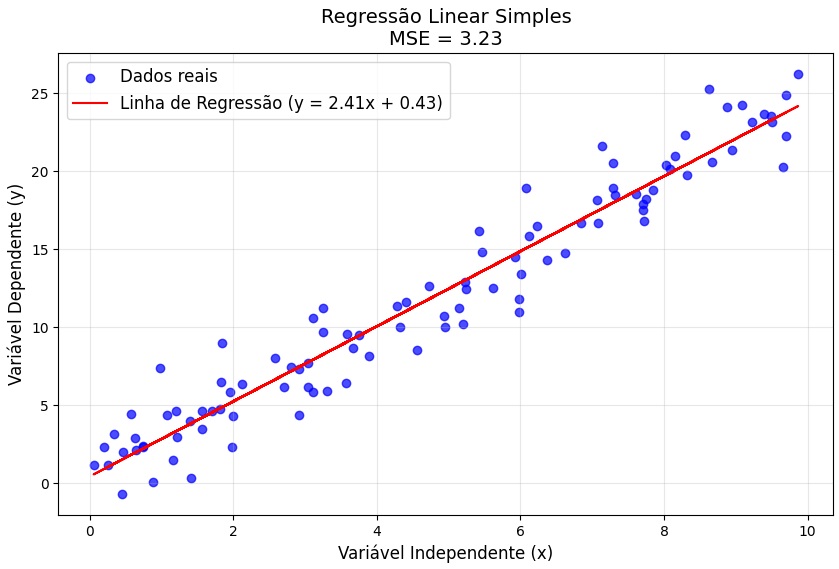

#### 📊 2. Regressão Linear Múltipla
A **regressão linear múltipla** é uma técnica estatística que estende a regressão linear simples ao incluir **várias variáveis independentes para prever uma variável dependente contínua**.

O modelo busca determinar como cada variável independente contribui para a variável dependente, ajustando um plano ou hiperplano nos dados que minimiza os erros entre os valores observados e previstos.

#### 📌 Ex:
tamanho + localização + idade do imóvel

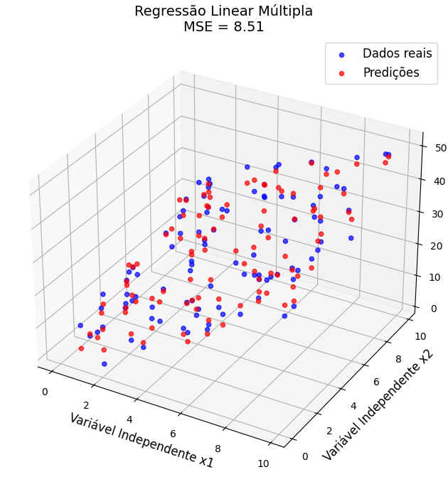

### 💡 Insight

👉 Regressão não é só previsão, ela ajuda a entender relações entre variáveis

### 🧩 Resumo
- Modela relação entre variáveis
- Permite prever valores
- Base de muitos modelos de ML

## 🔗 Correlação
A **correlação** entre variáveis **mede a força e a direção de uma relação linear entre elas**, indicando o grau em que elas **variam juntas**.

#### 👉 Responde:
“Essas variáveis se movem juntas?”

### 🔷 Coeficiente de correlação (r)
- Vai de -1 a +1

| Valor | Interpretação                |
| ----- | ---------------------------- |
| +1    | Correlação positiva perfeita |
| 0     | Sem relação                  |
| -1    | Correlação negativa perfeita |

> É importante ressaltar que a **correlação não implica que uma variável influencia ou causa mudanças na outra**, ela apenas descreve uma associação entre elas.

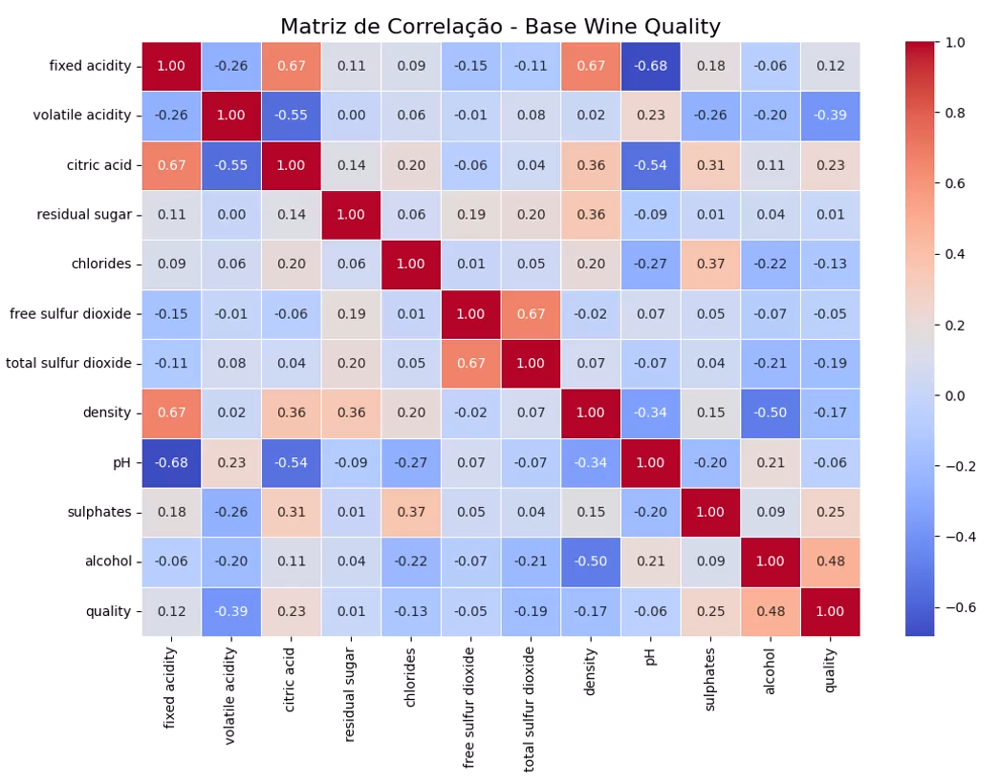

### 🔁 Correlação vs. Causalidade
Enquanto a correlação quantifica a relação entre variáveis, a causalidade vai além, **sugerindo que uma variável é responsável** por mudanças na outra.

Por exemplo, ima correlação entre **consumo de sorvete e afogamentos** pode ser alta, mas isso **não significa** que comer sorvete causa afogamentos.

Nesse caso, uma **variável oculta**, como **altas temperaturas**, **influencia** ambos eventos. Para estabelecer causalidade, é necessário utilizar métodos mais robustos, como **experimentos controlados ou análise de variáveis latentes**, além de uma interpretação cuidadosa do contexto.

## 📈🤖 Estatística Aplicada ao Machine Learning

### 🧠 Por que precisamos disso?

Quando treinamos um modelo, precisamos saber:

👉 Ele funciona bem só nos dados que viu ou também em dados novos?

➡️ É aí que entram **hold-out** e **validação cruzada**

### 🔷 Hold-out
É a estratégia de como vou separar os dados para **treino**, **teste** e **validação**.

- **Treino:** É o conjunto de dados usado para treinar o modelo, ou seja, ajustar os pesos e parâmetros do modelo de acordo com os padrões encontrados nos dados;
- **Validação:** É um conjunto de dados separado do treino, usado para avaliar o modelo durante o treinamento;
- **Teste:** É um conjunto de dados totalmente separado do treino e validação, usado apenas após o treinamento finalizado.

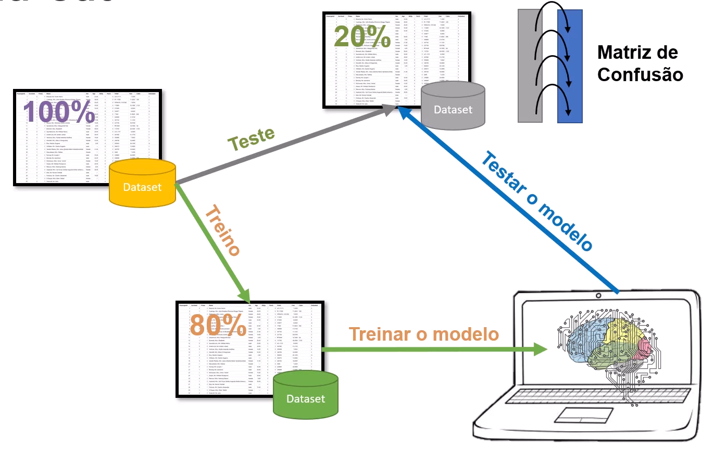

#### 📌 O que é?

É a forma mais simples de validação:

#### 👉 Dividir os dados em:
- Treino (ex: 70–80%)
- Teste (ex: 20–30%)

#### 🔹 Como funciona?
1. Treina o modelo com o conjunto de treino
1. Testa no conjunto de teste
1. Avalia o desempenho

### 🔁 Validação Cruzada (Cross-Validation)

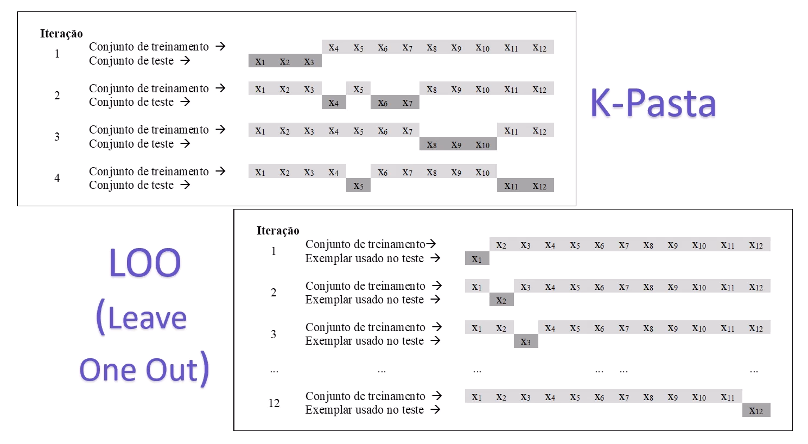

#### 📌 O que é?

Divide os dados em várias partes e **treina/testa várias vezes**

#### 🔹 K-Fold (mais comum)
1. Divide os dados em K partes (folds)
2. Treina K vezes:
    - Usa K-1 partes para treino
    - Usa 1 parte para teste

#### 📊 Exemplo (K = 5)
```bash
Fold 1 → teste | resto treino
Fold 2 → teste | resto treino
...
Fold 5 → teste | resto treino
```
👉 No final, faz a **média dos resultados**

#### ✅ Vantagens
- Mais confiável
- Usa melhor os dados
- Reduz viés

#### ⚠️ Desvantagens
- Mais lento
- Mais custo computacional

#### 🤖 Quando usar?
- **Poucos dados →** validação cruzada
- **Muitos dados →** hold-out já pode ser suficiente

### 📊 Métricas de Avaliação de Performance de Modelos

São medidas usadas para verificar o quão bom é o desempenho de um modelo.

#### 👉 Respondem:
“O modelo está acertando bem?”

### 🛑 Depende do tipo de problema

### 🔷 1. Regressão (valores contínuos)

#### 📌 MAE (Erro Absoluto Médio)
- Média do erro absoluto
- Fácil de interpretar

#### 📌 MSE (Erro Quadrático Médio)
- Penaliza mais erros grandes
- Sensível a outliers

#### 📌 RMSE
- Raiz do MSE
- Mesma unidade dos dados

#### 📌 R² (Coeficiente de determinação)
- Varia de 0 a 1
- Quanto mais próximo de 1, melhor

### 🔷 2. Classificação
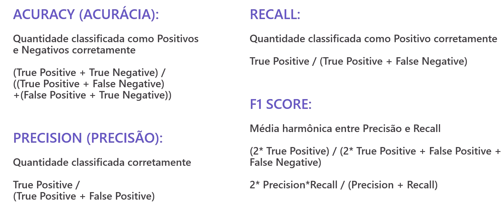

#### 📌 Acurácia
Quantidade classificada como Positivos e Negativos corretamente.
- % de acertos
- Pode enganar em dados desbalanceados
- **Fórmula:** (TP + TN) / ((TP + FN) + (FP + TN))

#### 📌 Precisão (Precision)
Quantidade classificada corretamente
- Dos positivos previstos, quantos são corretos
- **Fórmula:** TP / (TP + FP)

#### 📌 Recall (Sensibilidade)
Quantidade classificada como Positivo corretamente
- Dos positivos reais, quantos foram encontrados
- **Fórmula:** TP / (TP + FN)

#### 📌 F1-Score
Média harmônica entre Precisão e Recall
- Equilíbrio entre precisão e recall
- **Fórmula:** 
    - (2 * TP) / (2 * TP + FP + FN)
    - 2 * Precision * Recall / (Precision + Recall)


#### 📌 Matriz de Confusão
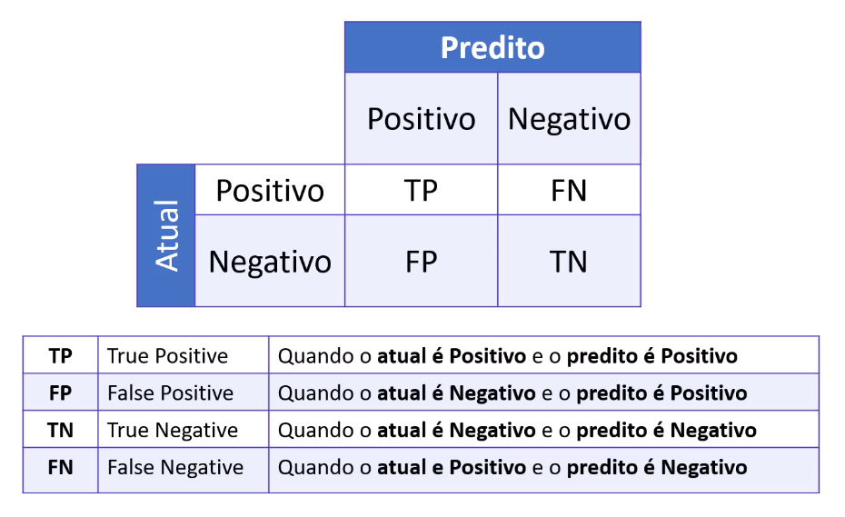


### 🔷 Outras métricas importantes

#### 📌 ROC-AUC
- Mede capacidade de separar classes

#### 📌 Log Loss
- Penaliza previsões erradas com alta confiança


### 🚀 Estatística no Machine Learning
| Etapa ML          | Estatística envolvida  | Técnicas estatísticas utilizadas                                |
| ----------------- | ---------------------- | --------------------------------------------------------------- |
| Exploração (EDA)  | Estatística Descritiva | Média, mediana, desvio padrão, correlação, histogramas, boxplot |
| Pré-processamento | Estatística Descritiva | Normalização, padronização (z-score), tratamento de outliers    |
| Modelagem         | Probabilidade          | Regressão, distribuição normal, Teorema de Bayes                |
| Treinamento       | Inferência Estatística | Estimativa de parâmetros, mínimos quadrados                     |
| Avaliação         | Inferência Estatística | MSE, RMSE, acurácia, precisão, recall                           |
| Validação         | Inferência Estatística | Hold-out, validação cruzada (K-Fold)                            |
| Seleção de modelo | Inferência Estatística | Teste de hipótese, p-valor, comparação de modelos               |


