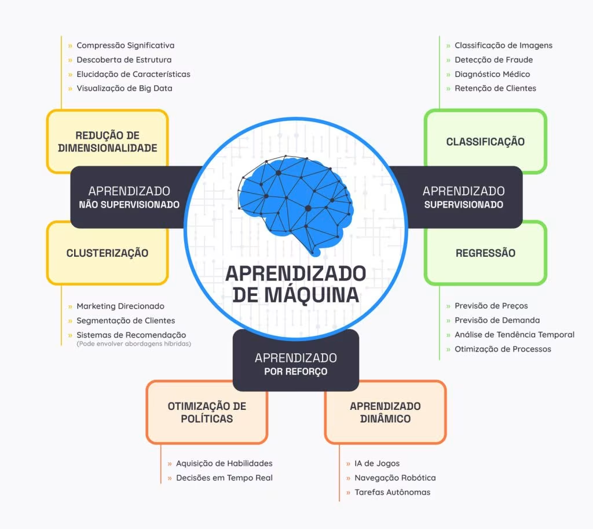
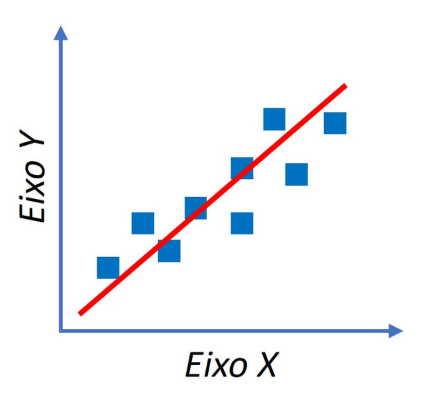
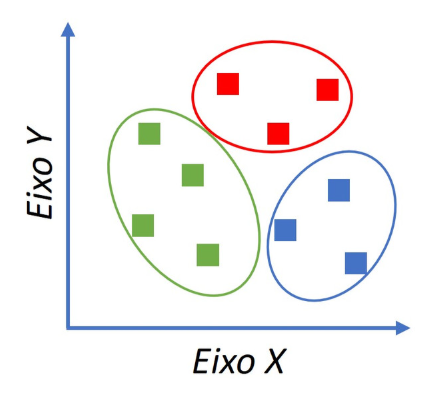
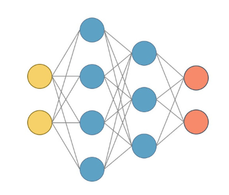
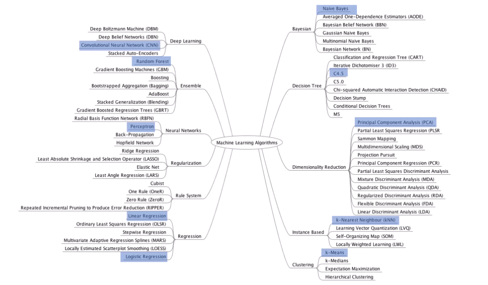
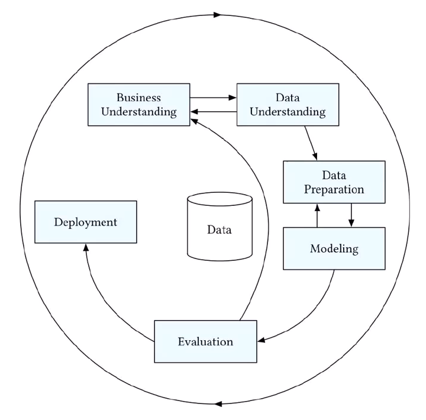
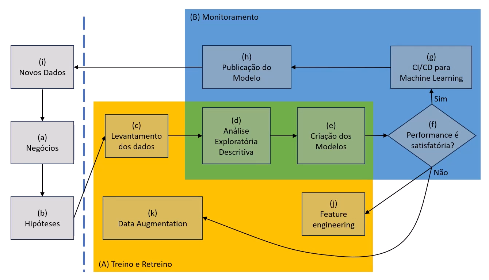

# 🧠 Machine Learning
**Machine Learning (ML)** é uma área da **Inteligência Artificial** que permite que sistemas aprendam padrões a partir de dados e tomem decisões ou façam previsões sem serem explicitamente programados para cada regra. Em vez de regras fixas, você fornece dados + objetivo → o modelo aprende a “função”.

## 📚 Abordagens

### 🕵🏻 1. Aprendizado Supervisionado

Você tem dados rotulados (entrada + resposta correta).

**👉 Objetivo:** aprender a mapear entrada → saída

#### Tipos principais:
- **Classificação →** prever categorias **Ex:** spam vs não spam
- **Regressão →** prever valores contínuos **Ex:** preço de casa

#### Algoritmos comuns:
- Regressão Linear
- Regressão Logística
- Árvores de Decisão
- Random Forest
- Gradient Boosting (XGBoost, LightGBM)
- SVM (Support Vector Machine)
- Redes Neurais

#### 📌 Exemplo prático:
Prever se um cliente vai cancelar **(classificação)** ou prever faturamento **(regressão)**

### 🙈 2. Aprendizado Não Supervisionado
Você tem dados sem rótulos.

**👉 Objetivo:** encontrar padrões escondidos

#### Tipos principais:
- **Clusterização →** agrupar dados similares
- **Detecção de Anomalias →** encontrar comportamentos fora do padrão
- **Redução de Dimensionalidade →** simplificar dados
- **Sistemas de Recomendação** (em parte)

#### Algoritmos comuns:
- K-Means
- DBSCAN
- Hierarchical Clustering
- PCA (Principal Component Analysis)
- Autoencoders

#### 📌 Exemplo:
Segmentação de clientes por comportamento

### 🫣 3. Aprendizado Semi-Supervisionado

#### Mistura de:

- poucos dados rotulados
- muitos dados não rotulados

👉 Muito usado quando rotular dados é caro (ex: imagens médicas)

### 🎰 4. Aprendizado por Reforço (Reinforcement Learning)
Um agente aprende interagindo com o ambiente.

#### 👉 Conceitos-chave:
- Estado
- Ação
- Recompensa

#### Algoritmos comuns:
- Q-Learning
- Deep Q-Network (DQN)
- Policy Gradient
- Actor-Critic

#### 📌 Exemplo:
- Jogos (tipo AlphaGo)
- Robótica
- Sistemas de decisão

### 🤔 Quando usar cada abordagem?
- **Supervisionado →** quando você tem histórico com respostas
- **Não supervisionado →** quando quer descobrir padrões
- **Reforço →** quando há tomada de decisão sequencial
- **Semi-supervisionado →** quando rótulos são escassos

### 💡 Resumão rápido
- **Supervisionado:** aprende com resposta
- **Não supervisionado:** encontra padrões
- **Reforço:** aprende por tentativa e erro
- Algoritmos variam conforme problema

## ⚛ Tipos de Algoritmos (organizado por função)

### 📊 Classificação

#### Prever classes/categorias:
- Logistic Regression
- Decision Tree
- Random Forest
- SVM
- KNN (K-Nearest Neighbors)
- Naive Bayes
- Redes Neurais (MLP, CNN)

### 📈 Regressão

#### Prever valores contínuos:
- Linear Regression
- Ridge / Lasso
- Decision Tree Regressor
- Random Forest Regressor
- Gradient Boosting

### 🧠 Clusterização

#### Agrupar dados:
- K-Means
- DBSCAN
- Hierárquico

### 🚨 Detecção de Anomalias

#### Identificar outliers:
- Isolation Forest
- One-Class SVM
- LOF (Local Outlier Factor)

### 🎯 Sistemas de Recomendação

#### Sugerir itens:
- Filtragem colaborativa
- Filtragem baseada em conteúdo
- Matrix Factorization

#### 📌 Exemplo:
Netflix, Amazon, Spotify

### 🧬 Algoritmos Bio-inspirados

#### Inspirados na natureza:
- Algoritmos Genéticos
- Particle Swarm Optimization
- Ant Colony Optimization

### 🔽 Redução de Dimensionalidade

#### Simplificar dados:
- PCA
- t-SNE
- UMAP

## 🚀 Pipeline típico de Machine Learning
1. Coleta de dados
1. Limpeza e tratamento
1. Feature engineering
1. Treinamento do modelo
1. Avaliação
1. Deploy
1. Monitoramento

## 📋 CRISP-DM

**CR**oss-**I**ndustry **S**tandart **P**rocess for **D**ata **M**ining é um framework de processo que define como conduzir um projeto de dados do início ao fim, focando não só no modelo, mas no valor para o negócio.

#### 👉 A grande sacada:
Machine Learning não começa no algoritmo — começa no problema de negócio

### 🔄 As 6 fases do CRISP-DM

O modelo é cíclico (você volta fases sempre que necessário)

### 📑 1. Entendimento do Negócio (Business Understanding)

Aqui você define o **problema real**

- Qual é o objetivo?
- Qual métrica de sucesso?
- Qual impacto esperado?
- É viavel seguir com o projeto?

#### 📌 Exemplo:
- Reduzir churn em 10%
- Aumentar conversão

👉 **Saída:** problema traduzido para ML

### 📊 2. Entendimento dos Dados (Data Understanding)

Exploração inicial dos dados
- **Coleta de dados**
    - Identificar fontes de dados relevantes para projeto
    - Fontes: (banco de dados, arquivos, APIs, etc.)
- **Exploração de dados**
    - Visualizar os dados usando gráficos (histogramas, gráficos de disperção, etc.)
    - Identificar tendências, padrões e anomalias
    - Calcular estatísticas descritivas (média, desvio padrão, quartis, etc.)
    - Realizar análizes preliminares pra entender a distribuição dos valores.
- **Qualidade de dados**
    - Identificar valores ausentes (nulos) e decidir tratá-los
    - Verificar a consistência dos dados (Ex: valores fazem sentido?)
    - Avaliar a integridade dos dados (se não há duplicatas ou registros inconsistentes)

👉 Aqui você começa a **“sentir”** os dados

### 🧹 3. Preparação dos Dados (Data Preparation)

Geralmente a fase mais demorada 😅

- **Seleção de dados**
    - Determine quais conjuntos de dados serão usados no projeto
    - Documente as razões para inclusão ou exclusão de cada conjunto  
- **Limpeza dos dados**
    - Essa é geralmente a tarefa mais extensa. Sem uma limpeza adequada, você corre o risco de obter resultados imprecisos.
    - Corrije, adicione ou remova valores errados.
    - Lide com dados ausentes de maneira apropriada.
- **Transformação dos dados**
    - Crie novos atributos relevantes a partir dos dados existentes
    - Por Exemplo, crie um índice de massa corporal (IMC) a partir dos campos altura e peso. Crie o valor de venda a partir de preço e frete e assim por diante.
- **Integração de dados**
    - Combine dados de várias fontes, se necessário.
    - Crie novos conjuntos de dados integrando informações relevantes.
- **Divisão dos dados**
    - Separe dados em conjuntos de treinamento, teste e validação
    - Isso é essencial para avaliar o desempenho do modelo

👉 **Resultado:** dataset pronto para modelagem

### 🤖 4. Modelagem (Modeling)

Aplicação dos algoritmos
- **Técnicas de Modelagem**
    - Selecione os algoritmos ou técnicas de modelagem apropriados para o seu problema.
    - Considere fatores como a natureza dos dados, os objetivos do projeto e recursos disponíveis.
- **Treinamento e ajuste**
    - Use os dados preparados para treinar e validar os modelos.
    - Ajuste os hiperparâmetros dos modelos para otimizar o desempenho.
- **Avaliação de performance**
    - Avalie eficácia dos modelos usando métricas relevantes (Ex: acurácia, precisão, recall, etc.)
    - Utilize técnicas como validação cruzada para evitar overfiting.
- **Escolha do modelo vencedor**
    - Com base nos resultados da avaliação, escolha o modelo que melhor atende aos critérios de sucesso.
    - Documente as razões para a escoolha do modelo.
- **Preparação para implantação**
    - Prepare o modelo para implantação em produção.
    - Isso pode envolver a conversão do modelo para um formato específico ou a integração com sistemas existentes.

#### 📌 Resumo:
- Escolhas dos algoritmos
- Treinamento
- Ajuste de hiperparâmetros
- Escolha do modelo vencedor

#### 📌 Exemplo:
- Regressão
- Random Forest
- Redes neurais

### 📈 5. Avaliação (Evaluation)

Verificar se o modelo resolve o problema de negócio
- **Avaliação dos resultados**
    - Nesta etapa, avaliamos a precisão e a eficácia do modelo.
    - Verificar se o modelo atende aos objetivos de negócios estabelecidos.
    - Identificar possíveis deficiências e áreas de melhoria.
- **Métricas de avaliação**
    - Utilize métricas relevantes para medir o desempenho do modelo.
    - Exemplos incluem acurácia, precisão, recall, F1-score, etc.
- **Validação cruzada**
    - Evitar overfitting avaliando o modelo com dados não utilizados anteriormente.
    - Dividir o conjunto de dados em treinamento, teste e validação.
- **Seleção do modelo final**
    - Com base na avaliação de negócio, escolhemos o modelo mais adequado.
    - Documentar as razões para a escolha.

**👉 Aqui muita gente erra:**
não basta “boa acurácia”, precisa gerar valor

### 🚀 6. Deploy (Deployment)

Colocar o modelo em produção
- **Planejamento da implantação**
     - Nesta etapa, você define o modelo que será implantado em produção.
     - Planeje a integração do modelo com sistemas existentes e considere questões de escalabilidade.
- **Escolhas de formatos de serialização**
    - **Formatos nativos:** pickle (.pkl), joblib (.joblib)
    - **ONNX (Open Neural Network Exchange):** Permite rodar em várias linguagens (python, C#, Java, C++)
    - **PMML:** Baseado em XML
    - **SavedModel (TensorFlow):** Formato padrão do TensorFlow
    - **TorchScript (PyTorch):** Permite rodar fora do python
    - **HDF5 (.h5):** Muito usado em keras
- **Escolhas de formas de publicação (servir o modelo)**
    - API REST
    - gRPC
    - **Batch (processamento em lote):** Executa previsões em massa
    - **Streaming:** Processamento em tempo real
    - **Embedded (embarcado):** Modelo roda dentro da aplicação
- **Implantação do modelo**
    - Publicar em algum destino que permita a área de negócios utilizar a predição.
- **Monitoramento e manutenção**
    - Após a implantação, monitore o desempenho do modelo em tempo real.
    - Faça ajustes conforme necessário para garantir que o modelo continue a atender aos objetivos.
- **Relatório final**
    - Documente os resultados, metodologia e conclusões do projeto.
    - Isso é importante para compartilhar insights com as partes interessadas.
- **Revisão do projeto**
    - Avalie o projeto como um todo.
    - Identifique lições aprendidas e áreas de melhoria para futuros projetos.

#### CRISP-DM

#### 👉 Modelo útil = modelo em produção