# 🧠 Machine Learning
**Machine Learning (ML)** é uma área da **Inteligência Artificial** que permite que sistemas aprendam padrões a partir de dados e tomem decisões ou façam previsões sem serem explicitamente programados para cada regra.

## 📚 Abordagens
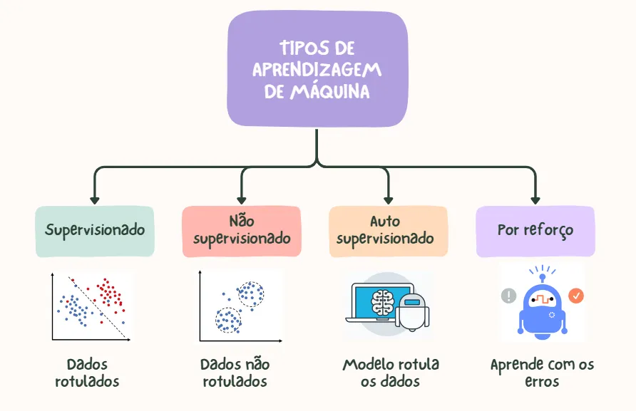

### 🕵🏻 1. Aprendizado Supervisionado

Você tem dados rotulados (entrada + resposta correta).

**👉 Objetivo:** aprender a mapear entrada → saída


#### Tipos principais:
- **Classificação →** prever categorias **Ex:** spam vs não spam
- **Regressão →** prever valores contínuos **Ex:** preço de casa

#### Algoritmos comuns:
- Regressão Linear
- Regressão Logística
- Árvores de Decisão
- Random Forest
- Gradient Boosting (XGBoost, LightGBM)
- SVM (Support Vector Machine)
- Redes Neurais

#### 📌 Exemplo prático:
Prever se um cliente vai cancelar **(classificação)** ou prever faturamento **(regressão)**

### 🙈 2. Aprendizado Não Supervisionado
Você tem dados sem rótulos.

**👉 Objetivo:** encontrar padrões escondidos


#### Tipos principais:
- **Clusterização →** agrupar dados similares
- **Redução de Dimensionalidade →** simplificar dados
- **Detecção de Anomalias →** encontrar comportamentos fora do padrão
- **Sistemas de Recomendação** (em parte)

#### Algoritmos comuns:
- K-Means
- DBSCAN
- Hierarchical Clustering
- PCA (Principal Component Analysis)
- Autoencoders

#### 📌 Exemplo:
Segmentação de clientes por comportamento


### 🫣 3. Aprendizado Semi-Supervisionado

#### Mistura de:

- poucos dados rotulados
- muitos dados não rotulados

👉 Muito usado quando rotular dados é caro (ex: imagens médicas)

### 🎰 4. Aprendizado por Reforço (Reinforcement Learning)
Um agente aprende interagindo com o ambiente.


#### 👉 Conceitos-chave:
- Estado
- Ação
- Recompensa

#### Algoritmos comuns:
- Q-Learning
- Deep Q-Network (DQN)
- Policy Gradient
- Actor-Critic

#### 📌 Exemplo:
- Jogos (tipo AlphaGo)
- Robótica
- Sistemas de decisão

### 🤔 Quando usar cada abordagem?
- **Supervisionado →** quando você tem histórico com respostas
- **Não supervisionado →** quando quer descobrir padrões
- **Reforço →** quando há tomada de decisão sequencial
- **Semi-supervisionado →** quando rótulos são escassos

### 💡 Resumão rápido
- **Supervisionado:** aprende com resposta
- **Não supervisionado:** encontra padrões
- **Reforço:** aprende por tentativa e erro
- Algoritmos variam conforme problema

## ⚛ Tipos de Algoritmos


### 🧠 Modelo vs Algoritmo
Um **algoritmo de aprendizado de máquina** é o **procedimento e a lógica matemática** pelos quais uma "máquina" ou "modelo" (um sistema de IA) aprende a **identificar padrões** em dados de treinamento e a aplicar esse reconhecimento de padrões para fazer previsões precisas sobre novos dados, ou seja, um **modelo de IA** é qualquer programa que **recebe dados de entrada** e gera uma **previsão ou decisão sem maior intervenção humana**.

#### 🔷 Algoritmo

É o **método ou conjunto de regras** usado para aprender com os dados.

#### 📌  Ex:
- Regressão Linear
- Random Forest
- K-Means

#### 🔷 Modelo

É o **resultado do treinamento do algoritmo com dados.**

#### 📌 Ou seja:
- o **modelo** é o **algoritmo “treinado”**

#### 🛑 Exemplo prático
#### 🏠 Prever preço de casa
- **Algoritmo →** Regressão Linear
- **Modelo →** equação aprendida com os dados

```bash
Preço = 2.000 * tamanho + 50.000
Modelo = Algoritmo + Dados
```
👉 Essa equação é o modelo

### 📈 Regressão

#### Prever valores contínuos:
1. Linear Regression
1. Ridge / Lasso
1. Decision Tree Regressor
1. Random Forest Regressor
1. Gradient Boosting

### 📉 1. Linear Regression (Regressão Linear)

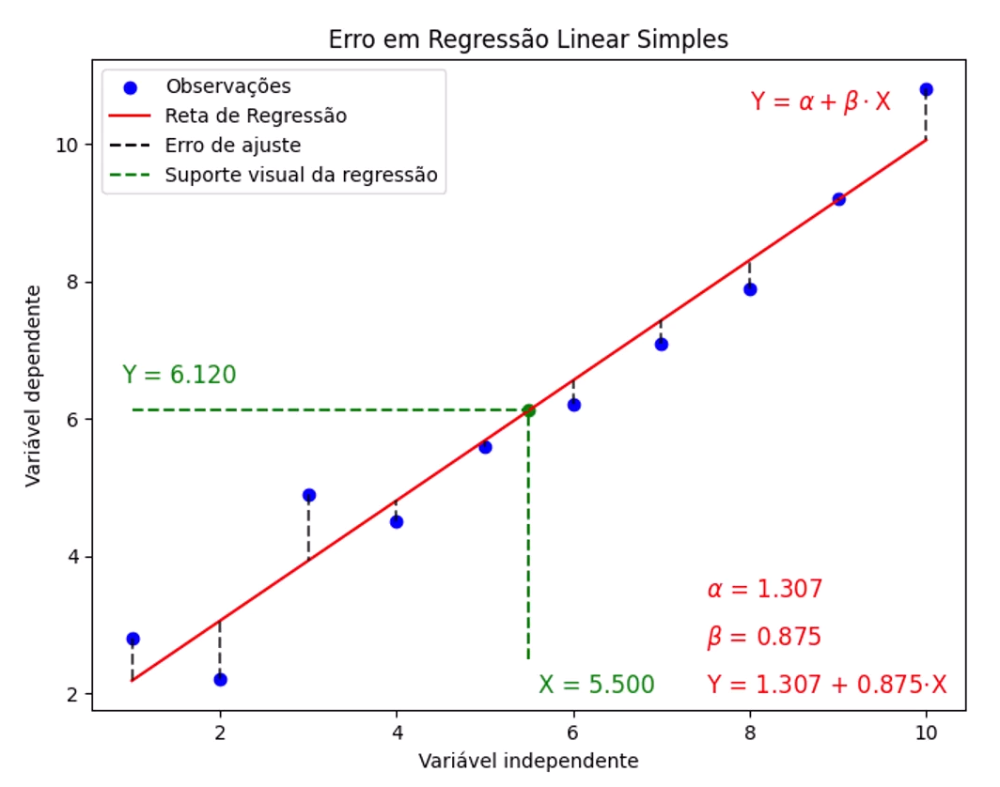

#### 🧠 O que faz?
Modela uma relação linear entre entrada e saída.

#### 🤔 Quando usar:
Quando a relação é **simples e aproximadamente linear**

#### 💼 Use cases:
- 🏠 Previsão de preço de imóveis
- 💰 Estimar salário com base em experiência
- 📈 Previsão de vendas com base em investimento em marketing

#### 👉 Por que usar? 
- Simples
- Fácil de interpretar

#### 📌 Equação 
```bash
Y = α + β * X
Y = α (alfa) + β (beta) * X (variável independente)
```

#### Equações dos Coeficientes (alpha e beta):
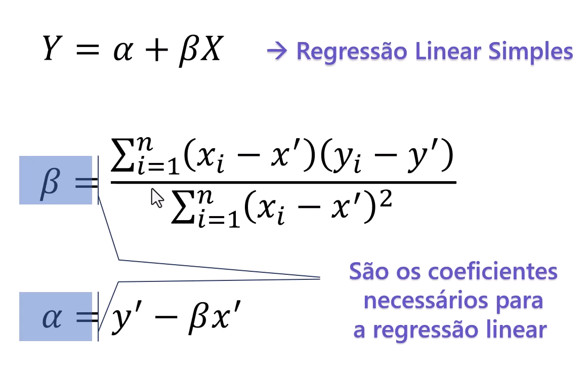

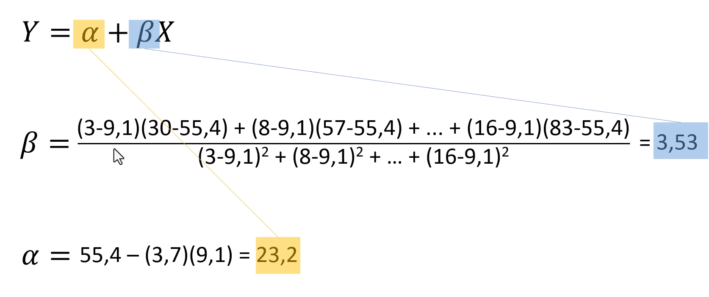

#### ⚙️ Como funciona?
1. **Correlação** entre as variáveis
1. **Inclinação** da linha de regressão
1. Ponto de **interceptação** da linha de regressão quando o X for 0
1. Calcula o **valor predito**

#### 💡 Ideia Principal:
👉 “Qual a melhor linha que passa pelos pontos?”

### 🧊 2. Ridge e Lasso (Regularização)
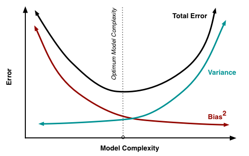

#### 🧠 O que faz?
São variações da regressão linear que evitam **overfitting**.

#### 🤔 Quando usar:
Quando há **muitas variáveis** ou risco de overfitting

#### 💼 Use cases:
- 📊 Modelos com muitas features (ex: dados financeiros)
- 🧬 Bioinformática (muitas variáveis, poucos dados)
- 📈 Marketing → identificar quais variáveis impactam vendas

#### 👉 Diferencial:
- **Ridge →** estabiliza o modelo
- **Lasso →** seleciona variáveis importantes

#### 🔹 Ridge (L2)
#### 📌 Equação (função de custo)
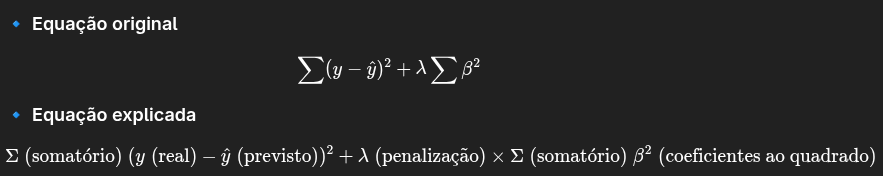

#### ⚙️ Como funciona?
- Penaliza coeficientes grandes
- Mantém todas as variáveis, mas reduz impacto

#### 🔹 Lasso (L1)

#### 📌 Equação
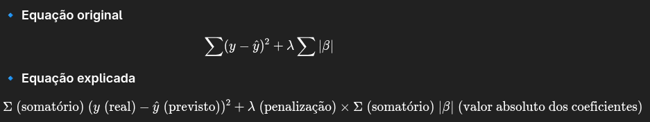

#### ⚙️ Como funciona?
- Pode zerar coeficientes \
👉 Faz seleção de variáveis

#### 💡 Ideia Principal:
| Modelo | Comportamento          |
| ------ | ---------------------- |
| Ridge  | “encolhe” coeficientes |
| Lasso  | elimina variáveis      |

### 🌳 3. Decision Tree Regressor
É um modelo de aprendizado supervisionado que faz previsões segmentando os dados em divisões hierárquicas baseadas em **regras de decisão**.

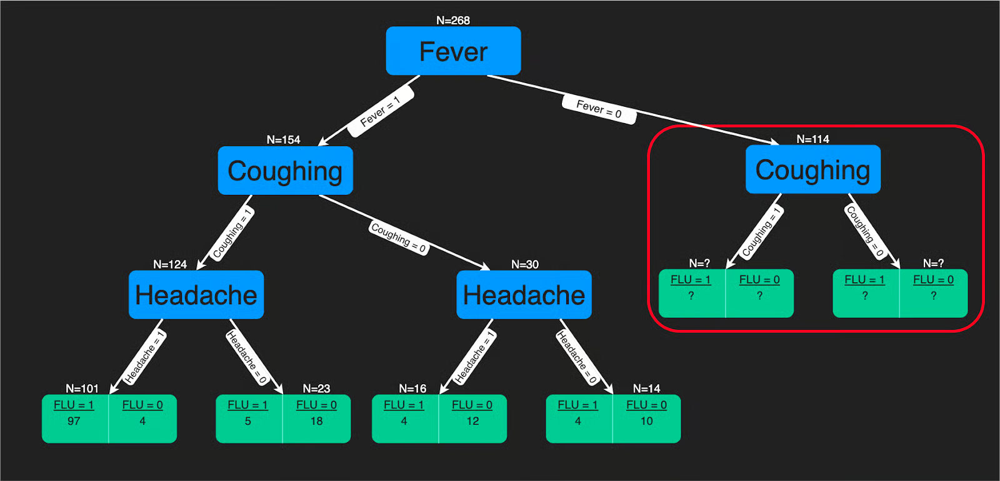

#### 🧠 O que faz?
Divide os dados em regiões e faz **previsões por média**.

#### 🤔 Quando usar:
Quando há **relações não lineares e regras claras**

#### 💼 Use cases:
- 🏦 **Crédito →** estimar limite com base em perfil
- 🛒 **E-commerce →** prever valor de compra por perfil
- 🏥 **Saúde →** estimar risco com base em condições

#### 👉 Por que usar?
- Fácil de explicar (regras)
- Funciona bem com dados complexos

#### ⚙️ Como funciona?

-  Cria divisões (splits):
```bash
se idade < 30 → grupo A
senão → grupo B
```
-  Em cada folha: \
👉 previsão = média dos valores

#### 📌 Equação
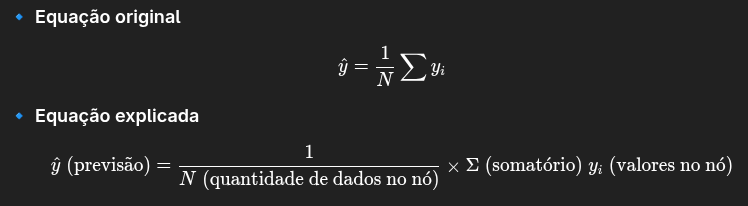

####  📌 Critério
Minimiza erro dentro dos grupos (variância)

#### 💡 Ideia Principal:
👉 “quebra os dados em pedaços mais homogêneos”

### 🌲 4. Random Forest Regressor

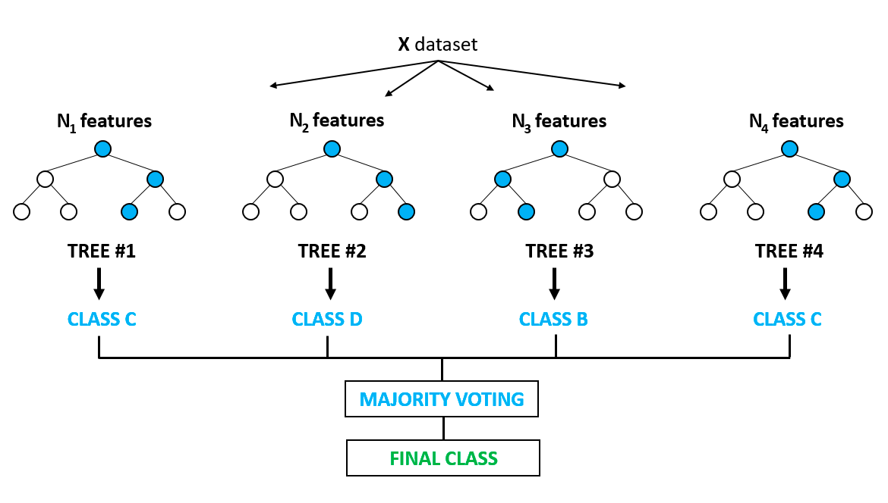

#### 🧠 O que faz?
Combina várias árvores de decisão.

#### 🤔 Quando usar:
Quando precisa de mais precisão e robustez

#### 💼 Use cases:
- 📦 Previsão de demanda de produtos
- 🚗 Preço de carros usados
- 🏭 Previsão de falhas em máquinas (manutenção preditiva)

#### 👉 Por que usar?
- Reduz overfitting
- Mais estável que uma árvore só

#### ⚙️ Como funciona?
1. Cria várias árvores (com dados aleatórios)
1. Cada árvore faz uma previsão
1. Resultado final = média das previsões

#### 📌 Equação
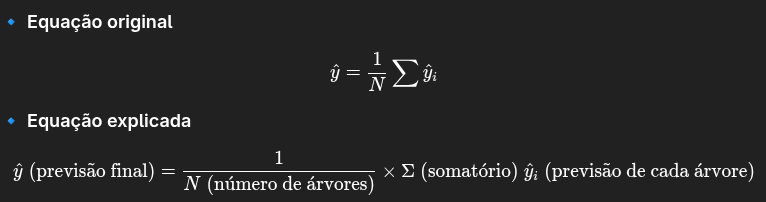

#### 💡 Ideia Principal:
👉 “muitas opiniões → resposta mais estável”

### 🚀 5. Gradient Boosting
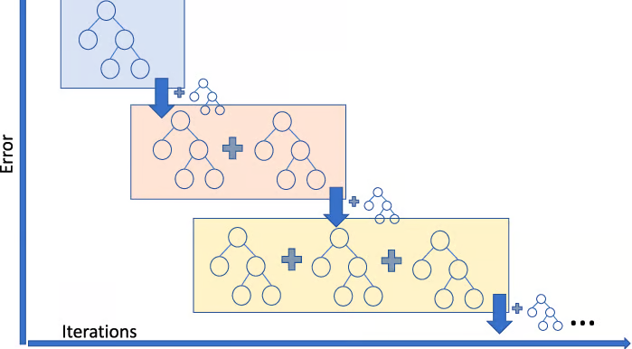

#### 🧠 O que faz?
Cria modelos sequenciais, onde cada um corrige o erro do anterior.

#### 🤔 Quando usar:
Quando precisa de alta performance e precisão

#### 💼 Use cases:
- 💳 Detecção de fraude (valor esperado)
- 📈 Previsão de churn (valor de cliente)
- 🏆 Competições (Kaggle)
- 🛍️ Sistemas de recomendação

#### 👉 Por que usar?
- Excelente desempenho
- Captura padrões complexos

#### ⚙️ Como funciona?
1. Primeiro modelo faz previsão
1. Calcula o erro (resíduo)
1. Próximo modelo aprende o erro
1. Soma as previsões

#### 📌 Equação
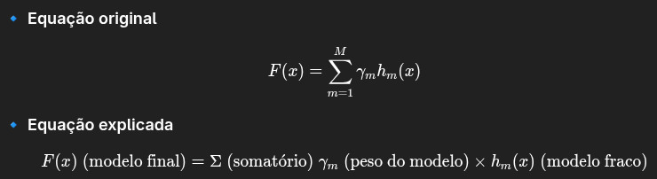

#### 💡 Ideia Principal:
👉 “cada modelo aprende com os erros do anterior”

### ⚖️ Comparação geral
| Modelo            | Tipo                | Ponto forte         |
| ----------------- | ------------------- | ------------------- |
| Linear            | Simples             | Interpretável       |
| Ridge/Lasso       | Linear regularizado | Evita overfitting   |
| Decision Tree     | Não linear          | Fácil interpretação |
| Random Forest     | Ensemble            | Estável             |
| Gradient Boosting | Ensemble sequencial | Alta performance    |

### π Simbolos das Equações
- **Σ (sigma) →** soma tudo
- **λ (lambda) →** controla penalização
- **β (beta) →** peso das variáveis
- **ŷ (y chapéu) →** previsão
- **N →** quantidade (dados ou modelos)
- **γ (gama) →** peso no boosting
- **h(x) →** modelo base

### 📊 Classificação

#### Prever classes/categorias:
1. Logistic Regression
1. Decision Tree
1. Random Forest
1. SVM
1. KNN (K-Nearest Neighbors)
1. Naive Bayes
1. Redes Neurais (MLP, CNN)

### 📈 1. Logistic Regression (Regressão Logística)
A **regressão logística** é um modelo estatístico usado para **classificação binária**, onde a saída é uma probabilidade associada a uma das duas classes.

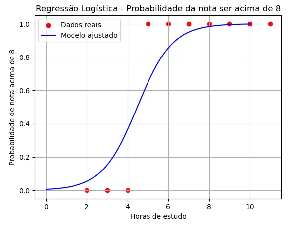

#### 🧠 O que faz?
Modela a probabilidade de uma classe usando uma função logística (sigmoid).

#### 🤔 Quando usar:
Quando o problema é linear e interpretável

#### 💼 Use cases:
- 📧 Detecção de spam
- 💳 Aprovação de crédito
- 🏥 Diagnóstico (doença: sim/não)

#### 👉 Por que usar?
- Simples e rápido
- Interpretável
- Base forte estatística

#### ⚙️ Como funciona?
1. Combina variáveis linearmente
1. Aplica função sigmoid
1. Retorna probabilidade (0 a 1)

#### 📌 Equação
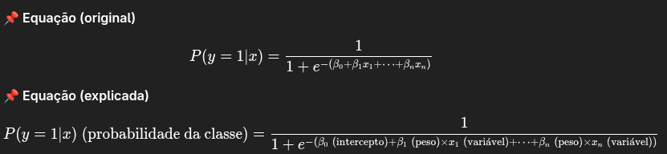

#### 💡 Ideia Principal:
👉 “transforma uma reta (soma linear) em probabilidade”

### 🌳 2. Decision Tree Classifier
Uma árvore de decisão para classificação divide os dados em regras até chegar a uma decisão final (classe).

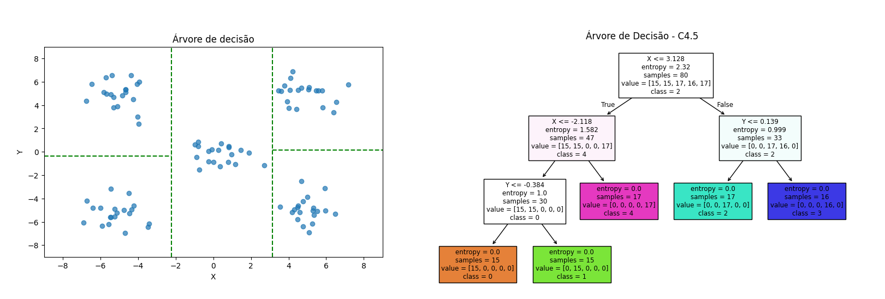

#### 🧠 O que faz?
Cria regras para separar os dados em classes, utilizando o algoritmo C4.5 que faz a representações dos elementos em formato de grafos.

#### 🤔 Quando usar:
Quando precisa de um modelo interpretável e baseado em regras

#### 💼 Use cases:
- 💳 Aprovação de crédito
- 🏥 Diagnóstico médico
- 🛒 Classificação de clientes

#### 👉 Por que usar?
- Fácil de interpretar
- Funciona bem com dados não lineares
- Não precisa de normalização

#### ⚙️ Como funciona?
1. Escolhe a melhor variável para dividir os dados
1. Cria regras (ex: idade < 30)
1. Repete até chegar em folhas
1. A folha define a classe

#### 📌 Equação
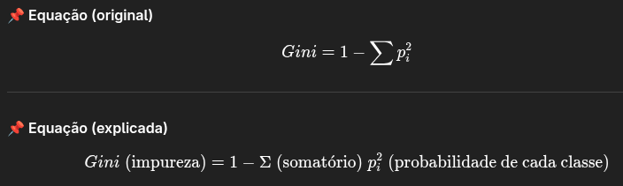

#### 💡 Ideia Principal:
👉 “divide os dados até cada grupo ficar o mais puro possível”

### 🌲 3. Random Forest Classifier
Random Forest é um conjunto de várias árvores de decisão que trabalham juntas para melhorar a precisão.


#### 🧠 O que faz?
Combina várias árvores para tomar uma decisão final.

#### 🤔 Quando usar:
Quando precisa de mais precisão e reduzir overfitting

#### 💼 Use cases:
- 🚨 Detecção de fraude
- 📧 Classificação de spam
- 🧑‍🤝‍🧑 Segmentação de clientes

#### 👉 Por que usar?
- Reduz overfitting
- Mais robusto que uma árvore só
- Boa performance geral

#### ⚙️ Como funciona?
1. Cria várias árvores com dados aleatórios
1. Cada árvore faz uma previsão
1. Resultado final = votação da maioria

#### 📌 Equação
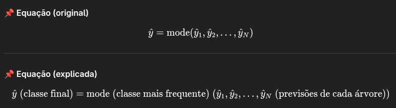

#### 💡 Ideia Principal:
👉 “várias árvores votam e vence a maioria”

### 📏 4. SVM (Support Vector Machine)
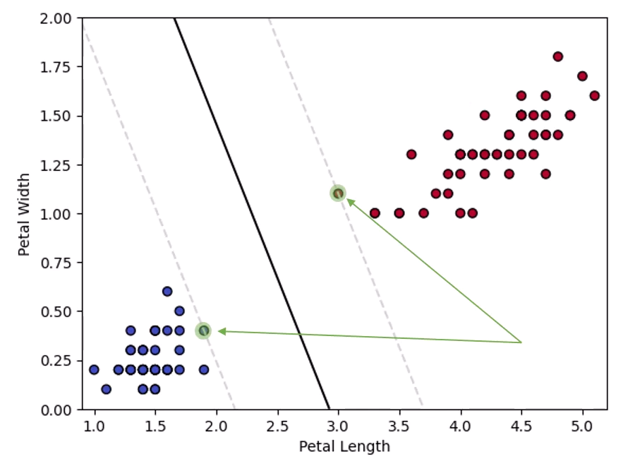

#### 🧠 O que faz?
Encontra a melhor fronteira que separa as classes.

#### 🤔 Quando usar:
Quando os dados são **separáveis (linear ou não)**

#### ⚙️ Truque do Kernel
Um **Kernel**,  em aprendizagem de máquina, é um modelo matemático que permite calcular a distância entre dois pontos x e y, num espaço diferente do espaço original.

#### ⚫ Tipos de Kernel
- **Kernel Linear:** não introduz nenhuma deformação no espaço, simplesmente trabalha no espaço original procurando o separador linear.
- **Kernel Polinomial:** equivalente a criar novas features a partir de polinômios que usam as features originais.
- **Kernel Gaussiano ou Raial (ou RBF: radial basis function):** baseado na distribuição normal, permite controlar a velocidade de variação da fronteira separadora.

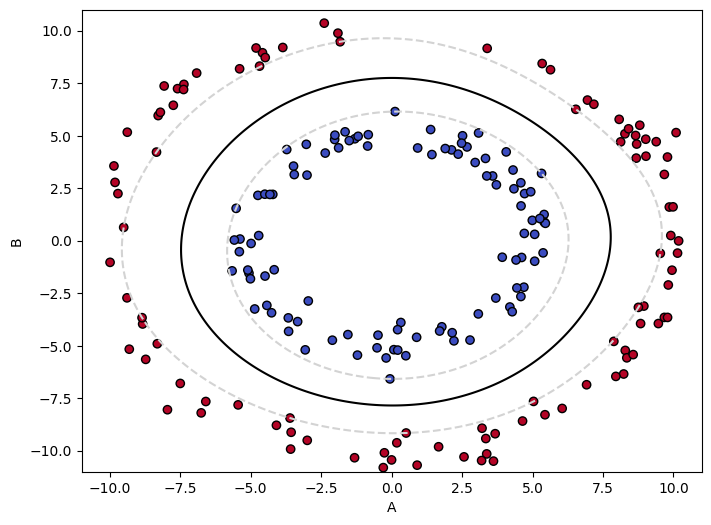

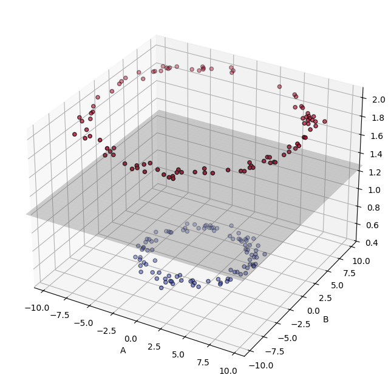

#### 💼 Use cases:
- 🧬 Classificação genética
- 🖼️ Reconhecimento de imagem
- 📄 Classificação de textos

#### 👉 Por que usar?
- Funciona bem em alta dimensão
- Pode usar kernels (não linear)

#### ⚙️ Como funciona?
1. Encontra uma linha/hiperplano separador
1. Maximiza a margem entre classes
1. Usa pontos críticos (support vectors)

#### 📌 Equação
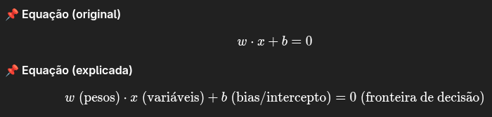

#### 💡 Ideia Principal:
👉 “separa as classes com a maior margem possível”

### 👥 5. KNN (K-Nearest Neighbors)
Esse é um processo baseado em instâncias, **não propriamente tem aprendizado** no resultado implementado.

A cada nova classificação que se deseja realizar, é necessário medir/calcular a distância desta nova observação com o resto do conjunto de dados utilizados no treino.

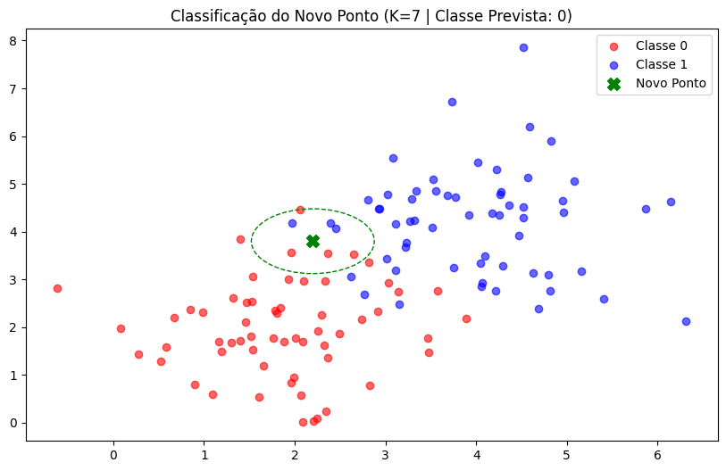

#### 🧠 O que faz?
Classifica baseado nos **vizinhos mais próximos**

#### 🤔 Quando usar:
Quando os dados têm padrões locais

#### 💼 Use cases:
- 🛒 Recomendação simples
- 🧑‍🤝‍🧑 Segmentação de clientes
- 🖼️ Classificação de imagens simples

#### 👉 Por que usar?
- Simples
- Não precisa de treino
- Fácil de entender

#### ⚙️ Como funciona?
1. Calcula distância entre pontos
1. Seleciona os K mais próximos
1. Classe final = maioria

#### 📌 Equação
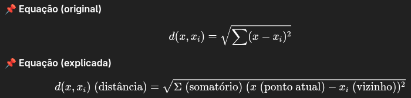

#### 💡 Ideia Principal:
👉 “diga-me quem são seus vizinhos que direi quem você é”

### 📊 6. Naive Bayes
É um algoritmo de classificação baseado no **Teorema de Bayes**, que assume que as variáveis são independentes **entre si** (“naive” = ingênuo).


#### 🧠 O que faz?
Usa probabilidade para classificar assumindo independência entre variáveis.

#### 🤔 Quando usar:
Quando os dados são **probabilísticos (ex: texto)**

#### 💼 Use cases:
- 📧 Filtro de spam
- 📰 Classificação de notícias
- 💬 Análise de sentimento

#### 👉 Por que usar?
- Muito rápido
- Funciona bem com texto
- Poucos dados necessários

#### ⚙️ Como funciona?
1. Calcula probabilidade de cada classe
1. Aplica Teorema de Bayes (Assume independência entre as variáveis)
1. Escolhe maior probabilidade

#### 📌 Equação
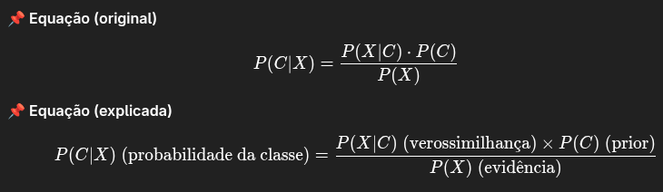

#### 💡 Ideia Principal:
👉 “qual classe é mais provável dado os dados?”

### 🧠 7. Redes Neurais (MLP, CNN)
São modelos inspirados no cérebro humano, formados por **neurônios artificiais** que processam informação em camadas.

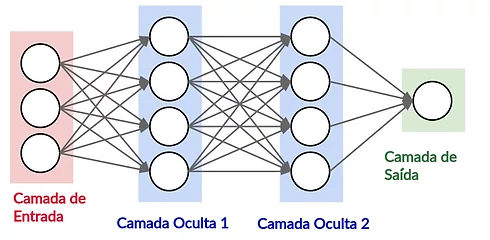

👉 Usadas para aprender padrões complexos em dados (imagem, texto, áudio, etc.)

#### 🧬 Neurônio Biológico
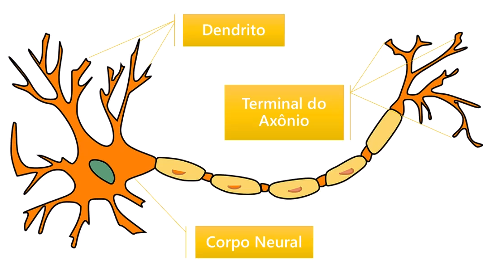

#### 🔩 Neurônio Artificial
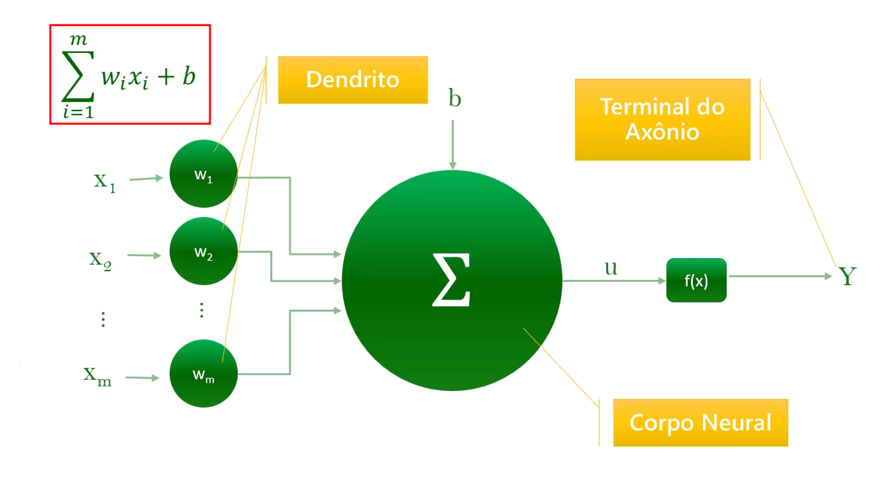

#### ⚛️ Rede Neural Simples VS. Deep Learning
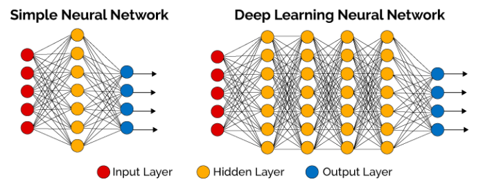

#### 🔷 Conceitos fundamentais
- **Neurônio artificial →** unidade básica de cálculo
- **Peso (w) →** importância de cada entrada
- **Bias (b) →** ajuste fino da saída
- **Função de ativação →** decide se o neurônio “ativa”

#### 🏗️ Arquitetura
Uma rede neural é organizada em camadas:

#### 📌 1. Camada de Entrada
- Recebe os dados (features)

#### 📌 2. Camadas Ocultas (Hidden Layers)
- Onde ocorre o aprendizado
- Podem ter várias camadas (Deep Learning)

#### 📌 3. Camada de Saída
- Retorna a previsão
- número (regressão)
- classe (classificação)

#### 🔧 Componentes principais
#### 🔷 1. Pesos (w)
Controlam a influência de cada entrada

#### 🔷 2. Bias (b)
Permite ajustar a saída independentemente das entradas

#### 🔷 3. Função de ativação

#### Exemplos:
- Sigmoid
- ReLU
- Tanh
- Softmax

👉 Introduz **não linearidade**

#### 🔷 4. Função de perda (Loss)
Mede o erro do modelo

#### Ex:
- MSE (regressão)
- Cross-entropy (classificação)

#### 🔷 5. Otimizador
Ajusta os pesos para reduzir erro

#### Ex:
- Gradient Descent
- Adam

#### ✴️ O que faz?
Aprende padrões complexos usando camadas de neurônios artificiais.

#### 🤔 Quando usar:
Quando há **grande volume de dados e padrões complexos**

#### 💼 Use cases:
- 🖼️ Visão computacional (CNN)
- 🗣️ Reconhecimento de voz
- 🤖 NLP (texto)

#### 👉 Por que usar?
- Alta performance
- Captura relações complexas
- Flexível

#### ⚙️ Como funciona (passo a passo)
#### 1️⃣ Forward Pass
- Dados entram
- Passam pelas camadas
- Geram uma previsão

#### 2️⃣ Cálculo do erro
- Compara previsão vs valor real

#### 3️⃣ Backpropagation
- Calcula como cada peso contribuiu para o erro

#### 4️⃣ Atualização dos pesos
- Ajusta pesos usando gradiente

#### 📌 Equação
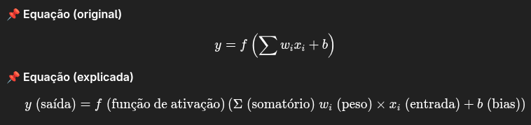

#### 🛑 Tipos de Redes Neurais

#### 🔷 Perceptron
- Redes simples com uma camada de entrada e uma camada de saída

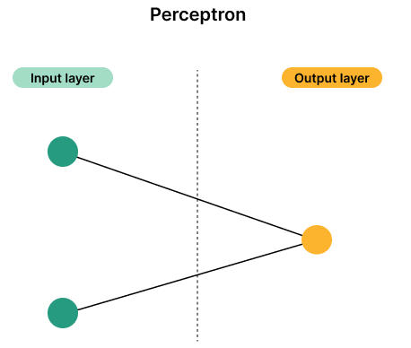

#### 🔷 MLP (Perceptron Multicamadas)
- Dados tabulares, introdução do backpropagation

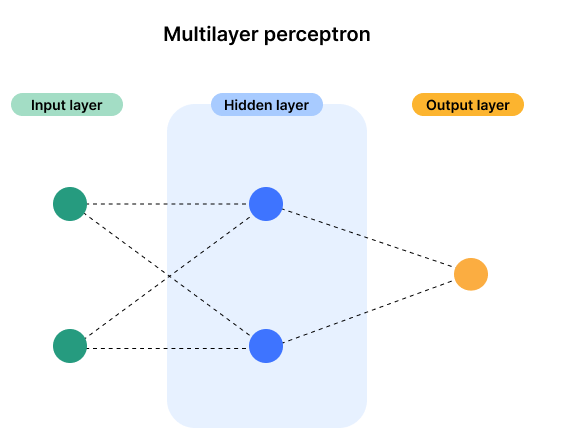

#### 🔷 CNN (Convolutional Neural Network)
- Imagens

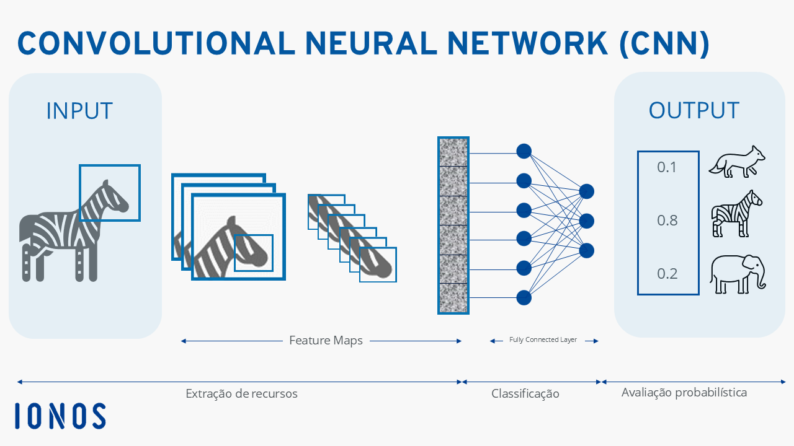

#### 🔷 RNN (Recurrent Neural Network)
- Sequências (texto, séries temporais)

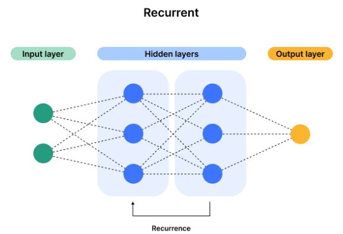

#### 🔷 Transformers
- NLP moderno (ex: ChatGPT)

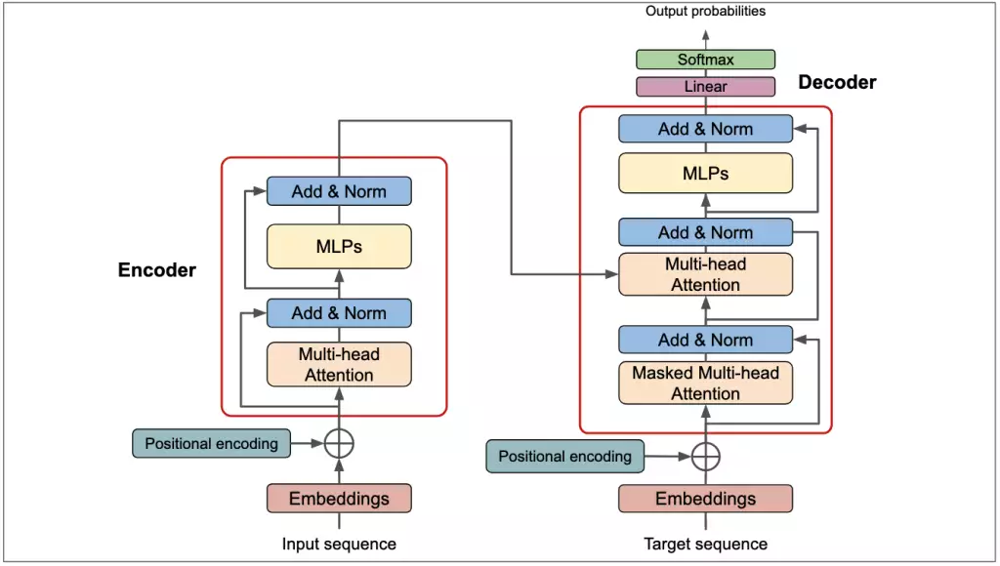

#### 💡 Ideia Principal:
```bash
Entrada → combina sinais → ativa neurônios → passa para próxima camada → saída
```
👉 “aprende padrões como o cérebro, em camadas”

### 🧠 Clusterização
É o processo de **agrupar dados semelhantes entre si**, sem precisar de rótulos.

#### 👉 Objetivo:
colocar itens parecidos no mesmo grupo (cluster)

#### Agrupar dados:
1. K-Means
1. Hierárquico
1. Spectral
1. DBSCAN

### 🔴 Tipos de agrupamentos
- **Hierarquicos:** Criam uma decomposição dos dados, podendo ser aglomerados ou divisórios.
    - **Aglomerativos:** Começam atribuindo um elemento a cada grupo, e sucessivamente se unem a grupos mais próximos até o momento de parada (ponto de corte).
    - **Divisivo:** Começam com todos os elementos fazendo parte de um único grupo, e vão particionando até o momento de parada.
- **Particionais:** A partir dos dados apresentados, serão contruídas "K" partições, sendo que cada partição K, sendo K <= n, interagindo com umm algoritmo de realocação iterativa.

### 🖼️ Representação dos grupos
- **Protótipos:** Corresponde a um ponto (geralemente a media dos valores) de um grupo. Mas pode ser também um ponto existente qualquer dentro do grupo.
- **Hierarquico:** è um caso particular de grafos que representam hierarquias entre os elementos e os grupos.
- **Grafos:** São grupos que possuem  Nós (pontos) e Arestas (ligações) entre si no grupo. Qualquer elemento que esteja interligando, pode representar parte do grupo.

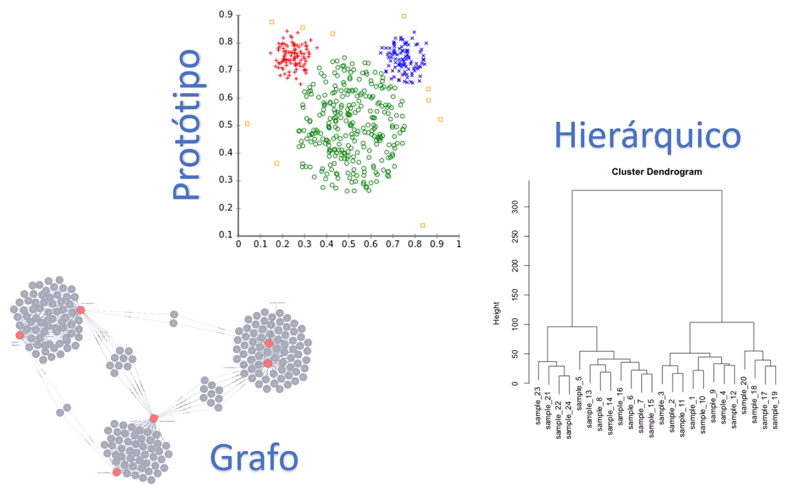

### 👥 1. K-Means
Algoritmo que agrupa os dados em **K clusters** com base na proximidade dos pontos ao centro (centroide).

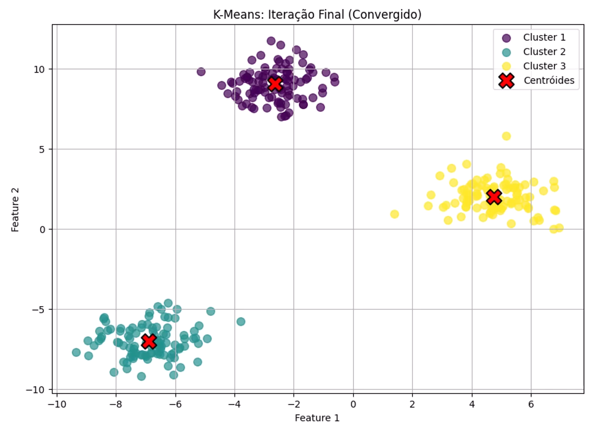

#### 🧠 O que faz?
Divide os dados em K grupos minimizando a distância até o centro do cluster.

#### 🤔 Quando usar:
Quando os dados formam **grupos bem definidos e esféricos**

#### 💼 Use cases:
- 🧑‍🤝‍🧑 **Clientes →** segmentação de perfis
- 🛒 **Marketing →** agrupamento por comportamento
- 🖼️ **Imagem →** compressão

#### 👉 Por que usar?
- Simples e rápido
- Escalável
- Fácil de interpretar

#### ⚙️ Como funciona?
1. Define o número de clusters (K)
1. Inicializa centroides
1. Associa cada ponto ao centro mais próximo
1. Atualiza os centroides
1. Repete até convergir

#### 📌 Equação
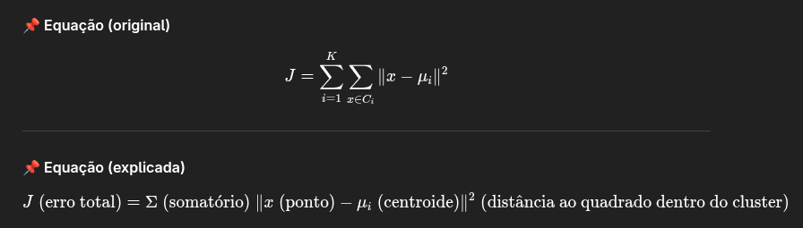

#### 💡 Ideia Principal:
👉 “cada ponto vai para o centro mais próximo”


### 🖧 2. Hierárquico
O **clustering hierárquico** é uma família de algoritmos de agrupamento que constrói uma hierarquia de clusters, também conhecida como **árvore de clusters (dendograma)**.

Uma característica distintiva e vantajosa desses métodos é que eles **não exigem a pré-especificação do número de clusters**, como é o caso do k-means.

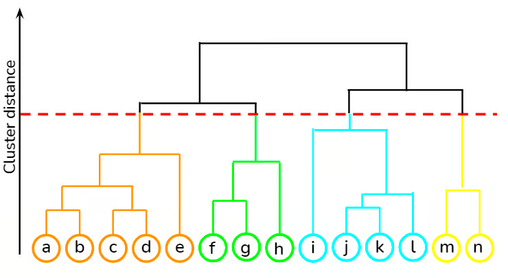

#### 🌳 Dendograma
- No **eixo horizontal (folhas da árvore)**, são representados os pontos de dados individuais.
- O eixo vertical representa a distância ou dissimilaridade na qual os clusters foram **fundidos (aglomerativos)** ou **divididos (divisivo).**
- **Linhas horizontais** no dendograma conectam os clusters que foram **mesclados**, e a altura da linha indica a **distância inter-cluster** no momento da fusão.
- Para obter um número **especifico de clusters**, pode-se **"cortar"** o dendograma com uma linha horizontal.

#### 🔗 Métodos de Linkage
**Linkage (ligação)** nada mais é que **como a distância entre dois clusters é calculada**.

#### Existem quatro métodos clássicos:
- **Single Linkage (vizinho mais próximo):** Define a distância entre dois clusters como a distância entre os dois pontos mais próximos de cada um. Tende a criar clusters alongados, sendo sensível a outliers e ruído. Bom para detectar formas não-convexas.
- **Complete Linkage (vizinho mais distante):** Usa a distância entre os dois pontos mais distantes de cada cluster. Produz clusters mais compactos e de tamanho equilibrado, mas é sensível a outliers no sentido oposto, um ponto extremo pode impedir fusões naturais.
- **Average Linkage (UPGMA):** Calcula a média de todas as distâncias par-a-par entre pontos dos dois clusters. É um meio-termo: menos sensível a extremos, tende a produzir clusters razoavelmente compactos e equilibrados.
- **Ward's Method:** Em vez de distâncias, minimiza o aumento na variância interna (soma dos quadrados) ao fundir dois clusters. Tende a gerar clusters esféricos, de tamanho similar e bem separados. É o mais usado na prática, mas assume clusters convexos.

#### Métodos:
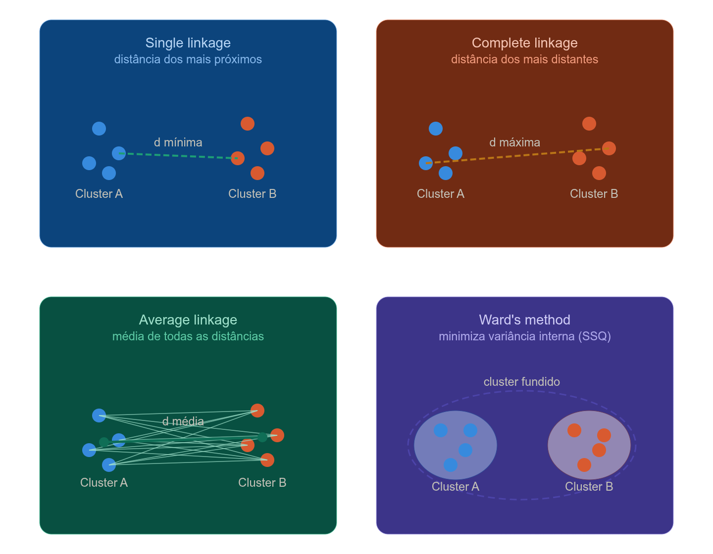

#### Gráficos:
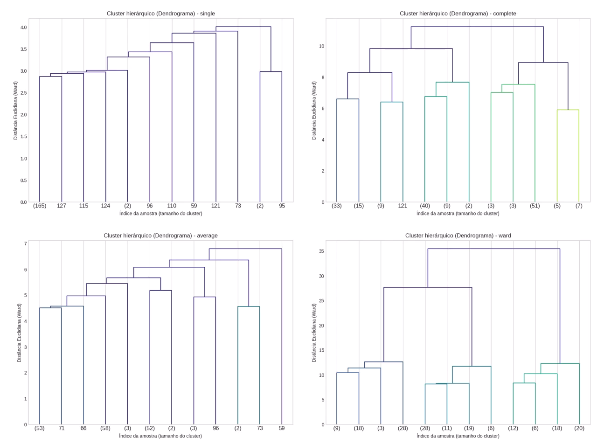

#### 🧠 O que faz?
Agrupa dados formando uma **hierarquia de clusters**

#### 🤔 Quando usar:
Quando você quer entender a **estrutura dos dados em níveis**

#### 💼 Use cases:
- 🧬 **Biologia →** classificação genética
- 🧑‍🤝‍🧑 **Clientes →** segmentação em níveis
- 📊 **Análise exploratória**

#### 👉 Por que usar?
- Não precisa definir K inicialmente
- Fácil de visualizar
- Mostra relações entre grupos

#### ⚙️ Como funciona?
1. Começa com cada ponto como um cluster
1. Junta os mais próximos
1. Repete até formar um único cluster
1. Pode cortar a árvore no nível desejado

#### 📌 Equação
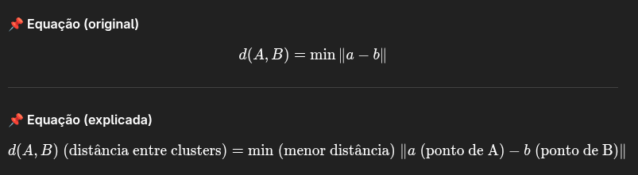

#### 💡 Ideia Principal:
👉 “vai juntando os pontos mais próximos em níveis”

### 🌐 3. Spectral Clustering
Usa **teoria de grafos** para encontrar clusters complexos.

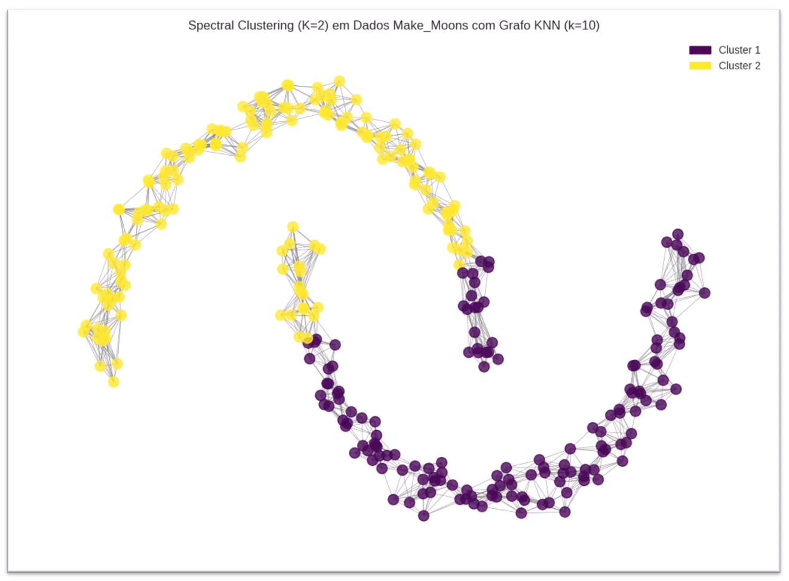

#### 𝄜 Matriz de Afinidade
A **matriz de afinidade** (ou matriz de similaridade) representa o quanto **dois pontos são parecidos entre si**.

👉 Em vez de distância, ela mede **proximidade/similaridade**

A primeira etapa crucial no Spectral Clustering é a construção de um grafo de **similaridade G = (V,E)**, onde:
- **V** é o conjunto de pontos de dados **(vértices)**
- **E** é o conjunto de **arestas**

O **peso** de uma aresta entre os nós representa a **similaridade** entre os pontos de dados (vértices)

#### </> Algoritmos
Existem 3 algoritmos principais para **construir a matriz de afinidade (W)** no Spectral Clustering. Eles definem **quem se conecta com quem e com qual intensidade**. Antes do Spectral funcionar, você precisa de uma **matriz (W)**:
- **ε-neighborhood:** 
    - Conecta pontos que estão dentro de um raio ε (epsilon). 
    - Cria conexões apenas entre pontos próximos dentro de uma distância limite.
- **KNN (K-Nearest Neighbors Graph):** 
    - Conecta cada ponto aos K vizinhos mais próximos. 
    - Garante que cada ponto tenha um número fixo de conexões.
- **Fully Connected:** 
    - Todos os pontos são conectados entre si. 
    - Cria um grafo completo (tudo conectado).
    - Usa uma **função de similaridade**, geralmente com **RBF - Radial Basis Function**

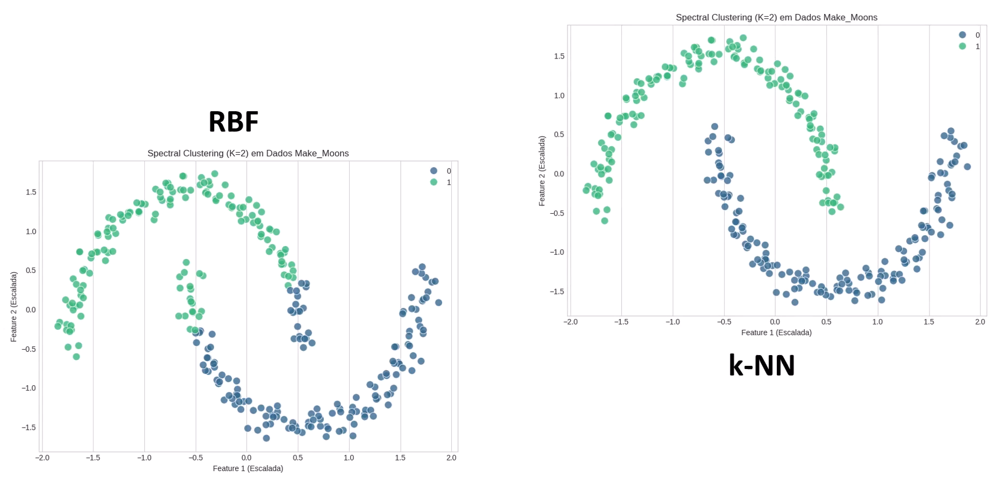

#### 🧠 O que faz?
Agrupa dados usando **relações de conectividade (grafo)**

#### 🤔 Quando usar:
Quando os clusters têm **formas complexas (não esféricas)**

#### 💼 Use cases:
- 🖼️ Visão computacional
- 🌐 Redes sociais
- 📊 Dados com estrutura complexa

#### 👉 Por que usar?
- Captura estruturas não lineares
- Funciona melhor que K-Means em dados complexos

#### ⚙️ Como funciona?
1. Constrói um grafo de similaridade
1. Calcula matriz Laplaciana
1. Reduz dimensionalidade
1. Aplica clustering (ex: K-Means)

#### 📌 Equação
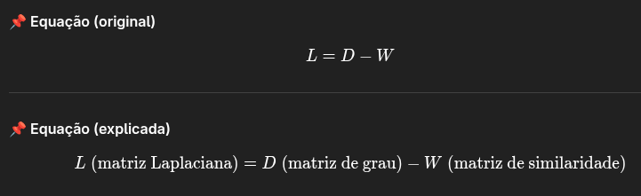

#### 💡 Ideia Principal:
👉 “agrupa pontos que estão conectados, não apenas próximos”

### 🚨 4. DB-SCAN
O **DB-SCAN (Density-Based Spatial Clustering of Applications with Noise)** é um algoritmo de agrupamento proeminente que se baseia na **noção de densidade** dos dados para formar clusters.

Ele agrupa pontos que estão **densamente compactados em uma região do espaço** de features, separados por regiões de menor densidade de pontos.

Pontos em regiões **afastadas** são considerados como **ruído (outliers)**.

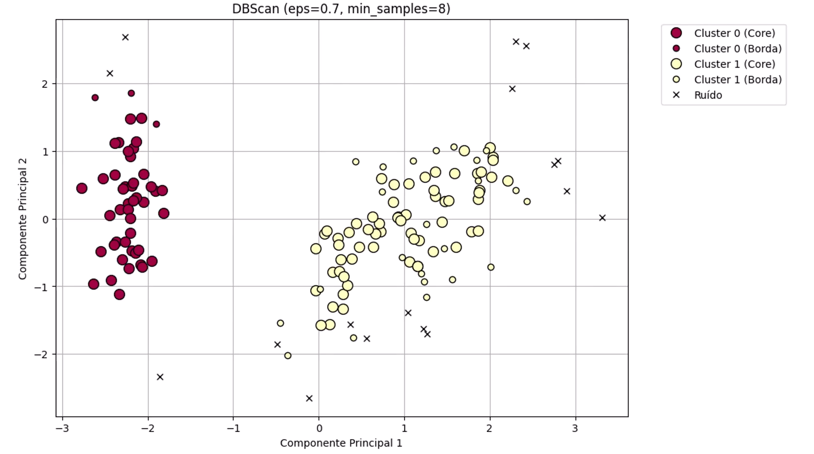

#### ⚙︎ Parâmetros
A Performance do DB-Scan é altamente dependente da escolha adequada de dois parâmetros principais:
- **min_samples (MinPts):** è o **número mínimo de pontos** de dados que devem existir dentro da vizinhança **eps** de um ponto para que esse ponto seja classificado como um **core point**.
- **eps (epsilon):** é um **valor de distância que define o raio** da vizinhança em torno de um ponto de dados. Dois pontos são considerados **vizinhos** se a distância entre eles for **menor ou igual a eps**.

#### 🗃️ Classificação de Categorias de Pontos
O DB-Scan classifica cada ponto de dados em uma das 3 categorias seguintes, com base em 2 parâmetros principais: **eps** e **min_samples**.
- **Core Point (Ponto Central ou Ponto Núcleo):** Um ponto é considerado um core point se houver pelo menos **min_samples** outros pontos (incluindo ele mesmo) dentro de uma distância **eps** dele. Estes são os pontos que estão no interior de um cluster.
- **Border Point (Ponto de Fronteira):** Um ponto é um border point se ele não é um core point (ou seja, tem menos de min_samples pontos sem sua vizinhança **eps**), m,as está dentro da vizinhança **eps** de pelo menos um core point. Pontos de fronteira estão nas bordas dos clusters.
- **Noise Point (Ponto de ruído ou outlier):** Um ponto é um noise point se **não** é nem um **core point** nem um **border point**. Estes são os pontos que não pertencem a nenhum cluster denso.

#### 🧠 O que faz?
Agrupa pontos com base na **densidade de vizinhos**

#### 🤔 Quando usar:
Quando há **ruído ou clusters de formatos variados**

#### 💼 Use cases:
- 🚨 **Fraude →** detecção de anomalias
- 🧑‍🤝‍🧑 **Clientes →** padrões incomuns
- 🌍 **Geolocalização →** regiões densas

#### 👉 Por que usar?
- Detecta outliers automaticamente
- Não precisa definir número de clusters
- Funciona com formatos complexos

#### ⚙️ Como funciona?
1. Define raio (ε) e mínimo de pontos
1. Identifica pontos densos
1. Expande clusters a partir deles
1. Marca pontos isolados como outliers

#### 📌 Equação
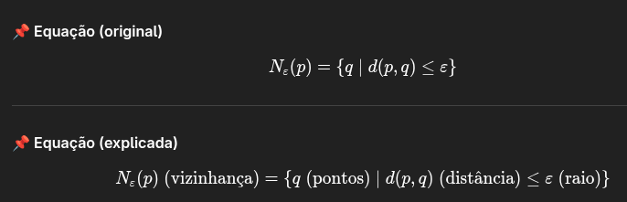

#### 💡 Ideia Principal:
👉 “onde há muita densidade, há um cluster”

### 🔽 Redução de Dimensionalidade
Em muitos problemas de machine learning, os dados podem ser de **alta dimensionalidade**, ou seja, podem possuir um **grande número de features**.

Embora mais fetures possam, teoricamente, fornecer mais informação, datasets com **dimensionalidade excessiva apresentam vários desafios**.

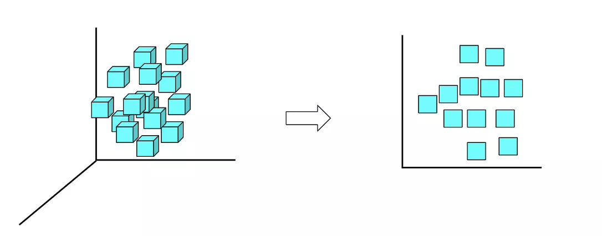

#### Simplificar dados:
- PCA
- t-SNE
- UMAP

### ⛔ 4 Pricipais Problemas 

#### 🛑 Maldição da Dimensionalidade
- A medida que on número de **dimensões aumenta**, o volume do **espaço de features** cresce exponencialmente.
- Isso leva à **esparsidade (afastamento)** dos dados, onde os pontos de dados tornam-se cada vez mais **distantes uns dos outros**, tornando as medidas de **distância** e **densidade** menos significativas.

#### 🛑 Redundância e ruído
- Em datasets de alta dimensão, é comum que muitas features sejam **correlacionadas (redundantes)** ou **irrelevantes (ruído)** para a tarefa de aprendizado.
- Essas features podem **obscurecer** os padrões importantes e levar a modelos mais **complexos** e menos **generalizáveis**.

#### 🛑 Eficiência Computacional e Armazenamento
- Processar e amrmazenar datasets com um grande número de features consome mais **recursos computacionais** (tempo de processamento, memória, latência, etc).
- A redução de dimensionalidade pode levar a modelos mais **rápidos** e a menor necessidade de armazenamento.

#### 🛑 Visualização de Dados
- É **"impossível"** visualizar diretamente dados com mais de 3 dimensões.
- A redução de dimensionalidade para 2 ou 3 dimensões permite a criação de visualizações que podem revelar a estrutura e os padrões nos dados.

### ✅ Formas de Resolver


#### 🟢 Seleção de features:
Consiste em **selecionar** um **subconjunto** das features originais que são consideradas mais relevantes para o problema, **descartando as demais**.

#### 🟢 Extração de features:
Consiste em **transformar** as features originais em um **novo conjunto de features** de menor dimensionalidade. As novas features são combinações das features originais.

### 📉 1. PCA (Principal Component Analysis)
O PCA transforma os dados em um novo espaço reduzido, preservando a maior variância possível.

Seu objetivo é transformar um conjunto de variáveis originais, que podem ser correlacionadas entre si, em um novo conjunto de variáveis linearmente não correlacionadas, chamadas Componentes Principais (CPs), os componentes com mais informações possui uma maior representação em relação aos dados originais.

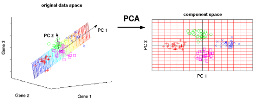

#### 🧠 O que faz?
Reduz o número de variáveis criando **componentes principais**.

#### 🤔 Quando usar:
Quando quer **reduzir dimensionalidade mantendo informação global**

#### 💼 Use cases:
- 📊 **Pré-processamento →** reduzir features
- 🖼️ **Imagem →** compressão
- 🧠 **Análise exploratória**

#### 👉 Por que usar?
- Reduz ruído
- Acelera modelos
- Remove redundância

#### ⚙️ Como funciona?
1. Centraliza os dados
1. Calcula matriz de covariância
1. Extrai autovalores/autovetores
1. Projeta dados nos principais componentes

#### 📌 Equação
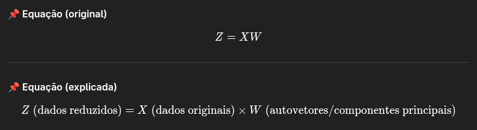

#### 💡 Ideia Principal:
👉 “projeta os dados nas direções de maior variância”

### 🌐 2. t-SNE (t-distributed Stochastic Neighbor Embedding)
O t-SNE reduz dimensionalidade preservando relações locais entre pontos (melhor para dados não linearesao contrário do PCA).

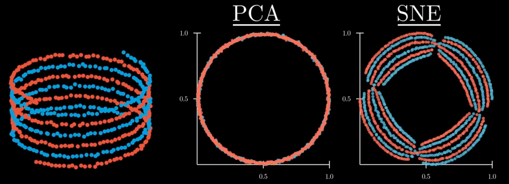

#### 🧠 O que faz?
Mantém **pontos próximos** próximos no novo espaço.

#### 🤔 Quando usar:
Quando quer **visualizar dados em 2D/3D**

#### 💼 Use cases:
- 📊 Visualização de clusters
- 🧬 Dados complexos
- 🧠 Exploração de dados

#### 👉 Por que usar?
- Excel1ente para visualização
- Captura estruturas não lineares

#### ⚙️ Como funciona?
1. Calcula similaridade no espaço original
1. Cria distribuição de probabilidade
1. Mapeia para baixa dimensão
1. Minimiza diferença entre distribuições

#### 📌 Equação
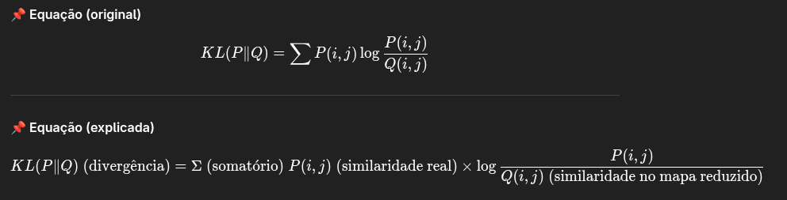

#### 💡 Ideia Principal:
👉 “mantém vizinhos próximos no mapa reduzido”

### 🧭 3. UMAP (Uniform Manifold Approximation and Projection)
UMAP é um método moderno que preserva estrutura local e global.

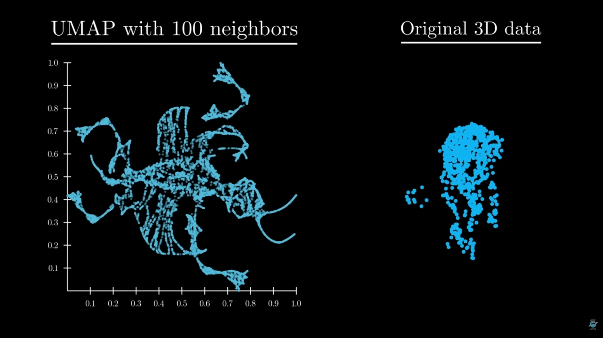

#### 🧠 O que faz?
Projeta dados mantendo **estrutura do espaço original**

#### 🤔 Quando usar:
Quando quer performance + boa visualização

#### 💼 Use cases:
- 📊 Visualização de dados complexos
- 🧬 Bioinformática
- 🧠 Pré-processamento ML

#### 👉 Por que usar?
- Mais rápido que t-SNE
- Preserva mais estrutura global
- Escalável

#### ⚙️ Como funciona?
1. Constrói grafo de vizinhança
1. Estima estrutura do espaço
1. Projeta em menor dimensão
1. Otimiza a representação

#### 📌 Equação
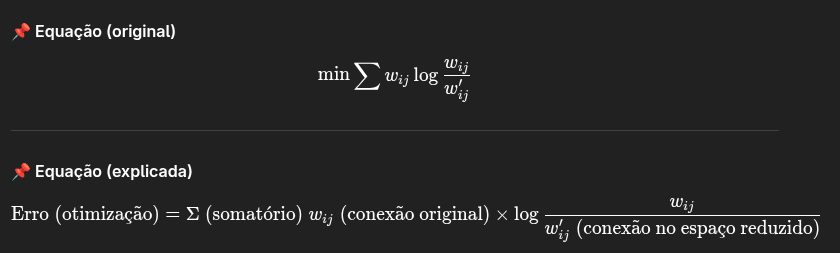

#### 💡 Ideia Principal:
👉 “preserva a estrutura do espaço ao reduzir dimensão”

### ⚖️ Comparação de Algoritmos
| Algoritmo | Vantagens                                                                                                           | Desvantagens                                                                                     | Melhor uso                                           |
| --------- | ------------------------------------------------------------------------------------------------------------------- | ------------------------------------------------------------------------------------------------ | ---------------------------------------------------- |
| **PCA**   | ✅ Rápido e simples<br>✅ Escalável<br>✅ Mantém variância global<br>✅ Determinístico                                  | ❌ Só captura relações lineares<br>❌ Pode perder estruturas complexas                             | 📊 Pré-processamento<br>⚡ Redução rápida de features |
| **t-SNE** | ✅ Excelente visualização<br>✅ Captura padrões não lineares<br>✅ Mantém vizinhos próximos                            | ❌ Muito lento<br>❌ Não preserva estrutura global<br>❌ Difícil de escalar<br>❌ Não determinístico | 🎨 Visualização 2D/3D<br>🧠 Exploração de dados      |
| **UMAP**  | ✅ Mais rápido que t-SNE<br>✅ Preserva estrutura local e global<br>✅ Escalável<br>✅ Funciona bem em datasets grandes | ❌ Mais complexo de ajustar<br>❌ Sensível a hiperparâmetros                                       | 🚀 Visualização + produção<br>📊 Redução para ML     |


### 🎯 Sistemas de Recomendação
**Sistema de Recomendação** são ferramentas **indispensáveis** no cenário digital atual, agindo como sofisticados **filtros** de informação.

Seu objetivo principal é **prever** a **"classificação"** ou **"preferência"** que o usuário consumiria deum determinado item, seja ele um produto, um filme, uma música ou qualquer conteúdo.

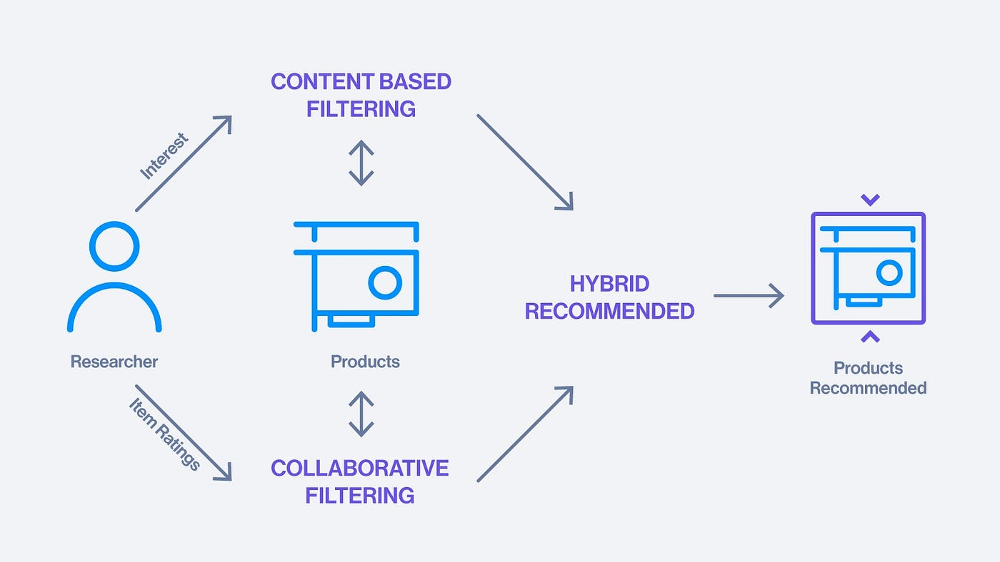

#### Sugerir itens:
- Filtragem colaborativa
- Filtragem baseada em conteúdo
- MBA - Market Basket Analysis
- Matrix Factorization

### 📚 Abordagens
#### 👥 Filtragem Colaborativa
Esta técnica basea-se no princípio de que usuários com comportamentos ou preferêmnncias similares no **passado** tenderão a ter preferências similares no **futuro**

- Baseia-se no comportamento de usuários para **recomendar itens similares**.
- É analisado **interações** históricas entre **usuários e itens** para indentificar similaridades, seja entre **usuários (user-based)** ou entre **itens (item-based)**.
- A ideia principal é que **usuários parecidos gostam de coisas parecidas**

#### 🧾 Filtragem Baseada em Conteúdo
Diferentemente da filtragem colaborativa, esta abordagem doca nos atributos dos próprios itens e no perfil de interesse do usuário.
- Recomenda itens semelhantes ao que o usuário já consumiu.
- Sugere itens com base nas **características dos itens**
- A ideia principal é que **"se você gostou disso, vai gostar de algo parecido"**

### 🛒 1. MBA (Market Basket Analysis)
O **MBA** analisa itens que são comprados juntos.

Pode revelar padrões de **co-ocorrência de produtos** que não são intuitivos ou óbvios, fornecendo a base para recomendações do tipo **"clientes que compraram o tem X também costumam comprar o intem Y"** ou **"itens frequentemente comprados juntos"**

O core do MBA é desvendar **associações** ou **correlações** entre itens dentro de conjunto de dados **transacionais**.

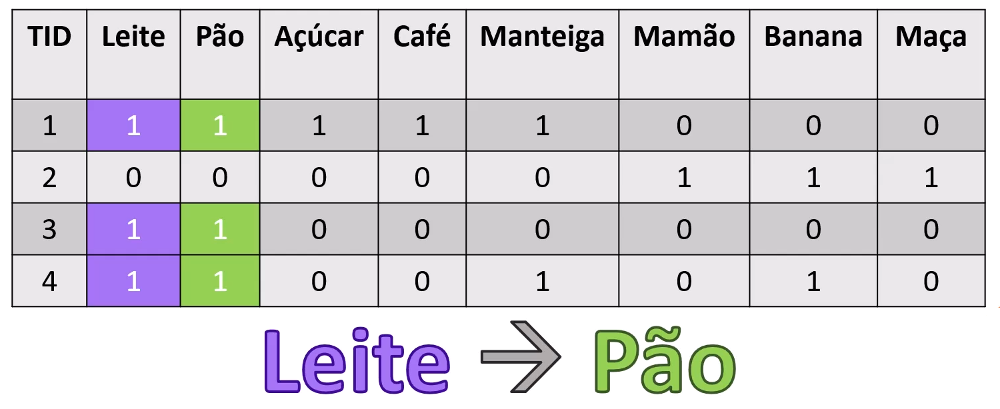

#### 📜 Conceitos
- **Itens:** Referem-se aos produtos, serviços ou quaisquer entidades individuais que podem ser adquiridas ou consumidas. Por exemplo, em um supermercado, **itens** seriam **"pão"**, **"leite"**, **manteiga**, etc.
- **Transações:** Uma transação representa um conjunto de um ou mais itens que foram **comprados juntos** por um cliente em uma **única ocasião** ou evento de compra. Cada transação é, portanto, uma **"cesta de compras"**
- **Regras de associação:** São o principal resultado do MBA e expressam relações de **implicação entre conjuntos de itens**. Uma regra de associação é tipicamente escrita no formato **X -> Y**, que se lê como **"Se X, então Y"** ou **"X incide em Y"**.
- **Suporte:** é o número de transações para as quais o MBA conseguirá fazer uma predição correta.
- **Confiança:** É o número de transações que o MBA prediz corretamente, proporcional às transações que ele se aplica.

#### 🧠 O que faz?
Descobre **associações entre produtos**

#### 🤔 Quando usar:
Quando há dados de **transações (carrinho de compras)**

#### 💭 Exemplo
Para entender o funcionamento do **MBA (Market Basket Analysis)**, primeiro é importante compreender como os dados são estruturados.

A base costuma ser representada por uma **matriz esparsa**, onde:

- Cada linha representa uma transação (compra)
- Cada coluna representa um produto
- O valor 1 indica que o item foi comprado naquela transação
- O valor 0 indica que o item não foi comprado

👉 Em outras palavras, é uma grande tabela que registra, de forma binária, a presença ou ausência de produtos em cada compra.

Essa estrutura facilita a identificação de padrões e associações entre itens, que é justamente o objetivo do MBA.

#### 📍 Armazenamento convencional de transação:
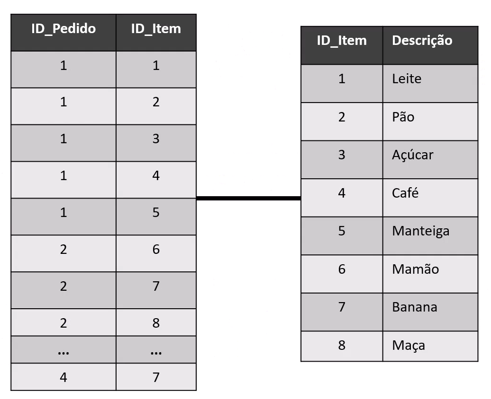

#### 📍 Armazenamento real da transação:
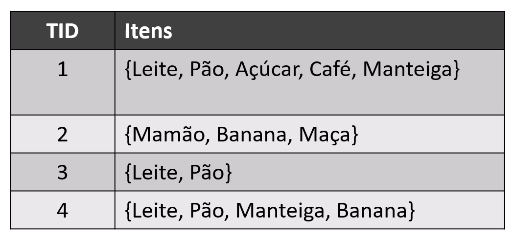

#### 📍 Matriz esparsa:
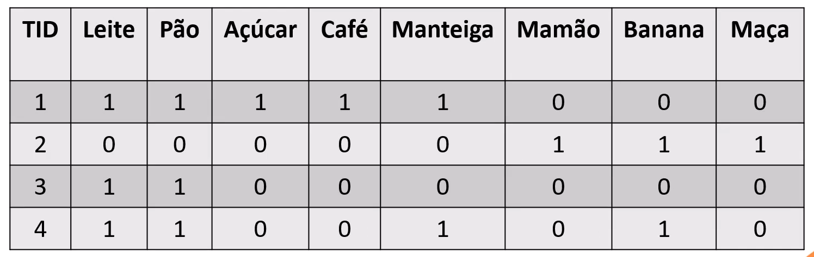

#### 🎬 Cenário
Neste nosso caso imagina que o item selecionado fosse o **leite**

#### 🔷 Passo 1 — Calcular o suporte de Leite


#### 🔍 Leite aparece em:
- TID 1 ✅
- TID 3 ✅
- TID 4 ✅

👉 Total = 3 vezes


#### 📊 Cálculo

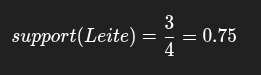

#### 🔷 Passo 2 — Escolher combinações com Leite

Vamos analisar:

- Leite → Pão
- Leite → Manteiga
- Leite → Café

#### 🔷 Passo 3 — Suporte conjunto


#### 🔍 1. Leite + Pão

Aparecem juntos em:

- TID 1 ✅
- TID 3 ✅
- TID 4 ✅

👉 Total = 3

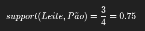

#### 🔍 2. Leite + Manteiga
- TID 1 ✅
- TID 4 ✅

👉 Total = 2

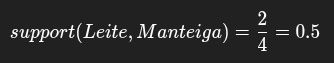

#### 🔍 3. Leite + Café
- TID 1 ✅

👉 Total = 1

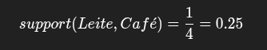

#### 🔷 Passo 4 — Calcular confiança

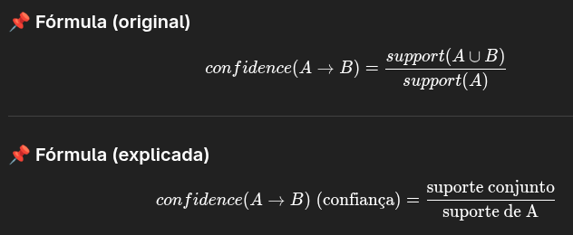

#### 🥖 Leite → Pão

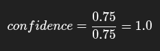

👉 100% das pessoas que compram leite também compram pão

#### 🧈 Leite → Manteiga

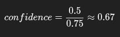

👉 67% compram manteiga junto

#### ☕ Leite → Café

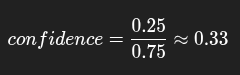

👉 33% compram café junto

#### 📊 Resultado final
| Regra            | Suporte | Confiança |
| ---------------- | ------- | --------- |
| Leite → Pão      | 0.75    | 1.00      |
| Leite → Manteiga | 0.50    | 0.67      |
| Leite → Café     | 0.25    | 0.33      |

#### 🧩 Resumo
1. Calcula suporte
2. Calcula suporte conjunto
3. Calcula confiança
4. Gera regras

#### 💼 Use cases:
- 🛒 **Supermercado →** produtos relacionados
- 📦 **Cross-sell →** recomendações complementares
- 💳 **Varejo →** combos de produtos

#### 👉 Por que usar?
- Identifica padrões de compra
- Fácil de interpretar

#### ⚙️ Como funciona?
1. Analisa transações
1. Identifica itens frequentes
1. Gera regras de associação

#### 📌 Equação
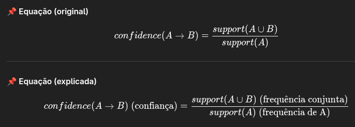

#### 💡 Ideia Principal:
👉 “quem compra A, tende a compra B”

### 🔢 4. Matrix Factorization
Decompõe a matriz usuário-item em fatores latentes.

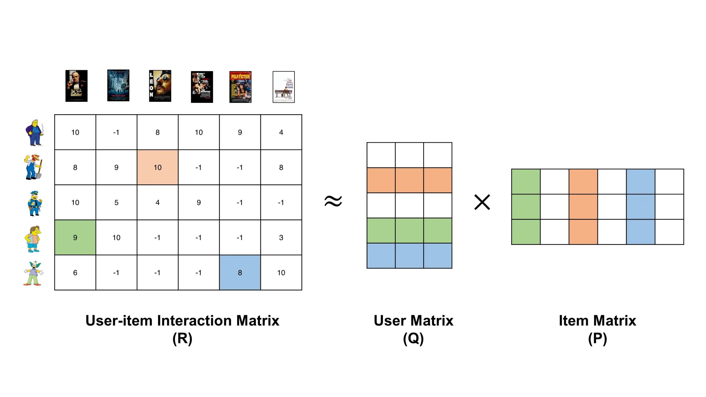

#### 🧠 O que faz?
Descobre **preferências ocultas (latentes)** entre usuários e itens

#### 🤔 Quando usar:
Quando há muitos dados e necessidade de personalização

#### 💼 Use cases:
- 🎬 **Netflix →** recomendação de filmes
- 🛒 **Amazon →** produtos personalizados
- 🎧 **Spotify →** músicas recomendadas

#### 👉 Por que usar?
- Alta performance
- Captura padrões complexos
- Escala bem

#### ⚙️ Como funciona?
1. Cria matriz usuário-item
1. Decompõe em duas matrizes menores
1. Reconstrói previsões

#### 📌 Equação
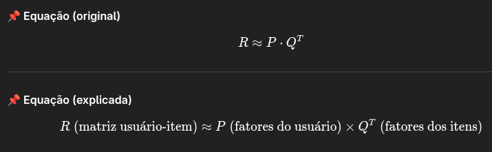

#### 💡 Ideia Principal:
👉 “descobre gostos ocultos e conecta usuários a itens”

### 🚨 Detecção de Anomalias
**Detecção de Anomalias**, também conhecido como **detecção de outliers** ou **valores discrepantes**, é o processo de identificar observações, eventos ou pontos de dados que se **desviam** significativamente do **comportamento padrão** ou esperado em conjunto de dados.

Essas anomalias são, por natureza, **raras** e **distintas** da maioria dos dados. Sua importância reside no fato de que podem **sinalizar eventos críticos**, como falhas em sistemas, atividades fraudulentas, intrusões em redes de computadores, ou, por outro lado, podem representar **oportunidades de otimização**.

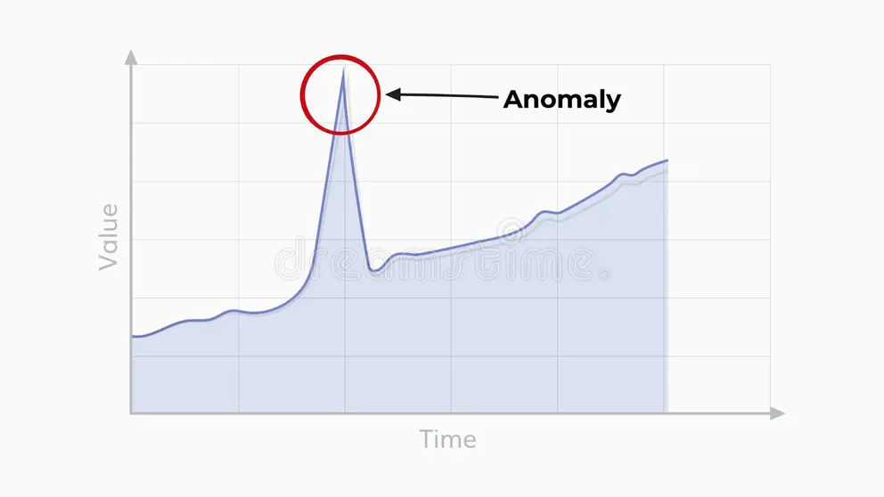

#### 🗃️ Categorias
- **Anomalias pontuais:** Referem-se a uma **única** atividade de ocorrência com dados que são **anômalos** em relação a todo o restante do conjunto de dados.
- **Anoimalias contextuais:** São instâncias de dados que são consideradas **anômalas** dentro de um **contexto específico**, mas que poderiam ser **normais em um contexto diferente**. Por exemplo, um gasto elevado em compras de **casacos de inverno** é normal durante o **inverno**, mas seria uma **anomalia contextual** se ocorresse no período do **verão**.
- **Anomalias coletivas** Representam um conjunto de instâncias de dados relacionados que, como um grupo, são anômalas em relação a todo o conjunto de dados, embora as instâncias individuais dentro do grupos possam não ser anômalas por si sós.

#### Identificar outliers:
1. Isolation Forest
1. One-Class SVM
1. LOF (Local Outlier Factor)

### 🌲 1. Isolation Forest
Algoritmo baseado em árvores que isola pontos anômalos mais rapidamente que pontos normais.

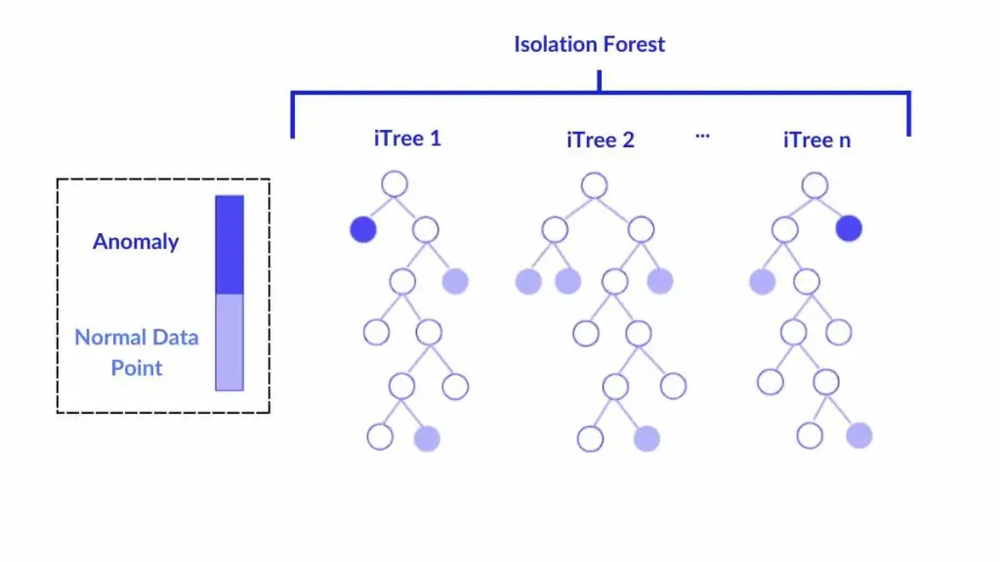

#### 🧠 O que faz?
Identifica anomalias isolando dados por meio de divisões aleatórias.

#### 🤔 Quando usar:
Quando há **grandes volumes de dados** e necessidade de detectar outliers

#### 💼 Use cases:
- 💳 **Fraude →** transações suspeitas
- 🏭 **Indústria →** falhas em máquinas
- 🌐 **Segurança →** comportamento anômalo

#### 👉 Por que usar?
- Rápido e escalável
- Funciona bem em alta dimensão
- Não precisa de dados rotulados

#### ⚙️ Como funciona?
1. Cria várias árvores aleatórias
1. Divide os dados recursivamente
1. Mede quantos “cortes” são necessários para isolar um ponto
1. Menos cortes → mais anômalo

#### 📌 Equação
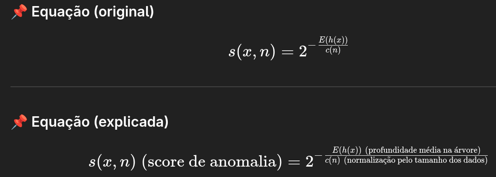

#### 💡 Ideia Principal:
👉 “pontos anômalos são mais fáceis de isolar”

### 📏 2. One-Class SVM
Modelo que aprende o padrão dos dados normais e identifica desvios.

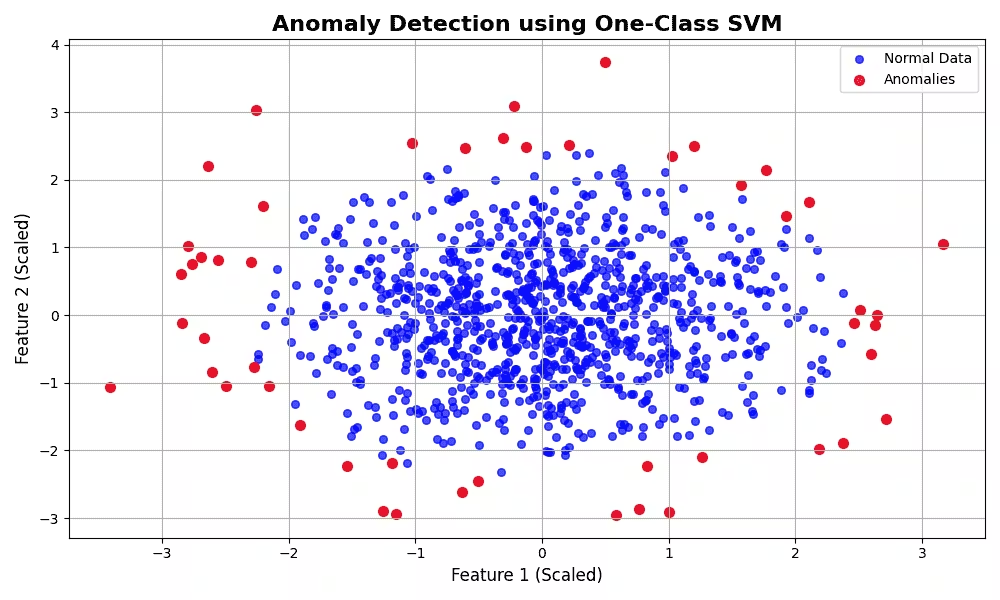

#### 🧠 O que faz?
Cria uma fronteira que engloba os dados normais.

#### 🤔 Quando usar:
Quando você tem **apenas dados normais (sem anomalias rotuladas)**

#### 💼 Use cases:
- 🔐 **Segurança →** intrusão em sistemas
- 💳 **Fraude →** comportamento fora do padrão
- 🏥 **Saúde →** detecção de anomalias em exames

#### 👉 Por que usar?
- Não precisa de exemplos de anomalias
- Funciona bem com dados complexos
- Pode usar kernels

#### ⚙️ Como funciona?
1. Aprende a região onde os dados normais estão
1. Define uma fronteira (hiperplano)
1. Pontos fora da fronteira → anomalias

#### 📌 Equação
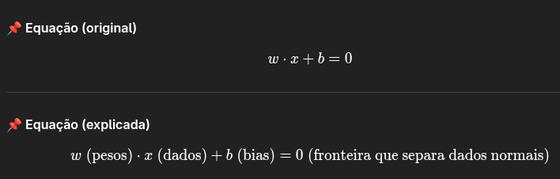

#### 💡 Ideia Principal:
👉 “aprende o que é normal e rejeita o resto”

### 📊 3. LOF (Local Outlier Factor)
Algoritmo que detecta anomalias comparando densidade local.

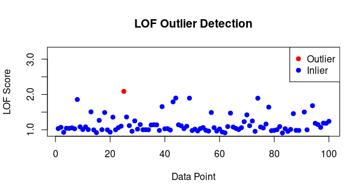

#### 🧠 O que faz?
Identifica pontos que têm **densidade muito diferente dos vizinhos**

#### 🤔 Quando usar:
Quando os dados têm **densidade variável**

#### 💼 Use cases:
- 🧑‍🤝‍🧑 **Clientes →** comportamento incomum
- 🌍 **Geolocalização →** pontos fora do padrão
- 📊 **Análise exploratória**

#### 👉 Por que usar?
- Detecta anomalias locais
- Não assume distribuição global
- Funciona bem com clusters diferentes

#### ⚙️ Como funciona?
1. Calcula vizinhos mais próximos
1. Mede densidade local
1. Compara densidade com vizinhos
1. Densidade menor → anomalia

#### 📌 Equação
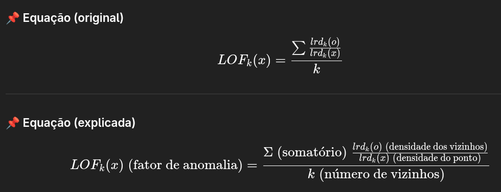

#### 💡 Ideia Principal:
👉 “se um ponto é muito menos denso que seus vizinhos, é anômalo”

## 🚀 Pipeline típico de Machine Learning
1. Coleta de dados
1. Limpeza e tratamento
1. Feature engineering
1. Treinamento do modelo
1. Avaliação
1. Deploy
1. Monitoramento

## 📋 CRISP-DM

**CR**oss-**I**ndustry **S**tandart **P**rocess for **D**ata **M**ining é um framework de processo que define como conduzir um projeto de dados do início ao fim, focando não só no modelo, mas no valor para o negócio.

#### 👉 A grande sacada:
Machine Learning não começa no algoritmo — começa no problema de negócio


### 🔄 As 6 fases do CRISP-DM

O modelo é cíclico (você volta fases sempre que necessário)

### 📑 1. Entendimento do Negócio (Business Understanding)

Aqui você define o **problema real**

- Qual é o objetivo?
- Qual métrica de sucesso?
- Qual impacto esperado?
- É viavel seguir com o projeto?

#### 📌 Exemplo:
- Reduzir churn em 10%
- Aumentar conversão

👉 **Saída:** problema traduzido para ML


### 📊 2. Entendimento dos Dados (Data Understanding)

Exploração inicial dos dados
- **Coleta de dados**
    - Identificar fontes de dados relevantes para projeto
    - Fontes: (banco de dados, arquivos, APIs, etc.)
- **Exploração de dados**
    - Visualizar os dados usando gráficos (histogramas, gráficos de disperção, etc.)
    - Identificar tendências, padrões e anomalias
    - Calcular estatísticas descritivas (média, desvio padrão, quartis, etc.)
    - Realizar análizes preliminares pra entender a distribuição dos valores.
- **Qualidade de dados**
    - Identificar valores ausentes (nulos) e decidir tratá-los
    - Verificar a consistência dos dados (Ex: valores fazem sentido?)
    - Avaliar a integridade dos dados (se não há duplicatas ou registros inconsistentes)

👉 Aqui você começa a **“sentir”** os dados

### 🧹 3. Preparação dos Dados (Data Preparation)

Geralmente a fase mais demorada 😅

- **Seleção de dados**
    - Determine quais conjuntos de dados serão usados no projeto
    - Documente as razões para inclusão ou exclusão de cada conjunto  
- **Limpeza dos dados**
    - Essa é geralmente a tarefa mais extensa. Sem uma limpeza adequada, você corre o risco de obter resultados imprecisos.
    - Corrije, adicione ou remova valores errados.
    - Lide com dados ausentes de maneira apropriada.
- **Transformação dos dados**
    - Crie novos atributos relevantes a partir dos dados existentes
    - Por Exemplo, crie um índice de massa corporal (IMC) a partir dos campos altura e peso. Crie o valor de venda a partir de preço e frete e assim por diante.
- **Integração de dados**
    - Combine dados de várias fontes, se necessário.
    - Crie novos conjuntos de dados integrando informações relevantes.
- **Divisão dos dados**
    - Separe dados em conjuntos de treinamento, teste e validação
    - Isso é essencial para avaliar o desempenho do modelo

👉 **Resultado:** dataset pronto para modelagem

### 🤖 4. Modelagem (Modeling)

Aplicação dos algoritmos
- **Técnicas de Modelagem**
    - Selecione os algoritmos ou técnicas de modelagem apropriados para o seu problema.
    - Considere fatores como a natureza dos dados, os objetivos do projeto e recursos disponíveis.
- **Treinamento e ajuste**
    - Use os dados preparados para treinar e validar os modelos.
    - Ajuste os hiperparâmetros dos modelos para otimizar o desempenho.
- **Avaliação de performance**
    - Avalie eficácia dos modelos usando métricas relevantes (Ex: acurácia, precisão, recall, etc.)
    - Utilize técnicas como validação cruzada para evitar overfiting.
- **Escolha do modelo vencedor**
    - Com base nos resultados da avaliação, escolha o modelo que melhor atende aos critérios de sucesso.
    - Documente as razões para a escoolha do modelo.
- **Preparação para implantação**
    - Prepare o modelo para implantação em produção.
    - Isso pode envolver a conversão do modelo para um formato específico ou a integração com sistemas existentes.

#### 📌 Resumo:
- Escolhas dos algoritmos
- Treinamento
- Ajuste de hiperparâmetros
- Escolha do modelo vencedor

#### 📌 Exemplo:
- Regressão
- Random Forest
- Redes neurais

### 📈 5. Avaliação (Evaluation)

Verificar se o modelo resolve o problema de negócio
- **Avaliação dos resultados**
    - Nesta etapa, avaliamos a precisão e a eficácia do modelo.
    - Verificar se o modelo atende aos objetivos de negócios estabelecidos.
    - Identificar possíveis deficiências e áreas de melhoria.
- **Métricas de avaliação**
    - Utilize métricas relevantes para medir o desempenho do modelo.
    - Exemplos incluem acurácia, precisão, recall, F1-score, etc.
- **Validação cruzada**
    - Evitar overfitting avaliando o modelo com dados não utilizados anteriormente.
    - Dividir o conjunto de dados em treinamento, teste e validação.
- **Seleção do modelo final**
    - Com base na avaliação de negócio, escolhemos o modelo mais adequado.
    - Documentar as razões para a escolha.

**👉 Aqui muita gente erra:**
não basta “boa acurácia”, precisa gerar valor

### 🚀 6. Deploy (Deployment)

Colocar o modelo em produção
- **Planejamento da implantação**
     - Nesta etapa, você define o modelo que será implantado em produção.
     - Planeje a integração do modelo com sistemas existentes e considere questões de escalabilidade.
- **Escolhas de formatos de serialização**
    - **Formatos nativos:** pickle (.pkl), joblib (.joblib)
    - **ONNX (Open Neural Network Exchange):** Permite rodar em várias linguagens (python, C#, Java, C++)
    - **PMML:** Baseado em XML
    - **SavedModel (TensorFlow):** Formato padrão do TensorFlow
    - **TorchScript (PyTorch):** Permite rodar fora do python
    - **HDF5 (.h5):** Muito usado em keras
- **Escolhas de formas de publicação (servir o modelo)**
    - API REST
    - gRPC
    - **Batch (processamento em lote):** Executa previsões em massa
    - **Streaming:** Processamento em tempo real
    - **Embedded (embarcado):** Modelo roda dentro da aplicação
- **Implantação do modelo**
    - Publicar em algum destino que permita a área de negócios utilizar a predição.
- **Monitoramento e manutenção**
    - Após a implantação, monitore o desempenho do modelo em tempo real.
    - Faça ajustes conforme necessário para garantir que o modelo continue a atender aos objetivos.
- **Relatório final**
    - Documente os resultados, metodologia e conclusões do projeto.
    - Isso é importante para compartilhar insights com as partes interessadas.
- **Revisão do projeto**
    - Avalie o projeto como um todo.
    - Identifique lições aprendidas e áreas de melhoria para futuros projetos.

#### CRISP-DM


#### 👉 Modelo útil = modelo em produção


## 📚 Bilbiotecas em Python de Machine Learning
| Categoria     | Biblioteca   | Para que serve                                                                  |
| ------------- | ------------ | ------------------------------------------------------------------------------- |
| Dados         | pandas       | Manipulação e análise de dados em tabelas (DataFrames), limpeza e transformação |
| Dados         | NumPy        | Operações matemáticas e arrays multidimensionais (base para outras libs)        |
| Visualização  | Matplotlib   | Criação de gráficos básicos (linha, barra, dispersão)                           |
| Visualização  | Seaborn      | Visualizações estatísticas mais avançadas e bonitas                             |
| ML            | scikit-learn | Algoritmos de Machine Learning (classificação, regressão, clustering)           |
| Deep Learning | TensorFlow   | Construção e treinamento de modelos de deep learning em larga escala            |
| Deep Learning | Keras        | API de alto nível para criar redes neurais de forma simples                     |
| Deep Learning | PyTorch      | Framework flexível para deep learning, muito usado em pesquisa                  |
| NLP           | NLTK         | Processamento básico de linguagem natural (tokenização, stopwords)              |
| NLP           | spaCy        | NLP avançado com foco em performance (NER, POS tagging)                         |
| Boosting      | XGBoost      | Algoritmo de boosting eficiente e muito usado em competições                    |
| Boosting      | LightGBM     | Boosting otimizado para grandes volumes de dados                                |


# 📉 Estatística
Estatística é a ciência que utiliza-se das **teorias probabilísticas** para explicar a frequência de eventos, tanto em estudos observacionais quanto em experimentos para modelar a **aleatoriedade** e a **incerteza** de forma a estimar ou possibilitar a previsão de fenômenos futuros, conforme o caso.

## 🎲 Tipos de dados


### 🟦 Dados Qualitativos (Categóricos)

Representam categorias, não números com significado matemático.

#### 📌 Tipos:
#### 🟢 Nominais
- Não t1êm ordem
- Apenas classificam

#### Exemplos:
- Cor (azul, vermelho)
- Estado civil
- Tipo de produto

#### 🟡 Ordinais
Têm ordem, mas sem distância numérica definida

#### Exemplos:
- Nível de satisfação (ruim, médio, bom)
- Escolaridade
- Ranking

### 🟦 Dados Quantitativos (Numéricos)

Representam valores numéricos com significado matemático

#### 📌 Tipos:
#### 🔵 Discretos
- Valores inteiros
- Resultado de contagem

#### Exemplos:
- Número de filhos
- Quantidade de vendas
- Número de acessos

#### 🔴 Contínuos
Podem assumir qualquer valor dentro de um intervalo

#### Exemplos:
- Altura
- Peso
- Temperatura
- Tempo

## ✨ Características dos Dados

### 🟦 Dados Estruturados

São dados organizados em um formato fixo e bem definido, geralmente em tabelas.

👉 Fácil de armazenar, consultar e analisar

#### 📊 Características:
- Estrutura rígida (linhas e colunas)
- Tipos de dados definidos
- Fácil uso com SQL
- Alta organização

#### 📌 Exemplos:
- Banco de dados relacional
- Planilhas (Excel)
- Tabelas CSV
 
```bash
Nome     Idade    Salário
João     30       5000
Maria    25       4000
``` 

#### 🧠 Onde são usados:
- Sistemas financeiros
- ERPs
- CRMs

### 🟦 Dados Não Estruturados

Não seguem um formato fixo ou tabela.

👉 Muito mais difíceis de processar automaticamente

#### 📊 Características:
- Sem estrutura definida
- Conteúdo livre
- Necessitam de processamento (NLP, visão computacional)

#### 📌 Exemplos:
- **Texto:** Isso pode incluir e-mails, documentos do World, PDFs, postagens de blogs, transcrições de áudio, etc. Esses dados são geralmente analisados usando técnicas de **processamento de linguagem natural (NLP)** para extrair informações úteis.
- **Imagens:** As imagens são uma forma comum de dados não estruturados. Elas podem ser analisadas usando técnicas de **visão computacional** para indentidicar padrões, objetos ou pessoas.
- **Vídeos:** Os vídeos contêm riqueza de informações, mas são desafiadores para analisar devido à natureza multimodal (visão, auditiva e, às vezes textual). Técnicas de **aprendizado profundo (deep learning)** são frequentemente usadas para analisar vídeos.
- **Sons:** Isso pode incluir gravações de áudio, músicas, ruídos de fundo, etc. A análise de som pode envolver **transcrição de fala em texto** ou a identificação de padrões específicos no áudio.

#### 🧠 Exemplos reais:
- Comentários de clientes
- Fotos de produtos
- Gravações de atendimento


### ⚔️ Dados Estruturados X Dados Não Estruturados


---

## 👨🏽‍🔬 Profissionais na área de dados
A área de dados é bem ampla e tem vários papéis, cada um com foco diferente dentro do **ciclo de dados (coleta → processamento → análise → modelagem → produção)**

### 🔷 1. Analista de Dados (Data Analyst)

👉 **Foco:** analisar e gerar insights

#### Funções:
- Explorar dados (EDA)
- Criar dashboards (Power BI, Tableau)
- Fazer consultas SQL
- Responder perguntas de negócio

#### 📌 Perfil:
- Mais próximo do negócio
- Menos foco em modelagem avançada

### 🔷 2. Cientista de Dados (Data Scientist)

👉 **Foco:** modelos preditivos e ML

#### Funções:
- Construir modelos de Machine Learning
- Fazer feature engineering
- Testar hipóteses
- Avaliar modelos

#### 📌 Usa:
- Python
- estatística
- ML

### 🔷 3. Engenheiro de Dados (Data Engineer)

👉 **Foco:** infraestrutura de dados

#### Funções:
- Construir pipelines (ETL/ELT)
- Integrar fontes de dados
- Trabalhar com Big Data
- Garantir qualidade e disponibilidade

#### 📌 Tecnologias:
- SQL
- Spark
- Airflow

### 🔷 4. Engenheiro de Machine Learning (ML Engineer)

👉 **Foco:** colocar modelos em produção

#### Funções:
- Deploy de modelos
- Criar APIs
- Monitorar performance
- Escalar soluções

#### 📌 Ponte entre:
- Data Science + Engenharia

### 🔷 5. Engenheiro de Analytics (Analytics Engineer)

👉 **Foco:** modelagem de dados para análise

#### Funções:
- Transformar dados brutos em dados confiáveis para análise
- Criar camadas analíticas
- Trabalhar com dbt

👉 Meio termo entre analista e engenheiro


### 🔷 6. Especialista em BI (Business Intelligence)

👉 **Foco:** visualização e indicadores

#### Funções:
- Criar dashboards
- Definir KPIs
- Automatizar relatórios

#### 📌 Ferramentas:
- Power BI
- Tableau

### 🔷 7. Arquiteto de Dados (Data Architect)

👉 **Foco:** design da arquitetura

#### Funções:
- Definir estrutura dos dados
- Escolher tecnologias
- Planejar armazenamento

👉 Papel mais estratégico


### 🔷 8. Engenheiro de MLOps

👉 **Foco:** operacionalizar ML

#### Funções:
- Automatizar pipelines de ML
- Versionar modelos
- Monitorar drift
- CI/CD para ML

### 🔷 9. Chief Data Officer (CDO)

👉 **Foco:** estratégia de dados

#### Funções:
- Nível Executivo
- Governança de dados
- Estratégia organizacional
- Cultura data-driven
- Garante que os dados gerem valor para o negócio

### 🔄 Como eles se conectam
```bash
Engenheiro de Dados → prepara dados
        ↓
Analista / BI → gera insights
        ↓
Cientista de Dados → cria modelo
        ↓
ML Engineer / MLOps → coloca em produção
```

### 💡 Resumo rápido
| Cargo                          | Foco                                               |
| ------------------------------ | -------------------------------------------------- |
| Analista de Dados              | Geração de insights e análises                     |
| Cientista de Dados             | Modelos preditivos e Machine Learning              |
| Engenheiro de Dados            | Construção de pipelines e infraestrutura           |
| Engenheiro de Machine Learning | Deploy e escala de modelos                         |
| Engenheiro de Analytics        | Modelagem de dados para análise (camada analítica) |
| BI (Business Intelligence)     | Dashboards e indicadores                           |
| Arquiteto de Dados             | Estrutura e arquitetura dos dados                  |
| Engenheiro de MLOps            | Operacionalização e monitoramento de ML            |
| CDO (Chief Data Officer)       | Estratégia e governança de dados                   |


### 🚀 Insight importante
👉 Não existe “melhor cargo”, existe o que mais combina com você:

- Gosta de negócio **→** Analista / BI
- Gosta de matemática **→** Cientista
- Gosta de sistemas **→** Engenheiro
- Gosta de produção **→** ML Engineer

---

## 📉 Estatística Descritiva
A **Estatística Descritiva** é a parte da Estatística focada em organizar, resumir e descrever os dados, sem tirar conclusões gerais (isso é papel da inferência).

#### 👉 Em outras palavras:
ela responde **“o que os dados estão mostrando?”**


### 🔷 Principais pontos

#### 📌 Tendência central (valor típico)
- Média
- Mediana
- Moda

#### 📌 Dispersão (variação dos dados)
- Desvio padrão
- Variância
- Amplitude

#### 📌 Distribuição
- Forma dos dados (simétrica, assimétrica)
- Identificação de outliers

#### 📌 Visualização
- Histogramas
- Boxplots
- Gráficos

### 🧠 Para que serve?
- Entender rapidamente um conjunto de dados
- Identificar padrões e tendências
- Detectar outliers (valores fora do padrão)
- Apoiar decisões iniciais

### 📊 Quarteto de Anscombe
O **Quarteto de Anscombe** é um dos exemplos mais clássicos e importantes da estatística, criado por Francis Anscombe em 1973.

👉 A ideia dele é simples, mas poderosa:

>Conjuntos de dados podem ter as mesmas estatísticas, mas comportamentos completamente diferentes

#### 🧠 O que é o Quarteto de Anscombe?

São **4 conjuntos de dados diferentes** que possuem praticamente os mesmos valores de:

- Média
- Variância
- Correlação
- Regressão linear

👉 Mas quando você plota os dados, eles são totalmente diferentes visualmente


### 💡 Lições importantes
#### 🚨 1. Nunca confie só em métricas

#### Mesmo com:
- mesma média
- mesma correlação

👉 os dados podem ser completamente diferentes

#### 📉 2. Visualização é essencial

#### Antes de qualquer modelo:

- faça gráficos
- explore os dados

👉 Isso evita erros graves

#### ⚠️ 3. Outliers podem enganar
- Um único ponto pode distorcer tudo
- Pode mudar regressão e conclusões

### 📊 Medidas de Tendência Central

São métricas que indicam o **valor “central” ou mais representativo** de um conjunto de dados.

### 🔷 Principais medidas
#### 📌 Média (mean)
Soma de todos os valores ÷ quantidade

👉 Sensível a outliers

#### Ex:
```bash
[10, 20, 30] → média = 20
```

#### 🎯 Uso:
- Dados gerais sem pesos
- Quando todos têm mesma importância

#### 📌 Média Ponderada
Cada valkor tem um **peso diferente**

#### Ex:
```bash
Nota 7 (peso 2), Nota 9 (peso 3)
→ média = 8,2
```

#### 🎯 Uso:
- Notas
- indicadores com relevância diferente

#### ƒ Fórmula


#### 📌 Média Harmônica
Usado para **taxas e razões**

👉 Penaliza valores muito altos

#### Ex (velocidade):
```bash
60 km/h e 30 km/h → média harmônica = 40 km/h
```

#### 🎯 Uso:
- Velocidade média
- Taxas (ex: km/h, produtividade)

#### ƒ Fórmula


#### 📌 Média Geométrica
Usada para **crescimento multiplicativo**

👉 Penaliza valores muito altos

#### Ex (velocidade):
```bash
Crescimento: 10% e 20%
→ média geométrica ≈ 14,9%
```

#### 🎯 Uso:
- Juros compostos
- Crescimento populacional
- Retornos financeiros

#### ƒ Fórmula


#### 📌 Mediana
Valor central após ordenar os dados

👉 Mais robusta a outliers

#### Ex:
```bash
[10, 20, 1000] → mediana = 20
```

#### 📌 Moda
Valor que mais se repete

#### Ex:
```bash
[1, 2, 2, 3] → moda = 2
```

### ⚖️ Quando usar cada uma?
- Média → dados sem valores extremos
- Mediana → dados com outliers
- Moda → dados categóricos ou frequência

### 🧩 Resumo
| Medida      | Melhor uso            |
| ----------- | --------------------- |
| Média       | Dados “normais”       |
| Ponderada   | Valores com peso      |
| Harmônica   | Taxas/razões          |
| Geomética   | Crescimento           |
| Mediana     | Dados com outliers    |
| Moda        | Frequência/categorias |

### 📊 Medidas de Dispersão

#### 👉 Respondem:
“Os dados estão concentrados ou muito espalhados?”

#### 🔷 1. Amplitude Total (Range)
Diferença entre o maior e o menor valor

```bash
[10, 20, 30] → amplitude = 30 - 10 = 20
```

📌 Simples, mas sensível a extremos

#### 🔷 2. Variância
**Quadrado do desvio padrão:** Mede o quanto os dados se afastam da média (ao quadrado)

👉 Quanto maior, mais disperso

#### 🔷 3. Desvio Padrão
**Raiz da variância:** É a medida da variação (distância) dos valores comparado com a média, ou seja, mede o quanto os dados se afastam da média.

👉 Interpretação mais intuitiva (mesma unidade dos dados)

#### 🔷 4. Intervalo Interquartil (IQR)
Similar à **aplitude total**, porém obtem a **diferença entre o 1 e 3 quartis**.

👉 Ignora outliers \
👉 Muito usado com boxplot

#### ⚖️ Comparação rápida
| Medida        | Característica               |
| ------------- | ---------------------------- |
| Amplitude     | Simples, sensível a extremos |
| Variância     | Matemática, menos intuitiva  |
| Desvio padrão | Mais usado na prática        |
| IQR           | Robusto a outliers           |

#### 🧩 Resumo
- Medem a variabilidade dos dados
- Complementam as medidas de tendência central
- Essenciais para entender o comportamento real dos dados

### 📊 Análise Exploratória
A **Análise Exploratória de Dados (EDA – Exploratory Data Analysis)** é uma etapa fundamental em qualquer projeto de dados. Com elementos de estatística, são descobertos **padrões**, **distribuições** e **comportamento** dos dados

#### 🔰 Subdivisões

- **Descritiva:** É a forma de ánalise de dados que responde perguntas com as **descrições**  de um acontecido. **Ex:** Quantos carros vendi mês passado?
- **Associativa:** Procura **correlação** entre as variáveis. Existe um aspecto suspeito da hipótese ter causas nestas variações. **Ex:** O preço do dólar influenciou a venda de carros?
- **Comparativa:** **Comparar** duas situações e **validar** se a comparação faz sentido. **Ex:** Eu vendo mamis carros conversíveis no verão ou no inverno?
- **Preditiva:** Com base nos dados e analises anteriores, como ser mais **efetivo** nas decisões. **Ex:** Quantos carros conversíveis à gasolina vou vender no pŕoximo verão?

#### 🧠 O que é Análise Exploratória?

#### É o processo de:
- explorar os dados
- identificar padrões
- detectar problemas
- gerar hipóteses

#### 👉 Responde:
“O que tem nesses dados?”

#### 🔷 Principais objetivos
- Entender a estrutura dos dados
- Identificar valores faltantes
- Detectar outliers
- Ver distribuição dos dados
- Encontrar relações entre variáveis

#### 🔍 O que você analisa na prática?
#### 📌 1. Estrutura dos dados
Quantidade de linhas e colunas
Tipos de dados

#### 📌 2. Estatísticas básicas
- Média, mediana
- Desvio padrão
- Mínimo e máximo

#### 📌 3. Dados faltantes
- Onde existem valores nulos
- Quanto impacto eles têm

#### 📌 4. Distribuição
- Histograma
- Assimetria

#### 📌 5. Relações entre variáveis
- Correlação
- Gráficos de dispersão

#### 📌 6. Outliers
- Valores muito fora do padrão

### 🧩 Resumo
- Explorar dados antes de modelar
- Entender padrões e problemas
- Base para qualquer análise ou ML

## 🎰 Probabilidade
A probabilidade é uma área da estatística e da matetmática, utilizada para **modelar incertezas** e tomar decisões baseadas em **informações incompletas**. É a área que estuda a chance de um evento acontecer.

### 🔷 1. Experimento Aleatório

Processo cujo resultado não é previsível, mesmo que as condições iniciais sejam conhecidas.

#### 📌 Ex:
- jogar um dado 🎲
- lançar uma moeda 🪙

### 🔷 2. Espaço Amostral (S)

Conjunto de **todos os resultados possíveis**.

#### 📌 Ex:
- Dado → S = {1, 2, 3, 4, 5, 6}
- Cartas → S = {2, 3, 4,...,9,10,J,Q,K,A}
- Naipes → S = {Paus, Copas, Espada, Ouro}
- Moeda → S = {Cara, Coroa}

### 🔷 3. Evento

Um **subconjunto** do espaço amostral.

#### 📌 Ex:
- tirar número par ao jogar o dado → E = {2, 4, 6}

### 🔷 4. Probabilidade simples

A probabilidade é uma medida do quão provável é a ocorrência desse evento em relação ao espaço amostral.

Se todos os resultados são igualmente prováveis:


Onde **E** é o número de elementos no evento e **S** é o número total de resultados no espaço amostral.


#### 📌 Ex:
- P(par) = 3/6 = 0,5

### 🔷 5. Probabilidade Condicional

A **probabilidade condicional** mede a probabilidade de um **evento ocorrer** dado que outro **evento já aconteceu**.


Queremos calcular a probabilidade condicional de que, uma vez que o primeiro **dado resultou em um número ímpar**, o **segundo dado também resulte em um número ímpar**.

**Interseção dos eventos (A ∩ B):** A interseção ocorre quando o primeiro dado é ímpar e o segundo dado também é ímpar.


Como cada dado é independente, a probabilidade de ambos serem ímpares é calculada como o produnto das probabilidades individuais.


Probabilidade do **evento A** (primeiro dado ímpar)


Probabilidade condicional do evento **B** dado **A** (segundo dado ímpar)


### 🔷 6. Teorema de Bayes

É uma fórmula que permite **atualizar a probabilidade de um evento com base em novas evidências**.

#### 📌 Conceitos
- **A priori** → Conhecimentos anteriores
- **A posteriori** → Argumentos posteriores

#### 👉 Em outras palavras:
você ajusta sua crença inicial quando recebe informação nova

#### ƒ Fórmula

**P(A|B) →** Probabilidade da hipótese **A** ser verdadeira dado que a evidência **B** foi observada (probabilidade a posteriori).


#### 🧠 O que significa cada parte?
- **P(B|A) →** probabilidade de observar a evidência **B** se a hipótese **A** for verdadeira (verossimilhança)
- **P(A) →** probabilidade da hipótese **A** ser verdadeira antes de observar a evidência (probabilidade a priori)
- **P(B) →** probabilidade de observar a evidência **B** em qualquer circunstância (probabilidade marginal).

#### 💡 Exemplo simples

- Segundo a OMS 1% da população 65+ tem a Doença de Parkison 🧐 
- Se uma pessoa faz o teste e o resultado é positivo, qual a probabilidade de ela realmente ter a doença? 🤔

#### 📝 Dados atualizados:
- **P(Doença)** = 1% = 0,01 (a priori)
- P(SemDoença) = **1-P(Doença)** = 99% = 0,99
- **P(TesteNegativo|SemDoença)** = 90% = 0,90
- P(TestePositivo|SemDoença) = **1-P(TesteNegativo|SemDoença)** 10% = 0,10
- **P(TestePositivo|Doença)** = 95% = 0,95 (verossimilhança)

#### Usando regra de probabilidade total


#### Usando teorema de bayes


#### ✅ Conclusão:
- Mesmo com um **teste positivo**, a probabilidade de a pessoa realmente ter a doença é **apenas 8,76%**
- Isso acontece porque a doença é rara **(1% da população 65+)**, e a maioria dos testes positivos ocorre em pessoas sem doença, o que gera falsos positivos **(~10% dos resultados).**

## 📉 Inferência Estatística
A **inferência estatística** é um processo de usar dados de uma **amostra** para fazer **estimativas**, **previsões** ou **tomar decisões** sobre uma **população** maior.

Como é geralmente **inviável estudar toda a população** devido a limitações de tempo, recursos ou acessibilidade, a estatística se baseia em **amostras representativas** para tirar conclusões.

### 🔷 Tipos de inferência
### 📊 1. Estimação

Na **estimação**, o objetivo é **determinar valores aproximados** de parâmetros populacionais, como **médias ou proporções**, utilizando **intervalos de confiança** para quantificar a incerteza.

#### 📌 Tipos:
- **Pontual →** um valor único
- **Intervalo de confiança →** faixa de valores

#### Ex:
👉 “A média está entre 50 e 60”

### 🧪 2. Teste de Hipóteses

Já no testes de hipótese, busca-se **avaliar uma suposição** especifica sobre a população, verificando se os dados amostrais **fornencem evidências** sufucuentes para **aceitá-la ou rejeitá-la**.

#### 🔹 Conceitos
As hipóteses são divididas em duas categorias principais: a **hipótese nula (H0)** e a **hipótese alternativa (Ha)**
 - A **H0** é uma declaração de **satus quo** ou ausência de efenito, assumindo que qualquer diferença observada nos dados ocorre apenas **por acaso**.
 - Por outro lado, a **Ha** representa uma **afirmação contrária à H0**, sugerindo a presença de umn efeito real ou **diferença significativa**.


#### 📌 Passos:
1. Definir hipótese nula (H0)
1. Definir hipótese alternativa (Ha)
1. Calcular estatística
1. Decidir rejeitar ou não H0

#### Ex:
👉 “Esse remédio funciona?”

### 🔬 O que é o T-Test
O **Teste t (T-Test)** é um teste estatístico usado para **comparar médias** e verificar se a diferença entre elas **é significativa** ou pode ter ocorrido por acaso.

#### 🔹 Quando usar?
- Comparar média de um grupo com um valor
- Comparar dois grupos
- Dados com distribuição aproximadamente normal
- Amostras pequenas (geralmente)

#### 🔹 Variações de T-Test

#### 📌 1. One-sample t-test

Compara a média de um grupo com um valor conhecido

#### Ex:
👉 média de salário vs salário esperado

#### 📌 2. Two-sample t-test

Compara médias de dois grupos independentes e avalia se diferem
 significativamente

#### Ex:
👉 grupo A vs grupo B

#### 📌 3. Paired t-test

Compara antes e depois (mesmo grupo)

#### Ex:
👉 desempenho antes e depois de um treinamento

### 📉 O que é o p-valor?

O p-valor indica a probabilidade de **obter um resultado tão extremo quanto o observado**, assumindo que a hipótese nula (H0) é verdadeira.

#### 🔹 Interpretação
| p-valor  | Interpretação                                 |
| -------- | --------------------------------------------- |
| p < 0,05 | evidência contra H0 (resultado significativo) |
| p ≥ 0,05 | não há evidência suficiente                   |

#### 🧠 Como os dois se conectam?
1. O T-Test calcula uma estatística t
1. A partir dela, obtemos o p-valor
1. O p-valor decide se rejeitamos H0

#### 📊 Exemplo simples

Queremos saber se um novo método melhora notas:
- H0: média igual
- H1: média diferente

#### Resultado:
```bash
p = 0,03
```

👉 Como p < 0,05:
- rejeitamos H0
- há evidência de diferença

#### 💡 Insight

#### 👉 O T-Test responde:
“As médias são diferentes?”

#### 👉 O p-valor responde:
“Essa diferença pode ser só acaso?”

#### 🧩 Resumo
- T-Test → compara médias
- p-valor → mede evidência contra H0
- Juntos → ajudam na tomada de decisão

## 📈 Regressão

A **regressão** é uma técnica estatística usada para **modelar a relação entre variáveis e fazer previsões**.

#### 👉 Responde:
“Como uma variável influencia outra?”

### 🔷 Ideia básica

#### 🔹 Variável Independente (X)

É a variável que **você controla ou usa como entrada.**

👉 Ela “explica” ou influencia outra variável

#### 🔹 Variável Dependente (Y)

É a variável que **você quer prever ou explicar.**

👉 Ela depende da variável independente

#### Você tem:

- **Variável independente (X) →** entrada ou explicativa
- **Variável dependente (Y) →** saída ou resposta

👉 A regressão tenta encontrar uma função que ligue X → Y

### 📌 Exemplo
####  🏠 Preço de casa
- **X (independente) →** tamanho da casa
- **Y (dependente) →** preço

#### 👉 A regressão aprende:
quanto o preço muda conforme o tamanho

#### 📚 Estudo vs nota
- **X →** horas de estudo
- **Y →** nota

#### 👉 Quanto mais estudo, maior a nota (em geral)

### 🔷 Tipos de Regressão

#### 📊 1. Regressão Linear Simples
A **regressão linear simples** é um método estatístico que modela a relação entra **uma variável dependente contínua e uma única variável independente**, ajustando uma linha reta que minimiza os erros entre os valores observados e previstos.


#### 📊 2. Regressão Linear Múltipla
A **regressão linear múltipla** é uma técnica estatística que estende a regressão linear simples ao incluir **várias variáveis independentes para prever uma variável dependente contínua**.

O modelo busca determinar como cada variável independente contribui para a variável dependente, ajustando um plano ou hiperplano nos dados que minimiza os erros entre os valores observados e previstos.

#### 📌 Ex:
tamanho + localização + idade do imóvel


### 💡 Insight

👉 Regressão não é só previsão, ela ajuda a entender relações entre variáveis

### 🧩 Resumo
- Modela relação entre variáveis
- Permite prever valores
- Base de muitos modelos de ML

## 🔗 Correlação
A **correlação** entre variáveis **mede a força e a direção de uma relação linear entre elas**, indicando o grau em que elas **variam juntas**.

#### 👉 Responde:
“Essas variáveis se movem juntas?”

### 🔷 Coeficiente de correlação (r)
- Vai de -1 a +1

| Valor | Interpretação                |
| ----- | ---------------------------- |
| +1    | Correlação positiva perfeita |
| 0     | Sem relação                  |
| -1    | Correlação negativa perfeita |

> É importante ressaltar que a **correlação não implica que uma variável influencia ou causa mudanças na outra**, ela apenas descreve uma associação entre elas.


### 🔁 Correlação vs. Causalidade
Enquanto a correlação quantifica a relação entre variáveis, a causalidade vai além, **sugerindo que uma variável é responsável** por mudanças na outra.

Por exemplo, ima correlação entre **consumo de sorvete e afogamentos** pode ser alta, mas isso **não significa** que comer sorvete causa afogamentos.

Nesse caso, uma **variável oculta**, como **altas temperaturas**, **influencia** ambos eventos. Para estabelecer causalidade, é necessário utilizar métodos mais robustos, como **experimentos controlados ou análise de variáveis latentes**, além de uma interpretação cuidadosa do contexto.

## 📈🤖 Estatística Aplicada ao Machine Learning

### 🧠 Por que precisamos disso?

Quando treinamos um modelo, precisamos saber:

👉 Ele funciona bem só nos dados que viu ou também em dados novos?

➡️ É aí que entram **hold-out** e **validação cruzada**

### 🔷 Hold-out
É a estratégia de como vou separar os dados para **treino**, **teste** e **validação**.

- **Treino:** É o conjunto de dados usado para treinar o modelo, ou seja, ajustar os pesos e parâmetros do modelo de acordo com os padrões encontrados nos dados;
- **Validação:** É um conjunto de dados separado do treino, usado para avaliar o modelo durante o treinamento;
- **Teste:** É um conjunto de dados totalmente separado do treino e validação, usado apenas após o treinamento finalizado.


#### 📌 O que é?

É a forma mais simples de validação:

#### 👉 Dividir os dados em:
- Treino (ex: 70–80%)
- Teste (ex: 20–30%)

#### 🔹 Como funciona?
1. Treina o modelo com o conjunto de treino
1. Testa no conjunto de teste
1. Avalia o desempenho

### 🔁 Validação Cruzada (Cross-Validation)


#### 📌 O que é?

Divide os dados em várias partes e **treina/testa várias vezes**

#### 🔹 K-Fold (mais comum)
1. Divide os dados em K partes (folds)
2. Treina K vezes:
    - Usa K-1 partes para treino
    - Usa 1 parte para teste

#### 📊 Exemplo (K = 5)
```bash
Fold 1 → teste | resto treino
Fold 2 → teste | resto treino
...
Fold 5 → teste | resto treino
```
👉 No final, faz a **média dos resultados**

#### ✅ Vantagens
- Mais confiável
- Usa melhor os dados
- Reduz viés

#### ⚠️ Desvantagens
- Mais lento
- Mais custo computacional

#### 🤖 Quando usar?
- **Poucos dados →** validação cruzada
- **Muitos dados →** hold-out já pode ser suficiente

### 🔷 Análise de Residual
É o estudo dos **erros do modelo**.

#### 👉 Responde:
“Onde e como o modelo está errando?”

### 📌 Equação
O **R² (coeficiente de determinação)** é uma das métricas mais importantes em regressão.

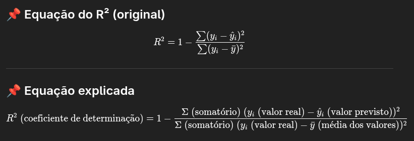

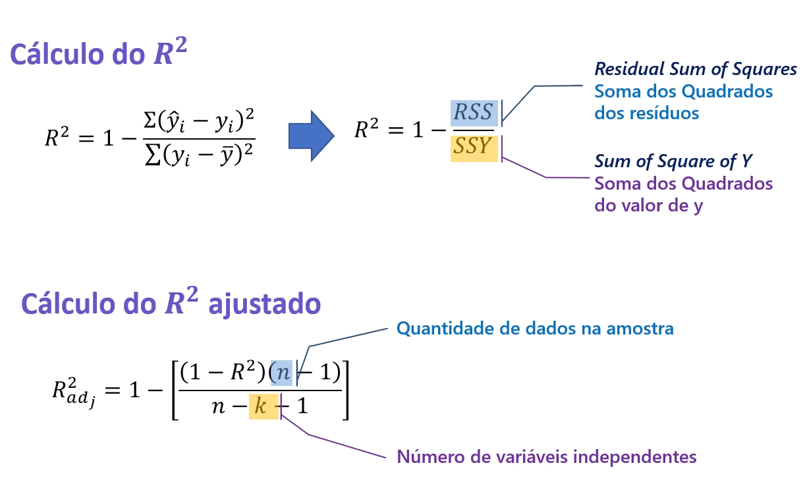

### 📊 Métricas de Avaliação de Performance de Modelos

São medidas usadas para verificar o quão bom é o desempenho de um modelo.

#### 👉 Respondem:
“O modelo está acertando bem?”

### 🛑 Depende do tipo de problema

### 🔷 1. Regressão (valores contínuos)

#### 📌 MAE (Erro Absoluto Médio)
- Média do erro absoluto
- Fácil de interpretar

#### 📌 MSE (Erro Quadrático Médio)
- Penaliza mais erros grandes
- Sensível a outliers

#### 📌 RMSE
- Raiz do MSE
- Mesma unidade dos dados

#### 📌 R² (Coeficiente de determinação)
- Varia de 0 a 1
- Quanto mais próximo de 1, melhor

### 🔷 2. Classificação


#### 📌 Acurácia
Quantidade classificada como Positivos e Negativos corretamente.
- % de acertos
- Pode enganar em dados desbalanceados
- **Fórmula:** (TP + TN) / ((TP + FN) + (FP + TN))

#### 📌 Precisão (Precision)
Quantidade classificada corretamente
- Dos positivos previstos, quantos são corretos
- **Fórmula:** TP / (TP + FP)

#### 📌 Recall (Sensibilidade)
Quantidade classificada como Positivo corretamente
- Dos positivos reais, quantos foram encontrados
- **Fórmula:** TP / (TP + FN)

#### 📌 F1-Score
Média harmônica entre Precisão e Recall
- Equilíbrio entre precisão e recall
- **Fórmula:** 
    - (2 * TP) / (2 * TP + FP + FN)
    - 2 * Precision * Recall / (Precision + Recall)

#### 📌 Matriz de Confusão


### 🔷 Clusterização

#### 📌 Compactação (intragrupo):
Objetos internos dos grupos devem estar o mais próximo possível dos outros que fazem parte daquele grupo.

#### 📌 Separação (intergrupo):
Os grupos devem estar o mais longe uns dos outros.

#### 📌 Internas:
Medidas que usam informações apenas do grupo, olhando para similariedade e cálculos intra e inter grupos.

#### 📌 Externas:
Avalia o quanto o grupo está repondendo ao que se espera encontrar (aqui é necessário conhecimento prévio do domínio de negócio especifico).

#### 📌 Cluster de protótipo
- A **inércia** avalia a que distância estão o spontos dentro de um cluster, ela nos dá a soma das distâncias gerando o valor **intracluster** (soma dos quadrados intra-cluster WCSS - Within-Cluster Sum of Squares)
- Calcula a soma da distância de todos os pontos dentro de uim grupo, a partir do **centróide** desse grupo.
- Calcula isso **individualmente para todos os grupos (clusters)** e o valor da inercia final é a soma de todas as distâncias.

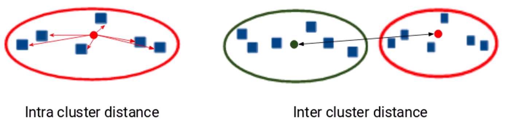

#### 📌 K-Means Cluster
- Para avaliar o método, o ponto central de cada grupo **(centróide)** é utilizado. Este ponto é flutuante, e representa a distância media dos pontos existentes grupo **naquele momento.** A cada iteração, espera-se que este ponto se ajuste aos dados.

### 🔷 Outras métricas importantes

#### 📌 ROC-AUC
- Mede capacidade de separar classes

#### 📌 Log Loss
- Penaliza previsões erradas com alta confiança

### 🚀 Estatística no Machine Learning
| Etapa ML          | Estatística envolvida  | Técnicas estatísticas utilizadas                                |
| ----------------- | ---------------------- | --------------------------------------------------------------- |
| Exploração (EDA)  | Estatística Descritiva | Média, mediana, desvio padrão, correlação, histogramas, boxplot |
| Pré-processamento | Estatística Descritiva | Normalização, padronização (z-score), tratamento de outliers    |
| Modelagem         | Probabilidade          | Regressão, distribuição normal, Teorema de Bayes                |
| Treinamento       | Inferência Estatística | Estimativa de parâmetros, mínimos quadrados                     |
| Avaliação         | Inferência Estatística | MSE, RMSE, acurácia, precisão, recall                           |
| Validação         | Inferência Estatística | Hold-out, validação cruzada (K-Fold)                            |
| Seleção de modelo | Inferência Estatística | Teste de hipótese, p-valor, comparação de modelos               |


#### Fontes
- https://elisaterumi.substack.com/p/top-8-algoritmos-de-machine-learning
- https://www.datacamp.com/pt/blog/top-machine-learning-use-cases-and-algorithms
- https://www.elastic.co/pt/blog/popular-ml-algorithms